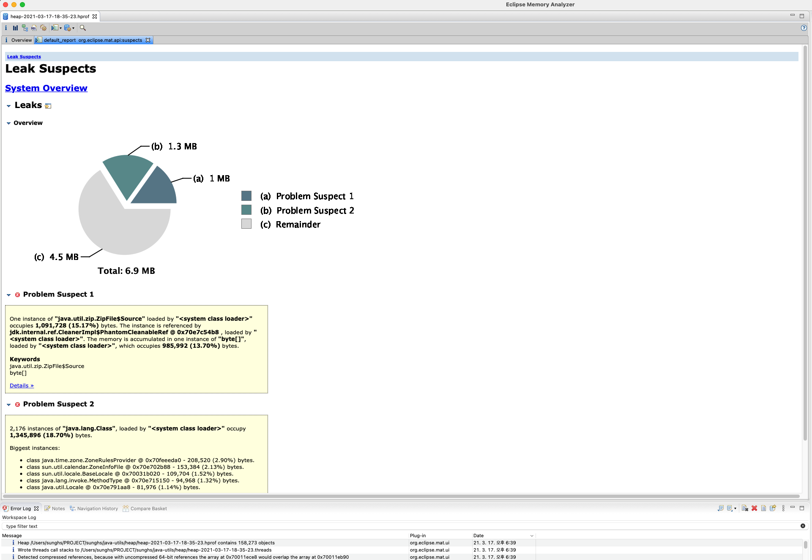

## HeapDump 파일 만들기

[Github](https://github.com/sunghs/java-utils)  

API 등 web application, 또는 daemon 형태의 java background application 서비스를 하다보면, OutOfMemoryException이 발생하는 경우가 있다.
또한 메모리가 튈 일이 없는 상황인데도 점차 주기적으로 Heap 점유율이 늘어난다던지 하는 경우가 있는데 이런 경우 HeapDump 파일을 만들어 분석하게 되면, 어느 객체가 메모리를 많이 차지하는지, 현재 참조가 끊어진 객체들은 어떤 것들이 있는지에 대해 분석 할 수 있다.

spring 프로젝트의 경우 actuator 모듈을 도입하게 되면, HeapDump 파일을 내려 받을 수 있는데, 사실 힙덤프 하나만을 위해서 actuator 도입을 해야하는 부담스러운 상황이거나 도입을 못 쓰는 상황이 있을 때 쓰면 좋은 Service 클래스이다.
(사실 actuator는 여러가지 모니터링을 지원해서 actuator 사용이 가능한 상황이라면 쓰는게 좋다..)

```java
package sunghs.java.utils.memory;

import com.sun.management.HotSpotDiagnosticMXBean;
import java.io.IOException;
import java.lang.management.ManagementFactory;
import java.nio.file.Files;
import java.nio.file.Path;
import java.nio.file.Paths;
import java.time.LocalDateTime;
import java.time.format.DateTimeFormatter;
import java.util.stream.Stream;
import javax.management.MBeanServer;
import lombok.extern.slf4j.Slf4j;
import org.springframework.core.io.Resource;
import org.springframework.core.io.UrlResource;

/**
 * 현재 시스템 Java Heap Dump hprof 파일을 만드는 클래스
 * @author https://sunghs.tistory.com
 * @see <a href="https://github.com/sunghs/java-utils">source</a>
 */
@Slf4j
public class HeapDumpMaker {

    private static final String HOTSPOT_BEAN_NAME = "com.sun.management:type=HotSpotDiagnostic";

    private static final DateTimeFormatter DATE_TIME_FORMATTER = DateTimeFormatter
        .ofPattern("yyyy-MM-dd-HH-mm-ss");

    private static final String NAME_PREFIX = "heap-";

    private static final String EXTENSION_SUFFIX = ".hprof";

    private static final String DEFAULT_SAVE_PATH = "./heap";

    private static HotSpotDiagnosticMXBean DIAGNOSTIC_MX_BEAN;

    public HeapDumpMaker() {
        Path defaultPath = Paths.get(DEFAULT_SAVE_PATH);
        try {
            if (!Files.exists(defaultPath) && !Files.isDirectory(defaultPath)) {
                Files.createDirectory(defaultPath);
            }
        } catch (Exception e) {
            log.error("heap dump instance create error", e);
        }
    }

    private HotSpotDiagnosticMXBean getHotspotMBean() {
        try {
            MBeanServer server = ManagementFactory.getPlatformMBeanServer();
            return ManagementFactory.newPlatformMXBeanProxy(server, HOTSPOT_BEAN_NAME, HotSpotDiagnosticMXBean.class);
        } catch (Exception e) {
            throw new RuntimeException(e);
        }
    }

    private synchronized void initHotspotMBean() {
        if (DIAGNOSTIC_MX_BEAN == null) {
            DIAGNOSTIC_MX_BEAN = getHotspotMBean();
        }
    }

    private String getFileName() {
        return NAME_PREFIX + LocalDateTime.now().format(DATE_TIME_FORMATTER) + EXTENSION_SUFFIX;
    }

    public Resource dump() {
        final Path savePath = Paths.get(DEFAULT_SAVE_PATH);
        final String fileName = getFileName();

        delete(savePath);
        initHotspotMBean();

        try {
            getHotspotMBean().dumpHeap(savePath + "/" + fileName, false);
            log.info("{} file create success", fileName);
            Path path = savePath.toAbsolutePath().normalize().resolve(fileName).normalize();
            return new UrlResource(path.toUri());
        } catch (Exception e) {
            log.error("create dump error", e);
            return null;
        }
    }

    public void delete(Path directory) {
        try (Stream<Path> pathStream = Files.list(directory)) {
            pathStream.filter(path -> path.toString().contains(NAME_PREFIX)).forEach(path -> {
                try {
                    Files.delete(path);
                } catch (Exception e) {
                    log.error("file delete error", e);
                }
            });
        } catch (IOException e) {
            log.error("get path list error", e);
        }
    }
}

```

추가해야 할 dependency는 없다.

기본적으로 위 소스를 사용하게 된다면, 해당 Project 폴더의 heap 이라는 폴더가 생기며, 그 아래 파일이 떨어진다.
자동으로 지워지는 방식은 아니며, 추가적으로 HeapDump 파일이 생성되는 경우, 파일 생성 전 전처리로 이전에 있던 HeapDump 파일을 모두 지운다.

`public void delete(Path directory)` 메소드가 아무 작동하지 않게 하거나 하면, 기존의 HeapDump 파일을 지우지 않는다.

현재 추가할 application이 REST API 등이라면, endpoint를 하나 만들어 HeapDump 파일을 return 하는 식으로 만들 수 있고,
특정 경로에 파일을 만들어 놓거나, 추가적으로 SSH, SFTP 등으로 전송하는 등 추가적인 트윅을 하면 된다.

### stateless 등의 REST API로 return 하는 경우 (예)

```java
public ResponseEntity<Resource> dump(final HttpServletRequest request) {
    try {
        // String name = 힙덤프 만들고 난 파일명
        Path path = dirs.toAbsolutePath().normalize().resolve(name).normalize();
        Resource resource = new UrlResource(path.toUri());
        String absolutePath = resource.getFile().getAbsolutePath();
        String type = request.getServletContext().getMimeType(absolutePath);

        if (StringUtils.isEmpty(type)) {
            type = "application/octet-stream";
        }
        return ResponseEntity.ok()
            .contentType(MediaType.parseMediaType(type))
            .header(HttpHeaders.CONTENT_DISPOSITION, "attachment; filename=\"" + name + "\";")
            .body(resource);
    } catch (Exception e) {
        // Exception 핸들링
        // return null 등
    }
}
```


### 테스트
```java
package sunghs.java.utils.memory;

import java.io.IOException;
import lombok.extern.slf4j.Slf4j;
import org.apache.commons.lang3.StringUtils;
import org.junit.jupiter.api.Assertions;
import org.junit.jupiter.api.Test;
import org.springframework.core.io.Resource;

@Slf4j
public class HeapDumpMakerTest {

    @Test
    public void test() throws IOException {
        HeapDumpMaker heapDumpMaker = new HeapDumpMaker();
        Resource resource = heapDumpMaker.dump();

        Assertions.assertTrue(resource.isFile());
        Assertions.assertTrue(resource.contentLength() > 0);
        Assertions.assertTrue(StringUtils.isNotEmpty(resource.getFilename()));

        log.info(resource.getFilename());
    }
}
```

### 결과
MAT 라는 툴로 만들어진 파일을 확인했다.


