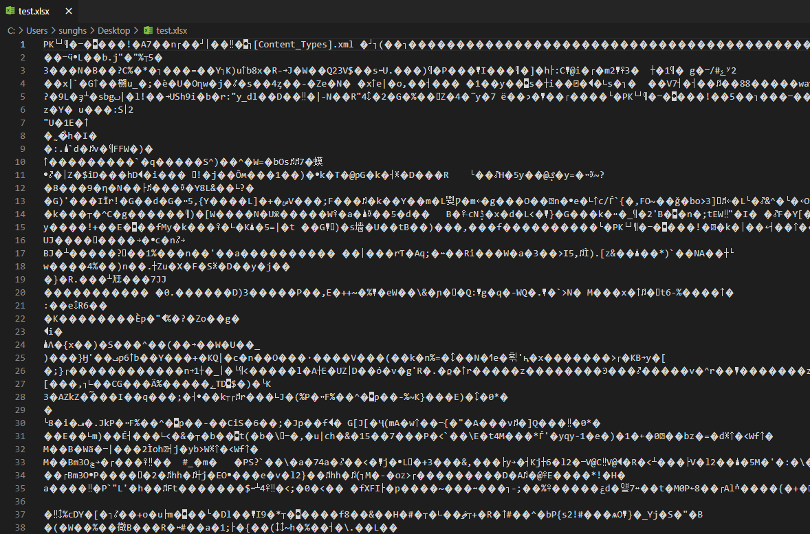

## 이진파일 문자열 변환 (binary to string)

예전에 포스팅 한 내용을 토대로 소스에 추가하고 테스트 케이스를 만들었습니다.

exe, docs, pptx, xlsx 파일 등 아래와 같이 문자열 변환이 불가능한 파일을 비트 연산으로 ascii 로 변경하는 작업입니다.

[포스팅 보기](https://sunghs.tistory.com/35?category=673780)


바이너리 파일을 텍스트 편집기 등으로 열면 이런식으로 보이죠.

문자열 변환이 불가능하기 보다는, new String(byte[] b) 로 읽고, 다시 getBytes() 로 쓰게 되면 데이터 손실이 발생하는데 그 손실 없이 String 으로 바꾸고 byte[] 로 바꾸는 기능입니다.

[소스는 여기](https://github.com/sunghs/java-utils)의 sunghs.java.utils.convert.BinaryConverter 클래스입니다.

### 소스 코드

```java
/**
 * binary byte를 문자열로 손실 없이 변환 해주는 컨버터
 *
 * @author https://sunghs.tistory.com
 * @see <a href="https://github.com/sunghs/java-utils">source</a>
 */
public class BinaryConverter {

    private final int bitCount;

    private final StringBuffer bitString;

    public BinaryConverter() {
        this(8);
    }

    public BinaryConverter(int bitCount) {
        this.bitCount = bitCount;
        this.bitString = new StringBuffer("0".repeat(Math.max(0, bitCount)));
    }

    /**
     * binary byte를 String 문자열로 변환
     * @param bytes binary bytes
     * @return String
     */
    public String convertBinaryToString(final byte[] bytes) {
        StringBuilder result = new StringBuilder();
        for (byte b : bytes) {
            result.append(byteToBitString(b));
        }
        return result.toString();
    }

    private String byteToBitString(final byte b) {
        StringBuilder byteString = new StringBuilder(this.bitString.toString());
        for (int bit = 0; bit < bitCount; bit++) {
            if (((b >> bit) & 1) > 0) {
                byteString.setCharAt((bitCount - 1) - bit, '1');
            }
        }
        return byteString.toString();
    }

    /**
     * 변환 된 String 문자열을 다시 binary byte로 변환
     * @param byteStrings byteStrings
     * @return binary bytes
     */
    public byte[] convertStringToBinary(final String byteStrings) {
        int repeatCount = byteStrings.length() / bitCount;
        byte[] result = new byte[repeatCount];
        for (int idx = 1; idx < repeatCount; idx++) {
            int begin = (idx - 1) * bitCount;
            int end = idx * bitCount;
            String byteString = byteStrings.substring(begin, end);
            result[idx - 1] = bitStringToByte(byteString);
        }
        return result;
    }

    private byte bitStringToByte(final String byteString) {
        byte b = 0;
        for (int idx = 0; idx < bitCount; idx++) {
            byte value = (byte) ((byteString.charAt(bitCount - 1 - idx) == '1') ? (1 << idx) : 0);
            b = (byte) (value | b);
        }
        return b;
    }
}

```

### 테스트

클래스의 사용법과 예제는 테스트 패키지의 같은 경로 안에 포함되어 있습니다.

파일을 읽는법, 쓰는법 만든 파일이 같은지 검증하는 케이스도 추가하였습니다.

```java
@Slf4j
class BinaryConverterTests {

    private final BinaryConverter binaryConverter = new BinaryConverter(8);

    @Test
    void test() throws IOException {
        String src = "/Users/sunghs/Downloads/test.zip";
        String dest = "/Users/sunghs/Downloads/result.zip";

        RandomAccessFile randomAccessFile1 = new RandomAccessFile(src, "r");
        FileChannel fileChannel1 = randomAccessFile1.getChannel();
        ByteBuffer byteBuffer1 = ByteBuffer.allocate(64);

        // given
        List<Byte> zip = new ArrayList<>();

        while (fileChannel1.read(byteBuffer1) != -1) {
            byteBuffer1.flip();
            while (byteBuffer1.hasRemaining()) {
                zip.add(byteBuffer1.get());
            }
            byteBuffer1.clear();
        }
        randomAccessFile1.close();

        byte[] bytes = new byte[zip.size()];

        for (int i = 0; i < zip.size(); i++) {
            bytes[i] = zip.get(i);
        }

        // when (byte -> string)
        String byteStrings = binaryConverter.convertBinaryToString(bytes);

        log.info(byteStrings);

        // when (string -> byte)
        byte[] convertedBytes = binaryConverter.convertStringToBinary(byteStrings);

        RandomAccessFile randomAccessFile2 = new RandomAccessFile(dest, "rw");
        FileChannel fileChannel2 = randomAccessFile2.getChannel();
        ByteBuffer byteBuffer2 = ByteBuffer.allocate(convertedBytes.length);

        byteBuffer2.put(convertedBytes);
        byteBuffer2.flip();

        while (byteBuffer2.hasRemaining()) {
            fileChannel2.write(byteBuffer2);
        }
        randomAccessFile2.close();

        // then
        Assertions.assertTrue(compare(src, dest));
    }

    boolean compare(String src, String dest) {
        try (FileChannel sChannel = new RandomAccessFile(src, "r").getChannel();
            FileChannel dChannel = new RandomAccessFile(dest, "r").getChannel()) {

            if (sChannel.size() != dChannel.size()) {
                return false;
            }

            ByteBuffer sBuffer = sChannel.map(MapMode.READ_ONLY, 0, sChannel.size());
            ByteBuffer dBuffer = sChannel.map(MapMode.READ_ONLY, 0, sChannel.size());

            for (int i = 0; i < sChannel.size(); i++) {
                if (sBuffer.get(i) != dBuffer.get(i)) {
                    return false;
                }
            }
            return true;
        } catch (Exception e) {
            log.error("error", e);
            return false;
        }
    }
}
```

