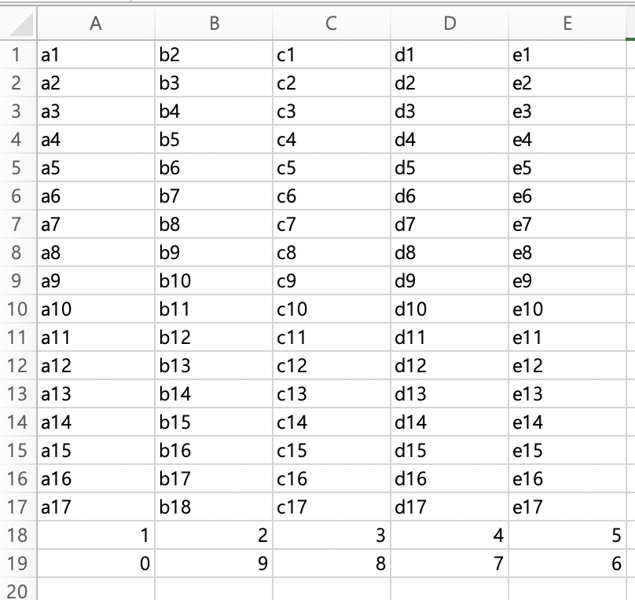
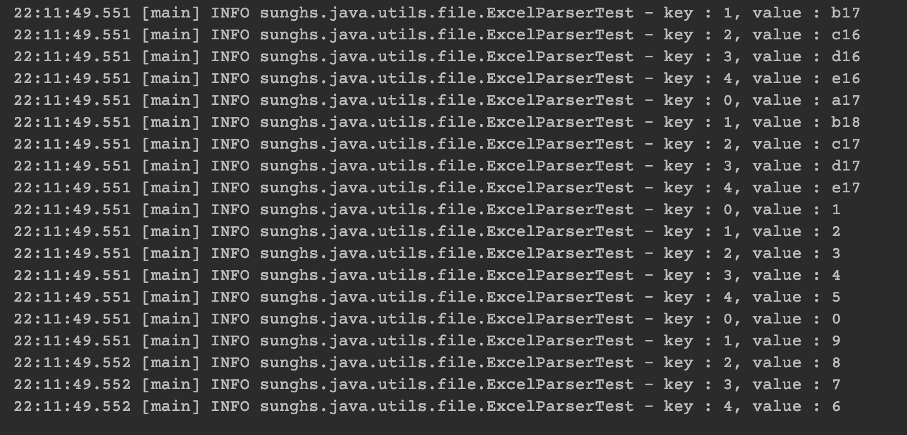
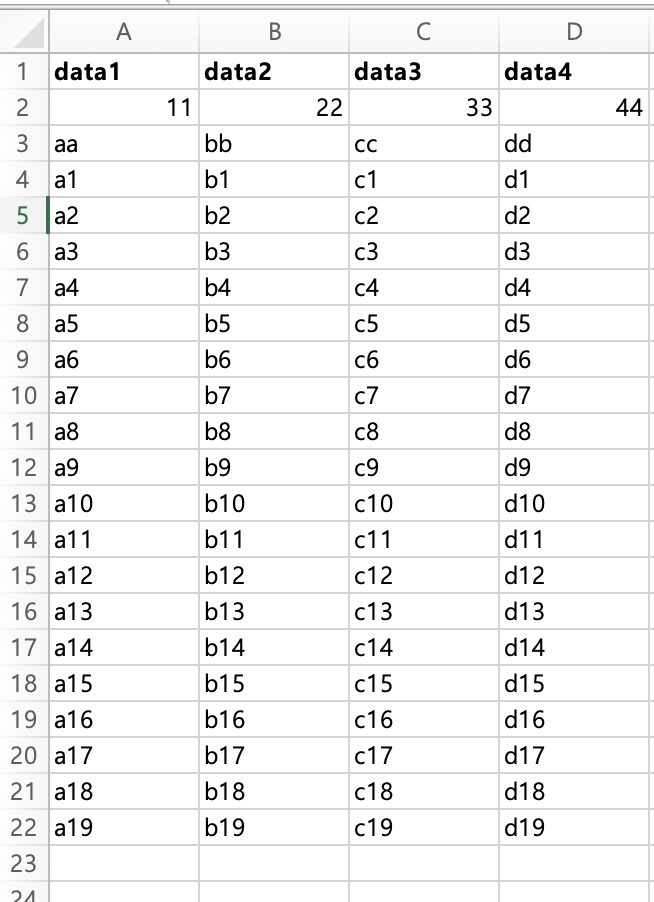
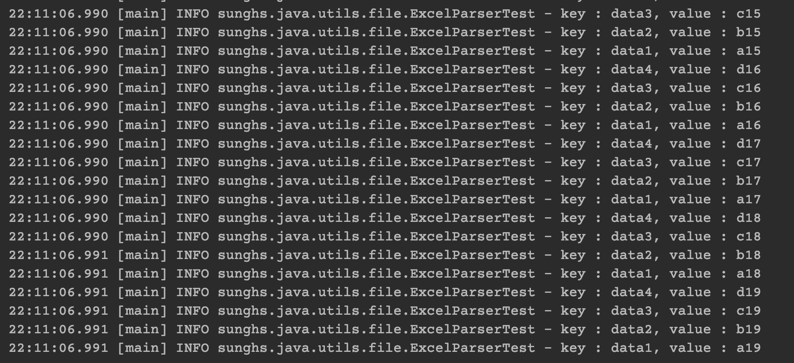

## 엑셀 읽기
깃허브 https://github.com/sunghs/java-utils
### apache-poi를 이용한 엑셀 파싱

**라이브러리 추가 필요**  

### build.gradle
```properties
// Excel
// https://mvnrepository.com/artifact/org.apache.poi/poi-ooxml
implementation('org.apache.poi:poi-ooxml:4.1.2')
```
2020.06 현재 가장 최신버전이다. (2020. 02 버전)

```java
/**
 * 엑셀 파일을 읽어 반환해주는 파서
 *
 * @author https://sunghs.tistory.com
 * @see <a href="https://github.com/sunghs/java-utils">source</a>
 */
public class ExcelParser {

    private final boolean isHeader;

    private final DataFormatter formatter = new DataFormatter();

    /**
     * @param isHeader 엑셀의 첫줄을 헤더로 볼 지 여부
     */
    public ExcelParser(final boolean isHeader) {
        this.isHeader = isHeader;
    }

    /**
     * 엑셀을 읽어 List&lt;Map&gt;로 반환
     *
     * @param excelFile 엑셀파일
     * @param sheetIndex 시트번호, 첫 시트번호는 0
     * @return List&lt;Map&gt;
     * @throws IOException IOException
     */
    public List<Map<String, String>> parse(final File excelFile, final int sheetIndex)
        throws IOException {
        Workbook workbook = new XSSFWorkbook(new FileInputStream(excelFile));
        Sheet sheet = workbook.getSheetAt(sheetIndex);

        int rowCount = sheet.getPhysicalNumberOfRows();

        if (rowCount <= 1) {
            return null;
        }

        List<String> header = new ArrayList<>();
        Row headerRow = sheet.getRow(0);

        for (int i = 0; i < headerRow.getPhysicalNumberOfCells(); i++) {
            Cell cursor = headerRow.getCell(i);
            if (isHeader) {
                header.add(formatter.formatCellValue(cursor));
            } else {
                header.add(String.valueOf(headerRow.getCell(i).getColumnIndex()));
            }
        }

        List<Map<String, String>> result = new ArrayList<>();

        for (int i = 1; i < rowCount; i++) {
            Row row = sheet.getRow(i);
            result.add(parseRow(header, row));
        }
        return result;
    }

    /**
     * 1개의 행을 읽어 Map으로 반환
     *
     * @param header 헤더 리스트 (첫 행)
     * @param row    데이터 (2번쨰 행부터)
     * @return Map
     */
    private Map<String, String> parseRow(List<String> header, Row row) {
        Map<String, String> data = new HashMap<>();
        for (int i = 0; i < row.getPhysicalNumberOfCells(); i++) {
            Cell cursor = row.getCell(i);
            data.put(header.get(i), formatter.formatCellValue(cursor));
        }
        return data;
    }
}
```

key-value 자료구조인 Map으로 현재 반환하게 해놨는데, 상황에 따라서 generic을 이용하던지, 
특정 POJO 클래스로 반환하게 수정하면 된다.

### 테스트
```java
@Test
public void excelTestWithHeader() throws IOException {
    ExcelParser parser = new ExcelParser(true);
    File excel = new File("/Users/sunghs/excel.xlsx");
    List<Map<String, String>> list = parser.parse(excel, 0);

    for(Map<String, String> row : list) {
        for(String key : row.keySet()) {
            log.info("key : {}, value : {}", key, row.get(key));
        }
    }
}

@Test
public void excelTestWithNoHeader() throws IOException {
    ExcelParser parser = new ExcelParser(false);
    File excel = new File("/Users/sunghs/excel.xlsx");
    List<Map<String, String>> list = parser.parse(excel, 1);

    for(Map<String, String> row : list) {
        for(String key : row.keySet()) {
            log.info("key : {}, value : {}", key, row.get(key));
        }
    }
}
```

### 결과
#### 헤더 없는 시트


#### 헤더 있는 시트



