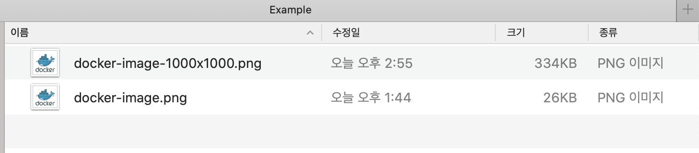

## 이미지 리사이징
### AffineTransform을 이용한 이미지 리사이징
원본 bufferedImage와 width, height를 가지고 리사이징을 진행  
소스는 github에도 있다.(https://github.com/sunghs/java-utils)  
**라이브러리 추가 없음**

```java
public class ImageResizer {

    public static final int MAX_SCALE_SIZE = 10000;

    /**
     * @param image 원본
     * @param w     리사이징 가로 (px)
     * @param h     리사이징 세로 (px)
     * @return reiszed buffered image
     */
    public BufferedImage resize(final BufferedImage image, int w, int h) {
        final int ow = image.getWidth();
        final int oh = image.getHeight();

        w = Math.min(w, MAX_SCALE_SIZE);
        h = Math.min(h, MAX_SCALE_SIZE);

        double sw = (double) w / (double) ow;
        double sh = (double) h / (double) oh;

        BufferedImage resize = new BufferedImage(w, h, image.getType());

        AffineTransform transForm = new AffineTransform();
        transForm.scale(sw, sh);
        AffineTransformOp transformOp = new AffineTransformOp(transForm, AffineTransformOp.TYPE_BICUBIC);
        return transformOp.filter(image, resize);
    }
}
```
### 테스트
```java
@Test
public void resizeTest() throws Exception {
    File original = new File("/Users/sunghs/Documents/Example/docker-image.png");
    InputStream in = new FileInputStream(original);

    ImageResizer imageResizer = new ImageResizer();
    int w = 1000;
    int h = 1000;
    BufferedImage resize = imageResizer.resize(ImageIO.read(in), w, h);

    String option = w + "x" + h;
    FileOutputStream out = new FileOutputStream("/Users/sunghs/Documents/Example/docker-image-" + option + ".png");
    ImageIO.write(resize, "png", out);
    out.flush();
}
```

### 결과
