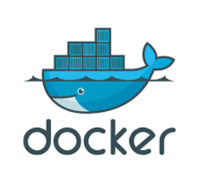

## Dockerfile


Dockerfile은 Docker Image를 만들기 위한 스크립트 파일이다. Dockerfile 내에 Docker Image를 만들면서 해야하는 작업을 전부 명령어화 시켜 Docker Image를 만들기 위한 과정을 작성 할 수 있다.

예를들면

특정 Spring Boot 웹서비스를 띄우기 위한 Docker Image가 필요한데 순정 배포판 Docker Image를 받아다가  
- JDK도 설치 
- tomcat설치  
(사실 여기까지 설치 되어있는 건 DockerHub에서 찾을수 있다.)  
그리고 DockerImage 내에 Spring Boot App도 배포해야 할것이다. 이런 과정을 Dockerfile 내에 스크립트로 작성해놓으면, Docker가 Dockerfile을 읽어 JDK+tomcat+SpringBoot App까지 배포가 완료된 Docker Image를 만든다.


### 도커파일 파일명
기본적으로 Dockerfile의 파일명은 Dockerfile 이다. (확장자없음)  
도커파일 빌드 시 옵션으로 이름을 변경할 수 있으나, 옵션을 주지 않으면 Dockerfile이다.

### FROM
Base 이미지를 지정한다. 로컬에 없는경우 DockerHub를 가서 찾아온다.
**FROM 이미지명:버전명**
```xml
FROM amazonlinux:latest
```

### RUN
명령어를 실행할때 쓴다. 1번의 RUN 명령어는 1개의 이미지를 생성한다.  
단계별로 이미지가 생성된다고 보면 된다.  
여러개의 명령어를 묶어 실행하고 1개의 이미지로 만들때는 && 연산자를 사용한다.  

curl 패키지 설치후 이미지 생성, 이후 이어서 루트 밑에 folder를 만든 이미지를 생성한다고 하면
```xml
RUN apt-get update && apt-get install -y curl
RUN mkdir /folder
```

### COPY
호스트에서 도커이미지 안으로 파일을 복사할 때 쓴다. 호스트 파일은 시작위치가 Dockerfile과 동일한 경로에서 시작한다.  
**COPY 호스트파일 도커이미지 내 파일경로**
```xml
COPY app.jar /folder/app.jar
```

### ADD
COPY와 기능은 유사하지만 원격 다운로드 및 압축 기능 등의 추가 기능이 포함됨.

### CMD
docker run/start로 컨테이너가 뜰 때 실행할 명령어. 다만 run 시 추가 argument를 부여하면 CMD 명령어는 실행되지 않는다.

컨테이너 구동하면서 폴더를 여러개 만들고 싶다면
```xml
CMD mkdir f1 f2 f3
또는
CMD ["mkdir", "f1", "f2", "f3"]
```

### ENV
컨테이너 안에서 사용할 환경변수 설정
```xml
ENV name sunghs
ENV url sunghs.tistory.com
```

### ARG
도커파일 안에서만 사용되며 컨테이너 구동시에는 사용 못함.
```xml
ARG name=sunghs
ARG url=sunghs.tistory.com
```

두 명령어는 ${key}로 사용 가능하다.  
**echo ${name} = sunghs**

### WORKDIR
연속된 cd명령어를 제외해준다. 이후 명령어에 상대경로를 사용하면 ${WORKDIR}/ 부터 시작한다.
```xml
WORKDIR /usr/local/
RUN sh ./test.sh
```
/usr/lcoal/test.sh가 실행된다.


### USER
사용자를 선택한다.
```xml
USER root
USER sunghs 등
```

### Dockerfile 빌드
Dockerfile이 있는 위치에서 실행시키면 된다.  
**docker build -t 이미지명:버전명 .**  
태그 뒤에 . 을 빼서는 안된다.


### 간단한 예제
amazonlinux:latest를 DockerHub에 받아서  
wget, java-openjdk11, which 패키지 설치  
이후 test.txt 파일을 도커 이미지 안으로 이동  
```sh
FROM amazon:ssl

USER root


RUN \
yum install -y wget \
&& amazon-linux-extras install -y java-openjdk11 \
&& yum install -y which

COPY test.txt /etc/test.txt
```