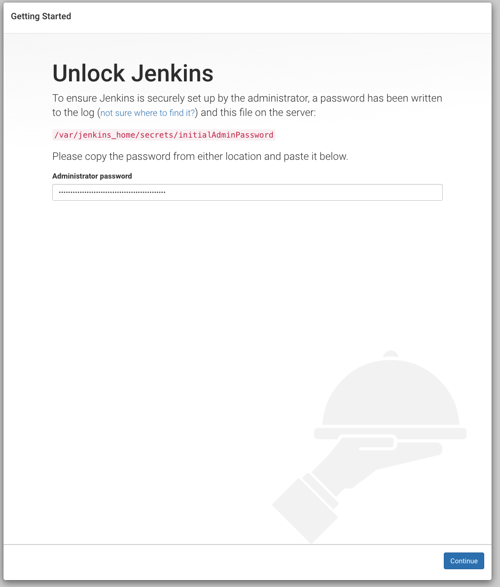

# Jenkins
**이 글은 추가사항이 있으면 계속 업데이트 됩니다.**  
~~last updated 2020. 04. 10~~
last updated 2020. 04. 13

## Docker Image Jenkins 기본 Run
첫 컨테이너 생성 시 -v 옵션으로 볼륨을 만들어 줘야 commit시 플러그인이 포함된다.  
https://github.com/jenkinsci/docker/blob/master/README.md
```sh
docker run -it -d -p 9999:8080 -p 50000:50000 --name jk jenkins/jenkins:lts-jdk11
```
도커는 war로 구동되는 웹 어플리케이션이다.  
그래서 -p 9999:8080로 주는경우 젠킨스 포트 8080이 호스트 9999에 포워딩 된다.  
로컬로 띄운 경우 localhost:9999 로 웹 진입이 가능하다.  


## Jenkins Container 진입
```sh
docker exec -it jk /bin/bash
```

### Jenkins 초기 비밀번호 위치
-p 옵션으로 부여한 포트번호로 들어가면 초기 비밀번호를 입력해야 한다.  
비밀번호 값은 컨테이너 내부에 있다.
```sh
# cat $JENKINS_HOME/secrets/initialAdminPassword
```



## Jenkins를 Docker Container로 띄운 경우
이후 plugin 설치 후 commit 해서 Image에 포함시키려면 반드시 컨테이너 생성 시 아래 파라미터를 추가해야 한다.  
~~볼륨을 지정해 줘야 plugin, Project 등이 commit Image에 남는다.~~  
볼륨이 docker 내부에 남는듯 보이며, 어떤 이미지를 쓰던 -v 옵션으로 jenkins_home을 공유하면 이전 이미지의 플러그인과 설정이 남는다.
```sh
-v jenkins_home:/var/jenkins_home
```