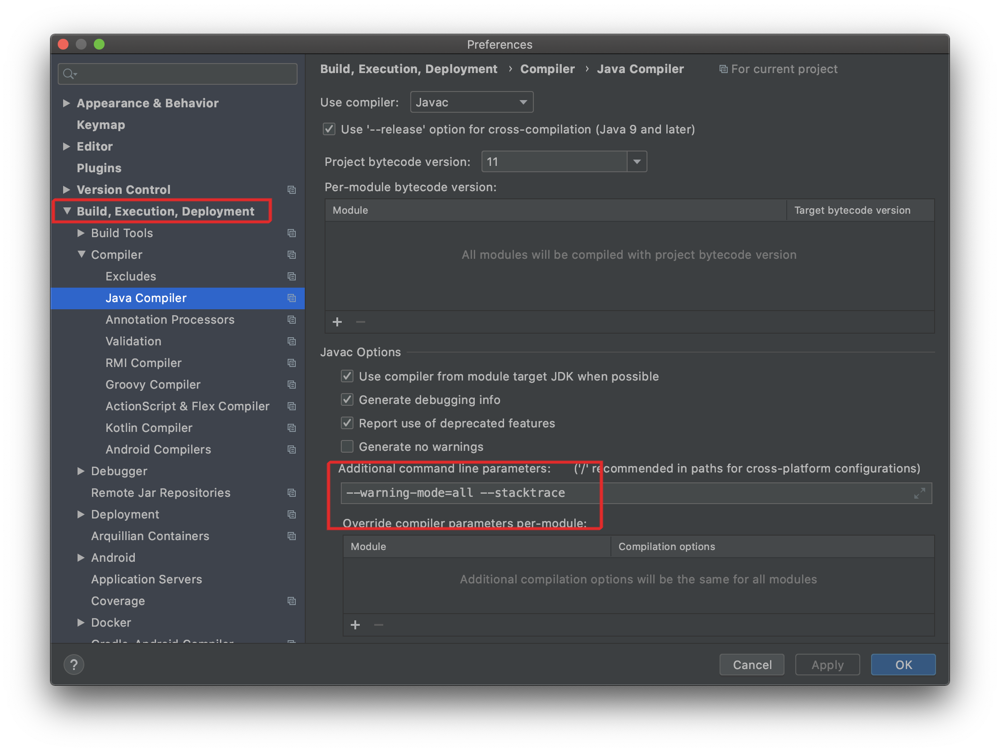

## Gradle 빌드 시 Deprecated Gradle features were used in this build, making it incompatible with Gradle x.x

일단 이 알림으로 인해 빌드에 실패하는건 아니다. 그냥 알림이다.  
빌드에 실패했다면 다른 이유를 찾아 해결해야 한다.

---


FAILURE: Build failed with an exception.
```
* What went wrong:
Execution failed for task ':test'.
> There were failing tests. See the report at: file:///home/sunghs/project/PacketSniffer2/PacketSniffer/build/reports/tests/test/index.html

* Try:
Run with --stacktrace option to get the stack trace. Run with --info or --debug option to get more log output. Run with --scan to get full insights.

* Get more help at https://help.gradle.org

Deprecated Gradle features were used in this build, making it incompatible with Gradle 7.0.
Use '--warning-mode all' to show the individual deprecation warnings.
See https://docs.gradle.org/6.0.1/userguide/command_line_interface.html#sec:command_line_warnings

BUILD FAILED in 8s
5 actionable tasks: 1 executed, 4 up-to-date
There were failing tests. See the report at: file:///xxx/yyy/zzz/project/build/reports/tests/test/index.html
오후 9:42:05: Task execution finished 'build'.
```
---

x.x 버전 이후에는 사용하지 못하는 현재 버전에서 deprecated 되는 gradle 기능들이 있어 빌드 시 알려주는 기능이다.
빌드시 옵션을 줘서 해당 기능을 끄거나, 그래들 버전을 올리거나 해야한다.

```
--warining-mode=all --stacktrace
```



[여기를 참조](https://lollolzkk.tistory.com/26)