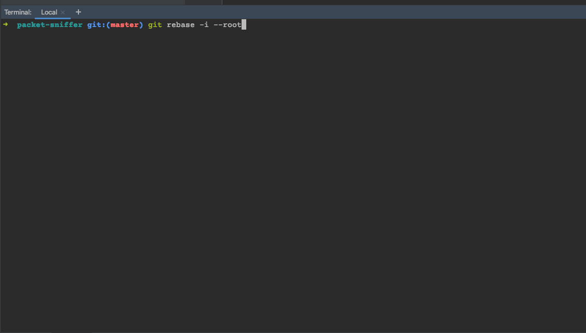
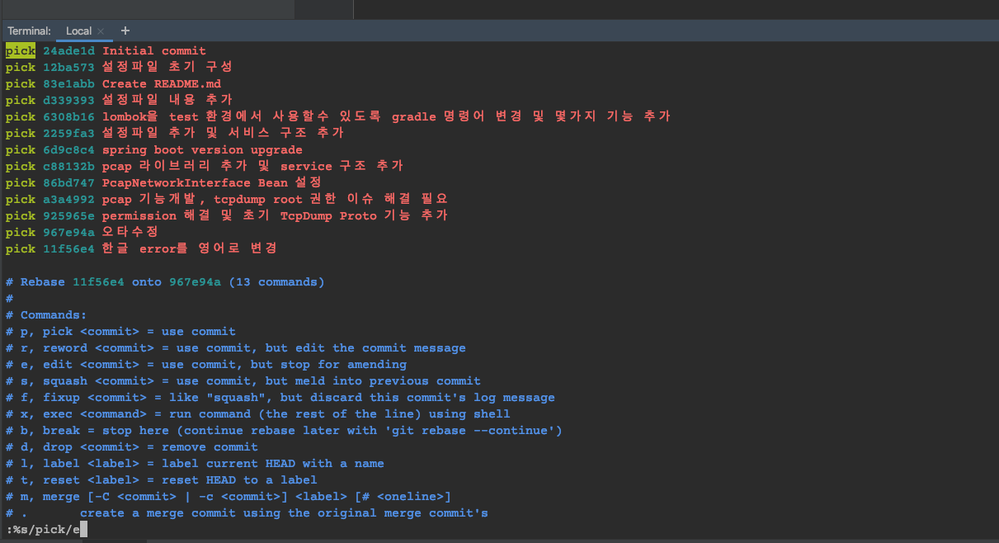
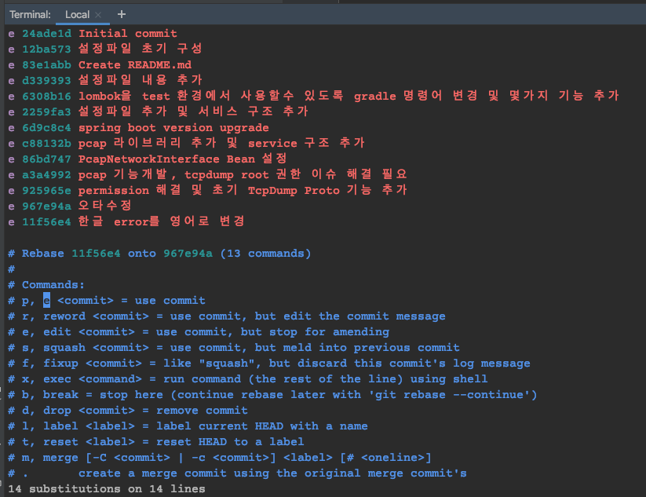
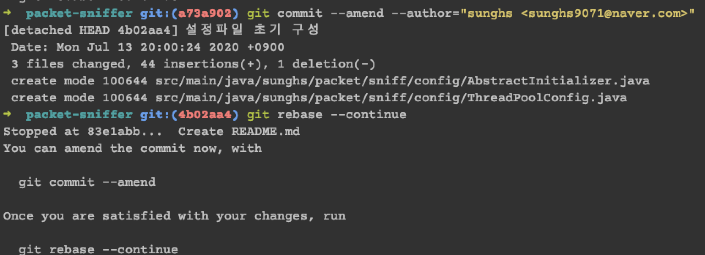
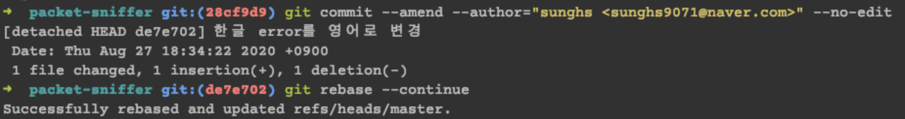
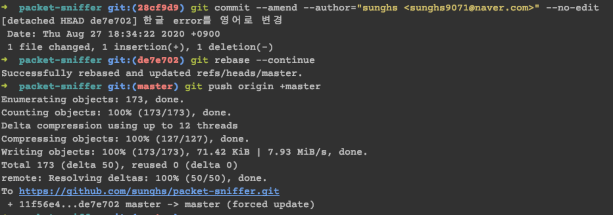
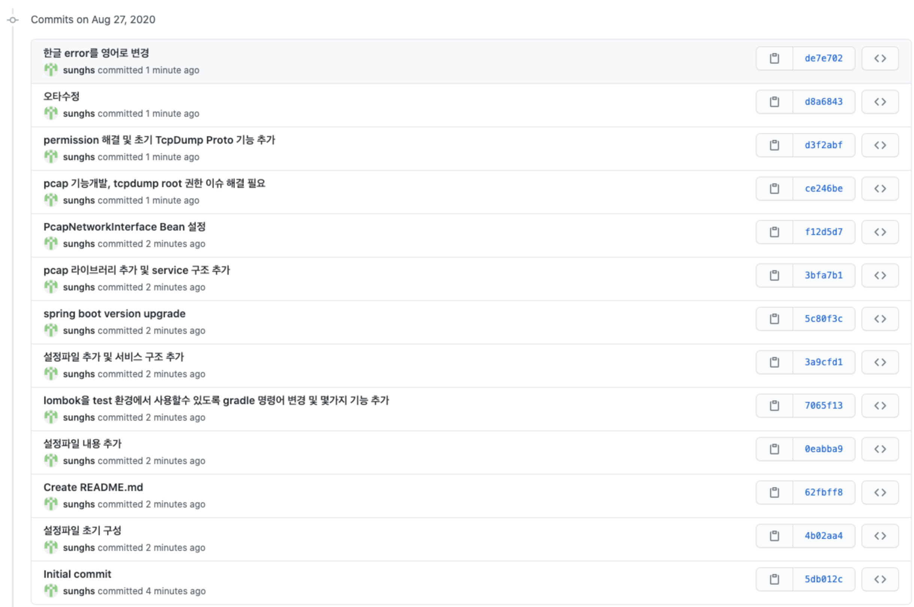

## Git Push Author 변경하기

IntelliJ 등 IDE 에서 여러 Git 호스팅 서버 (깃랩, 비트버킷 )등 을 이용하다보면 기존 프로젝트를 가져왔을 때
login user가 다른 호스팅 서버 아이디로 되어 있는 등 commit author가 잘못 되어 있는 경우가 있다.

그럴 때 이미 서버로 push 해 버린 author를 변경하는 방법이다.

### git commit author 보기 & 바꾸기
git은 global user와 해당 프로젝트의 user를 따로 지정 할 수 있다.
따라서 현재 다른 계정으로 커밋자가 되어 있다면 아래 명령어로 확인한다.

```
git config --list
```
config 설정에서 user.name 과 user.email 을 확인한다.

이후 name 과 email을 원하는 것으로 바꿔야 하는데

```
git config user.name "sunghs"
git config user.email "sunghs@domain.com"
```
sunghs 와 sunghs@domain.com 부분에 원하는 author 와 email을 작성한다.  
이 config 의 author를 바꾸지 않으면 이후 rebase 작업 시 author 와 commit 계정이 달라지게 된다.

### git push 된 author 변경하기
또한 바꿀 프로젝트의 commit history를 보고 변경할 hash를 기억하고 아래와 같이 입력한다.
```
git rebase -i -p hash값

처음부터 전부 진행하려면

git rebase -i --root
```

바꿀 hash값 이전 값을 입력해야 한다.  
입력 된 hash값 이후의 commit 내용만 변경 가능하다.


위와 같이 rebase 목록이 나온다면 바꿔야 할 commit list pick 부분을 e로 바꿔주면 된다.  
전부 다 바꿔야 한다면 vi 명령어로 아래와 같이 입력한다.  

```vi
%s/pick/e
```


pick 부분이 e로 위와 같이 전부 변경 되었는지 확인하고 변경되었다면 wq를 입력해 빠져 나온다.   
**(주석부분의 pick 도 e 로 바뀌었는데 신경 쓸 필요 없음.)**  
이후 각 commit 마다 진행 할 명령어를 입력해야 하는데 아래와 같이 입력한다.
```vi
git commit --amend --author="sunghs <sunghs@domain.com>"
```
author name 과 email 규칙은 author <email> 형태로 작성하면 된다.  

따라서 위의 sunghs 부분이 아까 config 에서 변경 한 user.name이 되고,  
sunghs@domain.com 부분이 user.email 부분이 된다.

이후 변경 내역이 정상적으로 바뀌었으면 아래와 같이 입력한다.
```
git rebase --continue
```
그러면 다음커밋으로 넘어가게 된다.


혹시 변경 내역을 보지 않고 바로바로 진행하려면 commit 옵션 뒤에 --no-edit을 추가하면 된다.


그렇게 쭉쭉 넘어가다 보면 master 또는 현재의 current branch 명이 보이게 되는데  
이후 전부다 변경했다면 아래 명령어로 강제 commit 하고 나오면 된다.
```
git push origin +master
```

master 부분이 브랜치명이며 브랜치 명이 다르다면 해당 브랜치 명을 써주면 된다.

그 뒤 git에 들어가 정상적으로 변경 되었는지 확인해본다.
