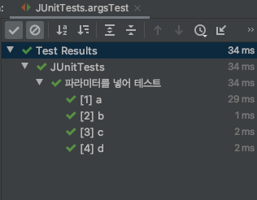
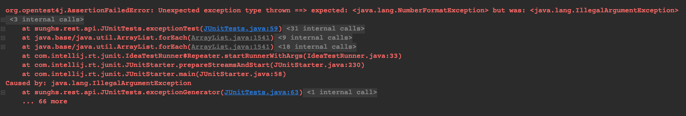
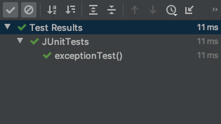

## JUnit5 사용법과 TDD (1)

### 설명
JUnit은 자바의 단위 테스트 프레임워크이다.  
xUnit에서 파생되어 각 언어별 Unit 프레임워크가 존재한다.
- C : CUnit
- C++ : cppUnit
- Python : pyUnit
- Java : JUnit

현재 JUnit은 2021년 3월 기준 5버전까지 나온 상태이다.  
[공식사이트](https://junit.org/junit5/)

---
### 프로젝트에 추가하기
spring boot 환경(intelliJ, Gradle)에서 추가하였다. JUnit은 spring-boot-starter-test에 기본적으로 포함 되어있다. 

build.gradle에 spring-boot-starter-test 패키지를 추가하고, 아래 useJUnitPlatform 을 테스트 영역에 작성한다.


```
dependencies {
    ...
    implementation('org.springframework.boot:spring-boot-starter-test')
    ...
}
test {
    useJUnitPlatform()
}
```

테스트시에만 implementation 하고 싶다면, testImplementation을 사용하여 dependency를 추가하면 된다.

---
### 기본문법 - 실행순서

***@BeforeAll***

테스트를 실행하기 전 해당 클래스에서 가장 먼저 수행된다.
static method에 붙어야 한다.
보통 전처리 기능으로 사용한다.

***@BeforeEach***

테스트 수행 이전 실행된다.
static method가 아닌 instance method에 붙으며, 멤버객체 주입 등 instance 이후 실행 할 전처리 수행이 가능하다.

***@AfterEach***

테스트 수행 이후 실행된다.
instance method에 붙는다.

***@AfterAll***

모든 테스트가 종료되고 실행된다.
static method에 붙는다.

***@Test***

일반적인 test 환경의 method에 붙는다.
instance method에 붙어야하며, static method에 붙을 시 Test Annotation이 작동하지 않는다.

---
아래 코드를 보자
```java
@Slf4j
public class JUnitTests {

    @BeforeAll
    public static void beforeAll() {
        log.info("beforeAll");
    }

    @BeforeEach
    public void beforeEach() {
        log.info("beforeEach");
    }

    @AfterEach
    public void afterEach() {
        log.info("afterEach");
    }

    @AfterAll
    public static void afterAll() {
        log.info("afterAll");
    }

    @Test
    public void noArgsTest() {
        log.info("noArgsTest");
    }
}
```
클래스명 우클릭 > Run 을 실행하면, 해당 클래스 내의 모든 Test 메소드가 수행된다.
특정 메소드의 유닛만 실행하고 싶다면 메소드 우클릭 > Run을 실행하면 된다.


noArgsTest 메소드를 실행하게 되면, **beforeAll -> beforeEach -> Test -> afterEach -> afterAll** 순으로 실행 되는 로그를 볼 수 있다.


---

### 파라미터 테스트
***@ParameterizedTest 와 @ValueSource***

기존 Test Annotation은 파라미터를 허용하지 않는 테스트인데, ParameterizedTest Annotation은 파라미터를 주입하여 테스트 할 수 있다. ValueSource Annotation 과 함께 쓰일 수 있으며, 인자의 갯수 만큼 루프를 돌며 실행한다.

특이한 점은, Dto같은 클래스 모델의 값을 인자로 넣어줄 수 없으며, 각 primitive 타입의 값, String 리터럴 값, 클래스 타입 값 (java.lang.Class) 만 지정 할 수 있다.

```java
@ParameterizedTest
@ValueSource(strings = {
    "a", "b", "c", "d"
})
public void argsTest(final String s) {
    log.info("argsTest : {}", s);
}
```

이런식으로 설정하면, argsTest 메소드가 4번 실행되며, 4번 실행하는동안, beforeEach, afterEach가 각각 전처리, 후처리로 같이 따라 붙는다.


---

### 기타 옵션

***@DisplayName***

메소드 테스트에 이름을 넣어줄 수 있다.
```java
@ParameterizedTest
@DisplayName("파라미터를 넣어 테스트")
@ValueSource(strings = {
    "a", "b", "c", "d"
})
public void argsTest(final String s) {
    log.info("argsTest : {}", s);
}
```



---

### Assertions
매번 테스트 코드의 값이 정상인지 눈으로 확인하는건 불가능하다. 그래서 해당 메소드가 정상적인 케이스를 통과하는지 결과를 예측할 수 있다면, Assertions 클래스를 사용하면 된다.

```java
@ParameterizedTest
@DisplayName("파라미터를 넣어 테스트")
@ValueSource(ints = {
    1, 2, 3, 4, 5
})
public void argsTest(final Integer i) {
    Assertions.assertTrue(convert(i));
}

// i 값이 5 미만이라면 true를 줍니다.
private boolean convert(Integer i) {
    return i < 5;
}
```


이런식으로 5 미만이라면 통과하게 메소드를 하나 만들어 시도했더니 5는 바로 통과하지 못하고 Error가 발생하게 된다.

Assertions 메소드에는 여러가지가 있는데, 대표적으로  
`public static void assertTrue(boolean condition)`  
`public static void assertFalse(boolean condition)`  
`public static void assertEquals`  
`public static void assertSame(Object expected, Object actual)`  
`public static <T extends Throwable> T assertThrows(Class<T> expectedType, Executable executable)`  
정도가 있다.

그중 assertEquals가 가장 많이 쓰일텐데, 기본 메소드의 인자값은 2개로, 
- expected : 결과가 기대되는 값을 작성
- actual : 실제 변수의 결과를 작성

expected 와 actual 값이 같은 경우 테스트 성공, 아닌경우 실패한다. 해당 메소드는 타입별로 오버로드가 되어 있어서 short, long, int, byte .... String , Object (주소값 비교) 등 명시가 되어 있다.

***예) 3만 통과할 수 있는 테스트***
```java
@ParameterizedTest
@DisplayName("파라미터를 넣어 테스트")
@ValueSource(ints = {
    1, 2, 3, 4, 5
})
public void argsTest(final Integer i) {
    Assertions.assertEquals(3, i);
}
```

그 다음으로는 Exception에 관한 테스트인데, 예상 되는 Exception이 제대로 발생하는지에 대한 테스트를 할 수 있다.
Excutable 의 함수형 인터페이스를 구현해야하는데, execute 메소드의 구현체는 리턴타입이 없으므로 그냥 람다 내부에서 실행시켜주면 된다.

***NumberFormatException이 발생할 것으로 보였지만 IllegalArgumentException이 발생하는 경우***
```java
@Test
public void exceptionTest() {
    Assertions.assertThrows(NumberFormatException.class, this::exceptionGenerator);
}

private void exceptionGenerator() {
    throw new IllegalArgumentException();
}
```


***제대로 Exception이 발생하는 경우***
```java
@Test
public void exceptionTest() {
    Assertions.assertThrows(NumberFormatException.class, this::exceptionGenerator);
}

private void exceptionGenerator() {
    throw new NumberFormatException(); // 넘버포맷으로 바꿈
}
```


다음편에서는 spring 관련 bean 주입과 Rest API 테스트에 대해 다루겠습니다.
