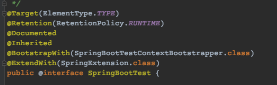
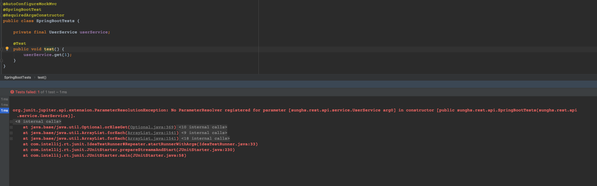
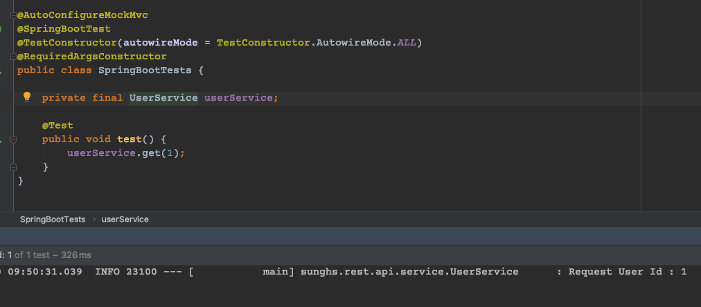
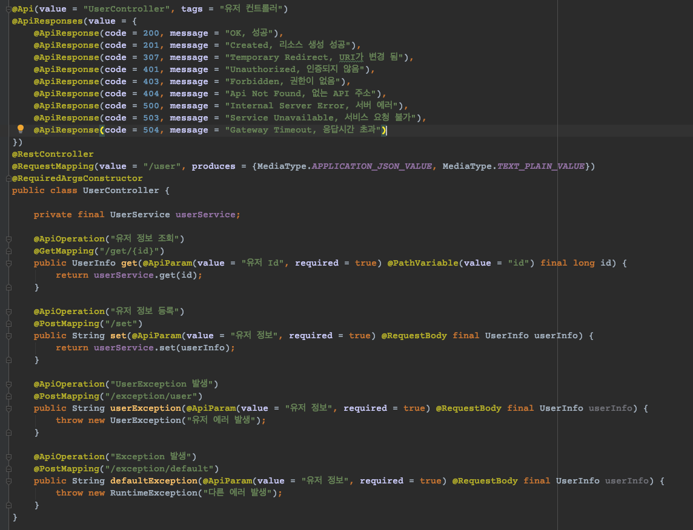
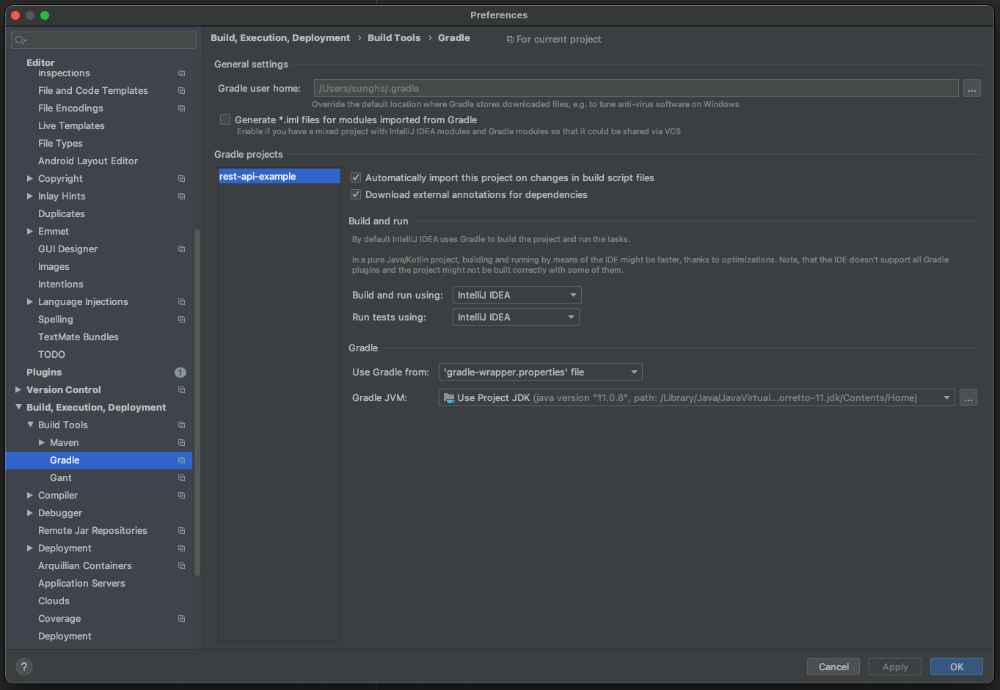

## JUnit 사용법과 TDD (2)
JUnit 5의 dependency 추가 방법과 실행 순서, 기본 annotation에 대한 정리 -> [TDD 정리 1](https://sunghs.tistory.com/134)


## Spring 관련 주요 Test Annotation
JUnit5와 spring-boot-test의 모든 annotation은 아니며 자주 사용되는 Annotation만 소개

***@ExtendWith(Class<? extends Extension> c)***

JUnit 4에서는 @RunWith로 사용되던 어노테이션이 JUnit5에 와서는 ExtendWith로 변경되었다.
ExtendWith 어노테이션은 메인으로 실행 될 class를 직접 지정 할 수 있다.
다만 SpringBootTest가 ExtendWith를 기본으로 채용하면서 @SpringBootTest 어노테이션을 추가하면 자동으로 ExtendWith 어노테이션이 추가된다.



테스트 클래스 위에 어노테이션 설정 시 Spring Application 실행하듯이 실행 된다.

***@AutoConfigureMockMvc***

spring.test.mockmvc 이하 설정을 로드하면서 MockMvc 클래스를 주입시킬 수 있다.
MockMvc 클래스는 REST API 테스트 시 내부에서 GET/POST 등의 호출을 해 볼 수 있는 클래스이다.
MockMvc 클래스 사용 방법은 하단에서 다루도록 한다.

AutoConfigure 어노테이션은 모듈별로 대부분 존재한다.


***@Import(Class<?>[] c)***

필요한 Class들을 Configuration 으로 만들어 사용 할 수 있다. (기존 Configuration 클래스도 땡겨 올 수 있다.)
Configuration Component이므로 내부에 있는 Bean 까지 등록이 가능하다.
Import 된 클래스는 주입으로 사용 가능.

***@Profile***

클래스와 메소드 레벨에서 지정 가능하며, 특정 profile을 주입해서 테스트가 가능하다.

## Autowired에 대해
기존 JUnit4 (5버전에서도 최근 버전을 제외하고는) 에서는 생성자 주입 (Constructor Injection) 방식이 불가능했다. 
생성자 주입 방식을 사용하면 NullPointerException이 발생한다.



이유는 기존 정상 환경 구동시에는 Spring loc 컨테이너가 Parameter Resolver를 가지고 있고 이를 처리하는데, 테스트 시에는 JUnit이 먼저 끼어들어 필요한 빈 주입을 Spring 에 요청하기 때문이다.
[잘 설명이 되어있는 링크](https://minkukjo.github.io/framework/2020/06/28/JUnit-23/)

그래서 대부분은 @Autowired로 서비스 레이어에 주입하거나, @BeforeEach 시작 시점에 직접 주입을 시켜주는 방식을 사용했다.

Spring 5.2.x에 오면서 Test에도 Constructor Injection 방식이 가능하게 끔 Parameter Resolver 구현체가 추가되었다.
바로 TestConstructor 어노테이션이다.

***@TestConstructor***

선언하지 않을 시 생성자 주입에 필요한 Parameter 들을 검색하지 않는다. 반드시 클래스 레벨에서 AutowireMode를 선언해 줘야 한다.
```java
// @Autowired 어노테이션이 없어도 모두 주입
@TestConstructor(autowireMode = TestConstructor.AutowireMode.ALL)
```
선언하지 않을 시 아래와 같이 동작한다.
```java
// @Autowired 있는 애들만 주입 (기본 값)
@TestConstructor(autowireMode = TestConstructor.AutowireMode.ANNOTATED)
```




## MockMvc 테스트
아래 코드는 위 어노테이션을 적용해서 만들어진 클래스
```java
@AutoConfigureMockMvc
@TestConstructor(autowireMode = AutowireMode.ALL)
@SpringBootTest
@RequiredArgsConstructor
public class SpringBootTests {

    private final UserService userService;

    private final MockMvc mockMvc;

    private final ObjectMapper objectMapper;

    @Test
    public void getTest() throws Exception {
        RequestBuilder requestBuilder = MockMvcRequestBuilders.get("/user/get/1")
            .contentType(MediaType.APPLICATION_JSON)
            .accept(MediaType.APPLICATION_JSON, MediaType.TEXT_PLAIN)
            .characterEncoding(StandardCharsets.UTF_8.displayName());

        MockHttpServletResponse response = mockMvc.perform(requestBuilder)
            .andExpect(MockMvcResultMatchers.status().isOk())
            .andExpect(MockMvcResultMatchers.content().contentType(MediaType.APPLICATION_JSON))
            .andReturn()
            .getResponse();
    }

    @Test
    public void postTest() throws Exception {
        UserInfo userInfo = new UserInfo();
        userInfo.setId(100);
        userInfo.setName("sunghs");
        userInfo.setAddress("earth");

        RequestBuilder requestBuilder = MockMvcRequestBuilders.post("/user/set")
            .content(objectMapper.writeValueAsString(userInfo))
            .contentType(MediaType.APPLICATION_JSON)
            .accept(MediaType.APPLICATION_JSON, MediaType.TEXT_PLAIN)
            .characterEncoding(StandardCharsets.UTF_8.displayName());

        mockMvc.perform(requestBuilder)
            .andExpect(MockMvcResultMatchers.status().isOk())
            .andExpect(MockMvcResultMatchers.content().contentType(MediaType.APPLICATION_JSON))
            .andExpect(MockMvcResultMatchers.content().string(HttpStatus.OK.toString()))
            .andReturn()
            .getResponse();
    }

    @Test
    public void injectionTest() {
        userService.get(1);
    }
}
```
테스트 코드는 github 의 [rest-api-example](https://github.com/sunghs/rest-api-example) 소스에 들어있으며 rest-api-example 을 기준으로 테스트 하였다.



### RequestBuilder
Request 요청의 내용을 정의.
예시코드에는 get, post만 했지만 put, patch, head 등 REST Http Method 는 전부 갖춰져있다.  

### TestMvc 의 주요 메소드
***andExpect***

response의 결과를 예측하는 메소드로 ResultMatcher 메소드가 인자로 들어간다.  
andExpect의 결과값과 일치하지 않으면 테스트는 실패한다.  
MockMvcResultMatchers를 static import로 올려 사용할 수도 있으나 위 코드에서 import 문 명세가 안되어 있어서 직접 호출하여 사용하였다.  

***andReturn***

MvcResult 를 반환한다. MvcResult 안에는 `getResponse()` 메소드를 통해 MockHttpServletResponse 객체를 꺼내올 수 있다.  
MockHttpServletResponse 객체에는 실제 return 되는 responseEntity가 들어있다.

***getResponse***

MockHttpServletResponse를 꺼내온다.

## MockMvc 테스트 시 401 unauthorized 발생 시
spring-security를 사용중이라면, test 시 자동 인증이 가능하도록 security-test 를 추가해 줘야 한다.
```
implementation('org.springframework.security:spring-security-test')
```

그리고 test 메소드에 WithMockUser 를 추가 하면 인증에 성공한다.
```java
@Test
@WithMockUser
public void postTest() throws Exception {
    UserInfo userInfo = new UserInfo();
    userInfo.setId(100);
    userInfo.setName("sunghs");
    userInfo.setAddress("earth");

    RequestBuilder requestBuilder = MockMvcRequestBuilders.post("/user/set")
        .content(objectMapper.writeValueAsString(userInfo))
        .contentType(MediaType.APPLICATION_JSON)
        .accept(MediaType.APPLICATION_JSON, MediaType.TEXT_PLAIN)
        .characterEncoding(StandardCharsets.UTF_8.displayName());

    mockMvc.perform(requestBuilder)
        .andExpect(MockMvcResultMatchers.status().isOk())
        .andExpect(MockMvcResultMatchers.content().contentType(MediaType.APPLICATION_JSON))
        .andExpect(MockMvcResultMatchers.content().string(HttpStatus.OK.toString()))
        .andReturn()
        .getResponse();
}
```

## 테스트 시 빌드 에러가 나는경우
인텔리제이의 build and run 을 Gradle 에서 IntelliJ IDEA 로 변경한다.
