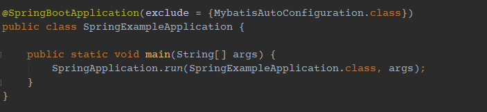
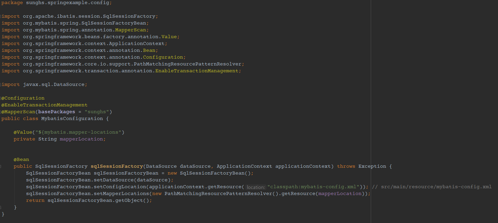

# mybatis 사용 시 xml, interface 경로가 일치해야 하는 문제

springBoot에서 mybatis-spring-boot-starter 를 이용할 때 Data Access Object를 구현하지 않고 인터페이스 자체로 매핑되어 Data Access Object로 이용하는 방식이 있습니다.
하지만 이 방식에서 쿼리 메소드를 가지고 있는 인터페이스 파일과 실제 쿼리문이 담긴 XML 파일의 경로가 같아야 한다는 문제가 있습니다.

예를들어 인터페이스 파일의 패키지 경로가 **sunghs.springexample.mapper.SampleMapper** 라고 한다면,
XML 파일의 경로도 **sunghs.springexample.mapper.SampleMapper** 이어야 한다는 문제 입니다.
(프로젝트 경로로 표현한다면 src/main/resources/sunghs/springexample/mapper/SampleMapper.xml 이어야 한다는 겁니다.)

즉 xml 파일의 패키지 경로가 중간에 하나라도 틀리면 **org.apache.ibatis.binding.BindingException: Invalid bound statement**가 뜨면서 쿼리를 찾지 못했다고 나오죠

|경로|성공여부
--|---|
|src/main/resources/sunghs/springexample/mapper/SampleMapper.xml|성공|
|src/main/resources/sunghs/springexample/SampleMapper.xml|실패|
|src/main/resources/sunghs/mapper/SampleMapper.xml|실패|

## mapper.xml 경로를 자유롭게 가져가는 방법 (해결법)

### 1. MybatisAutoConfiguration 제거
이는 application.yml의 mapperLocation을 자동으로 설정하는 MybatisAutoConfiguration을 먼저 제거해야 합니다.
@SpringBootApplication 이 붙어있는 스프링부트 엔트리포인트의 설정값으로 제외할 수 있습니다.


### 2. yml 또는 properties에 위치 설정
mybatis.mapper-locations 값을 설정합니다. antPathPattern을 사용하므로, 루트패키지 아래 와일드카드로 명시하면 모든 경로를 재귀탐색해서 매퍼를 가져옵니다.

**application.yml 기준**

```yml
mybatis:
  mapper-locations: classpath*:sunghs/**/*.xml
```
이렇게하면 `src/main/resources/sunghs/` 아래 있는 모든 xml 파일을 가져옵니다.

그리고 /** 은 디렉토리를 나타내므로, 서브 디렉토리가 없다면  `classpath*:sunghs/*.xml` 로 표현하면 됩니다.

참고로 이건 안됩니다.

```yml
mybatis:
  mapper-locations: classpath:sunghs/**/*.xml
```

classpath 와 classpath*는 다르게 인식합니다.

### 3. mybatis configuration 설정
DataSource 자동 설정을 해제했으니 직접 설정해줘야 합니다.

DataSource 설정은 다른 예제가 많으니 sqlSessionFactory에 어떻게 mapperLocation을 설정하는지만 보면 됩니다.

추가적인 mybatis-config 파일이 있다면 같이 등록해 주면 됩니다. mybatis에서 camelCase 등을 사용하기 위해 보통 config.xml 파일이 하나 생성되는 편입니다.



이렇게 설정이 완료되었다면 mapper.xml 파일의 위치가 꼭 interface mapper 파일의 패키지 경로와 동일하지 않아도 정상적으로 인식됩니다.


## 참조
[mybatis 공식 레퍼런스](https://mybatis.org/spring/ko/mappers.html)

[스택오버플로우](https://stackoverflow.com/questions/30253696/why-must-the-interface-and-xml-mapper-file-be-in-same-package-and-have-the-same)
