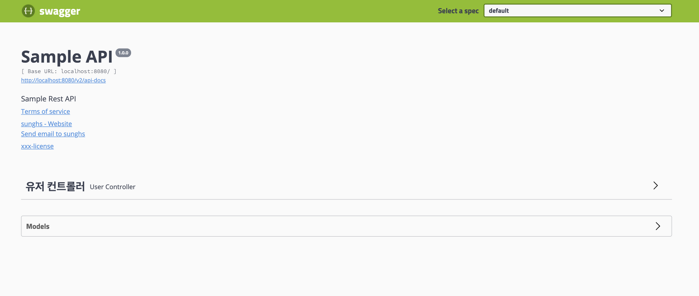
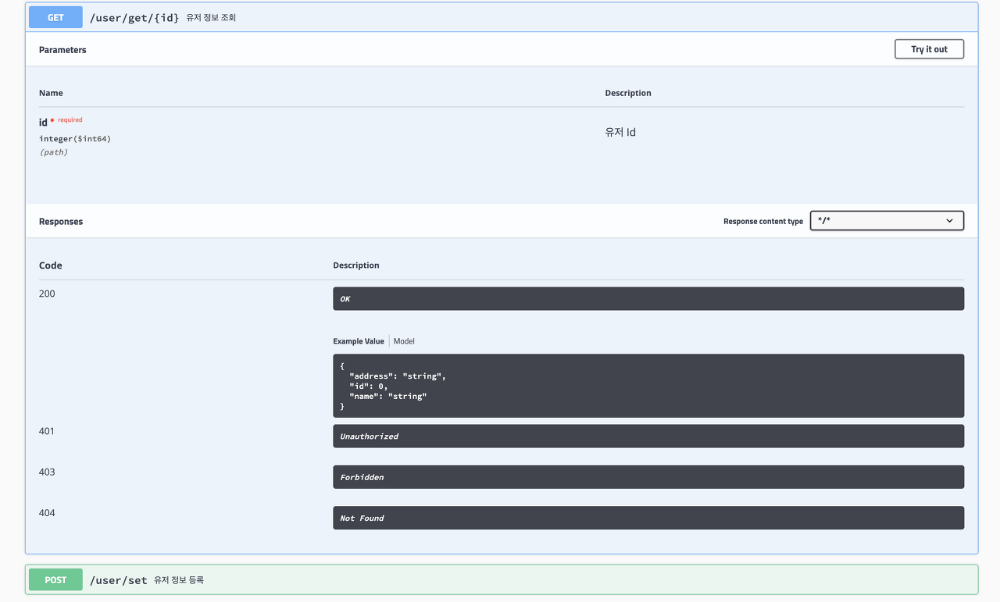
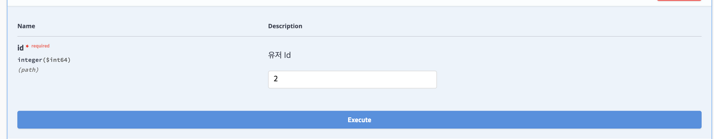
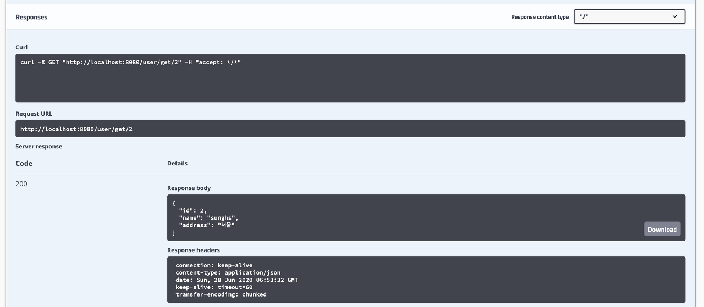
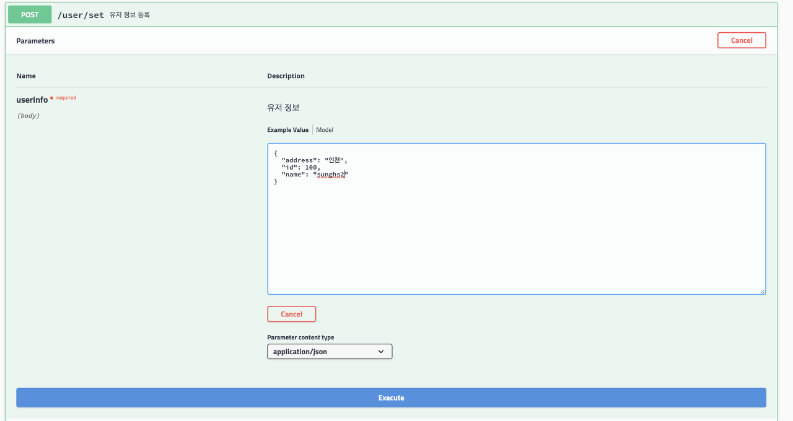
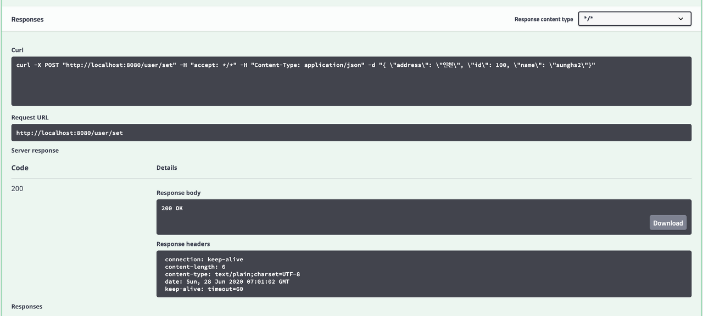
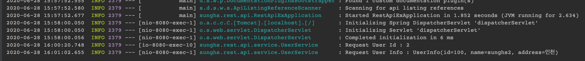

## REST API 개발하기 1 - 프로젝트 생성 및 Swagger2 연동

[GitHub 소스](https://github.com/sunghs/rest-api-example)


### REST API란
[REST API란?](https://ko.wikipedia.org/wiki/REST)

[URL 디자인 가이드는 여기를 참조함.](https://docs.microsoft.com/ko-kr/azure/architecture/best-practices/api-design)

### SWAGGER란
WEB API의 기능을 자동으로 문서화 해주는 라이브러리.

기존 API 기능을 PostMan등을 통해 테스트 해야 했다면, 그러한 불편한 과정을 전부 없애준다.

API 기능 request, response가 전부 가능하며, 기능 별 정리 및 model 명세서까지 전부 화면에서 확인이 가능하다.

### 프로젝트 생성 환경
- Spring Boot 2.3.1
- Gradle 6.4.1
- Java 11 (amazon-corretto 11)
- Lombok

### 1. Spring Initializer로 프로젝트를 생성하고 build.gradle에 아래 dependency를 추가

```xml
implementation 'org.springframework.boot:spring-boot-starter-web'
```

### 2. 그리고 Swagger2를 사용하기 위해 아래 4개도 추가
```xml
implementation('io.springfox:springfox-swagger2:2.9.2')
implementation('io.springfox:springfox-swagger-ui:2.9.2')
implementation("io.swagger:swagger-annotations:1.5.21")
implementation("io.swagger:swagger-models:1.5.21")
```
현재 최신버전은 2.10.5이지만 usages가 가장 높은 2.9.2 버전으로 설정한다.

사용에 지장은 없으나 swagger-ui.html 진입시 For InputString Exception이 발생하는 경우가 있는데, swagger-annotations과 swagger-models dependency를 이전 버전을 사용하면 에러가 발생하지 않아 추가해준다.

### 3. Swagger 설정
SwaggerConfig 라는 클래스를 하나 만들고 아래와 같이 세팅
```java
@Configuration
@EnableSwagger2
public class SwaggerConfig {

    @Bean
    public Docket docket() {
        return new Docket(DocumentationType.SWAGGER_2)
                .select()
                .apis(RequestHandlerSelectors.basePackage("sunghs.rest.api"))
                .paths(PathSelectors.any())
                .build()
                .apiInfo(apiInfo());
    }

    private ApiInfo apiInfo() {
        return new ApiInfo(
                "Sample API",
                "Sample Rest API",
                "1.0.0",
                "https://sunghs.service.example.com",
                new Contact("sunghs", "https://sunghs.tistory.com", "sunghs@example.com"),
                "xxx-license",
                "https://license.example.com",
                new ArrayList<>()
        );
    }
}
```
~~블로그 URL 빼고는 다 없는 URL이다..~~

RequestHandlerSelectors.basePackage 밑에 있는 api 기능을 스캔한다.

프로젝트 별로 패키지 명이 달라질 수 있으므로 자기 프로젝트에 맞는 base package를 선언하면 된다.

apiInfo는 해도 되고 안해도 된다. (Optional)

하게 된다면 생성자에서 필요로 하는 모든 내용을 작성해야 한다. (not null)

```java
/**
   * Default contstructor
   * @param title title
   * @param description description
   * @param version version
   * @param termsOfServiceUrl termsOfServiceUrl
   * @param contact contact
   * @param license license
   * @param licenseUrl license url
   * @param vendorExtensions vendor extensions
   */
public ApiInfo(
    String title,
    String description,
    String version,
    String termsOfServiceUrl,
    Contact contact,
    String license,
    String licenseUrl,
    Collection<VendorExtension> vendorExtensions) {
    this.title = title;
    this.description = description;
    this.version = version;
    this.termsOfServiceUrl = termsOfServiceUrl;
    this.contact = contact;
    this.license = license;
    this.licenseUrl = licenseUrl;
    this.vendorExtensions = newArrayList(vendorExtensions);
}
```

### 샘플로 회원정보를 조작하는 API 를 만든다.

### 4. Model 생성
UserInfo 라는 모델을 하나 생성한다.
```java
@Data
public class UserInfo {

    private long id;

    private String name;

    private String address;
}
```
Lombok을 이용해 getter, setter, toString을 위임한다.


### 5. RestService 생성
Controller에서 비즈니스 로직을 처리 할 UserService를 하나 만든다.
```java
@RequiredArgsConstructor
@Service
@Slf4j
public class UserService {

    /**
     * 유저 정보 조회
     * @param id 유저 id
     * @return UserInfo
     */
    public UserInfo get(final long id) {
        log.info("Request User Id : {}", id);
        // TODO storage에서 Data를 가져오는 로직..
        UserInfo userInfo = new UserInfo();
        userInfo.setId(id);
        userInfo.setName("sunghs");
        userInfo.setAddress("서울");
        return userInfo;
    }

    /**
     * 유저 생성
     * @param userInfo 생성할 유저 정보
     * @return HttpStatus
     */
    public String set(final UserInfo userInfo) {
        log.info("Request User Info : {}", userInfo.toString());
        // TODO insert 로직..
        return HttpStatus.OK.toString();
    }
}
```
현재는 DB 연결이 따로 없어서 로깅만 하고 response 하도록 구현한다.


### 6. RestContoller 생성
Rest API의 Controller를 하나 만든다.
```java
@Api(value = "UserController", tags = "유저 컨트롤러")
@RestController
@RequestMapping("/user")
@RequiredArgsConstructor
public class UserController {

    private final UserService userService;

    @ApiOperation("유저 정보 조회")
    @GetMapping("/get/{id}")
    public UserInfo get(@ApiParam(value = "유저 Id", required = true) @PathVariable(value = "id") final long id) {
        return userService.get(id);
    }

    @ApiOperation("유저 정보 등록")
    @PostMapping("/set")
    public String set(@ApiParam(value = "유저 정보", required = true) @RequestBody final UserInfo userInfo) {
        return userService.set(userInfo);
    }
}
```

각종 Annotation 설명
- Api : 컨트롤러의 설명이다. tags의 설명이 swagger-ui에서 보이게 된다.
- RestController : Rest형태의 컨트롤러로 사용하겠다고 선언한다. spring-boot-starter-web의 annotation이다.
- RequestMapping : 해당 Controller의 매핑 URL이다. domain/user/** 로 접근하는 모든 request는 UserController로 매핑된다.

- ApiOperation : 메소드의 기능을 설명한다. swagger-ui에서 보이게 된다.
- PostMapping, GetMapping, (DeleteMapping, PutMapping) : RequestMethod를 설정함과 동시에 URL 매핑을 정의한다. 예를 들어 PostMapping인 경우 Post Method로 요청을 해야 진입된다.
- ApiParam : swagger-ui에서 보여줄 파라미터가 무슨 역할을 하는지 정보이다. Rest에서 필요한 기능은 아니며 swagger를 쓰지않으면 필요없다.
- PathVariable : URL에서 변수처리를 해줄 annotation이다. URL 정보 자체를 메소드의 파라미터로 받아올 때 사용한다. 변수처리 할 URL을 {}로 감싸고, {}안의 키값을 PathVariable의 value 요소로 넣으면, 해당 annotation에 바인딩 된 파라미터에 매핑된다.
- RequestBody : Request는 Header와 Body로 구성되는데 이 때 Body를 통째로 매핑 할 파라미터를 지정한다. @RequestBody final UserInfo userInfo 인 경우, Request의 JSON 데이터를 전부 UserInfo 클래스에 스프링 MVC가 Jackson을 이용해 매핑시킨다.

### 구동
별다른 설정을 하지 않았으면 진입 주소는 http://localhost:8080/swagger-ui.html 이다.


### 초기화면

아래 유저 컨트롤러를 누르면 기능이 두개가 나온다. 그중 유저 정보 조회 기능을 눌러본다.

### GET 테스트

우측 상단에 Try it out이 있다. 누르면 파라미터를 넣는 창이 나온다.


값을 넣고 아래 execute를 누르면 하단에 response가 날아온다.



### POST 테스트
Request


Response


아래는 서버에 남은 로그, 실제로 Controller를 타고 넘어온 것이 보임.


