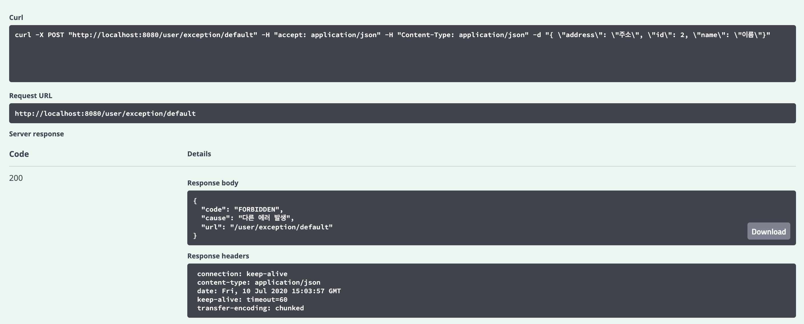

## REST API 개발하기 2 - ControllerAdvice, ExceptionHandler

[GitHub 소스](https://github.com/sunghs/rest-api-example)

ControllerAdvice 및 ExceptionHandler는 클라이언트에서 우리 API로 요청이 들어왔을 때, 에러가 발생한다면 어떻게 핸들링 할지에 대한 처리.

두 어노테이션은 하는 역할은 같지만, scope에 차이가 있는데,
1. ExceptionHandler는 Exception마다 어떻게 처리할지에 대해 메소드 레벨에 선언하는 어노테이션이다.
2. ControllerAdvice는 모든 컨트롤러에서 Exception이 발생한다면 핸들링을 담당할 핸들링 전용 Controller에 선언하는 어노테이션이다.

### Exception을 처리할 UserControllerAdvice를 만든다.
```java
package sunghs.rest.api.advice;

import java.nio.charset.StandardCharsets;
import javax.servlet.http.HttpServletRequest;
import lombok.extern.slf4j.Slf4j;
import org.springframework.http.HttpHeaders;
import org.springframework.http.HttpStatus;
import org.springframework.http.MediaType;
import org.springframework.web.bind.annotation.ExceptionHandler;
import org.springframework.web.bind.annotation.RestControllerAdvice;
import sunghs.rest.api.exception.UserException;
import sunghs.rest.api.model.ExceptionInfo;

@RestControllerAdvice
@Slf4j
public class UserControllerAdvice {

    @ExceptionHandler(Throwable.class)
    public ExceptionInfo defaultHandler(HttpServletRequest request, Throwable t) {
        HttpHeaders httpHeaders = new HttpHeaders();
        MediaType mediaType = new MediaType(MediaType.APPLICATION_JSON, StandardCharsets.UTF_8);
        httpHeaders.setContentType(mediaType);

        ExceptionInfo info = new ExceptionInfo();
        info.setCause(t.getMessage());
        info.setCode(HttpStatus.FORBIDDEN);
        info.setUrl(request.getRequestURI());

        return info;
    }

    @ExceptionHandler(UserException.class)
    public ExceptionInfo userHandler(HttpServletRequest request, UserException u) {
        HttpHeaders httpHeaders = new HttpHeaders();
        MediaType mediaType = new MediaType(MediaType.APPLICATION_JSON, StandardCharsets.UTF_8);
        httpHeaders.setContentType(mediaType);

        ExceptionInfo info = new ExceptionInfo();
        info.setCause(u.getMessage());
        info.setCode(HttpStatus.OK);
        info.setUrl(request.getRequestURI());

        return info;
    }
}
```

### ControllerAdvice
클래스 상단의 @RestControllerAdvice의 의미가 이 클래스가 Controller로부터 발생한 모든 Exception을 잡아 끌고 오겠다는 의미이다. 

RestControllerAdvice는 value를 가질 수 있는데, package의 선언이 가능하다.  
즉 @RestControllerAdvice("sunghs.rest.api.user")와 같이 선언하면 sunghs.rest.api.user 패키지 안에서 일어나는 Controller 들의 Exception만 포착한다.

어노테이션을 보면 RestControllerAdvice와 ControllerAdvice 두개가 있는데, Rest가 붙은 어노테이션은 ResponseBody의 역할을 같이 수행하므로, 결과물로 response 응답이 가능하다. (return 하는 즉시 해당 객체가 responseBody로 시리얼라이즈 된다.)

일반적인 ControllerAdvice는 웹MVC와 같은 곳에서 URL 리졸버 등에 의해 처리 될 데이터를 받아 핸들링한다.

### ExceptionHandler
이제 이 Exception을 받아서 처리 할 메소드를 구현한다. Exception 별로 메소드를 구현 할 수 있으며, override가 가능하다.

위에서 모든 Throwable 타입의 예외는 defaultHandler를 타서 FORBIDDEN status를 response하게 되어있으나, 아래 RuntimeException을 상속받아 구현 한 UserException은 userHandler를 타서 200 OK를 response 하게 된다.


### UserException의 모양
```java
package sunghs.rest.api.exception;

public class UserException extends RuntimeException {

    public UserException(final String msg) {
        super("userException : " + msg);
    }
}
```

### ResponseBody가 되어 줄 ExceptionInfo
```java
package sunghs.rest.api.model;

import lombok.Data;
import org.springframework.http.HttpStatus;

@Data
public class ExceptionInfo {

    private HttpStatus code;

    private String cause;

    private String url;
}
```

### 이제 Controller 또는 Service 등에서 의도적으로 Exception을 발생시킨다.
```java
@ApiOperation("UserException 발생")
@PostMapping("/exception/user")
public String userException(@ApiParam(value = "유저 정보", required = true) @RequestBody final UserInfo userInfo) {
    throw new UserException("유저 에러 발생");
}

@ApiOperation("Exception 발생")
@PostMapping("/exception/default")
public String defaultException(@ApiParam(value = "유저 정보", required = true) @RequestBody final UserInfo userInfo) {
    throw new RuntimeException("다른 에러 발생");
}
```

UserController에 두개 추가한다.
예상대로라면 userException은 200 OK를 반환할 것이고, defaultException은 FORBIDDEN을 반환 해야 한다.

### 테스트
#### UserException 테스트


#### 그외 다른 Exception 테스트

