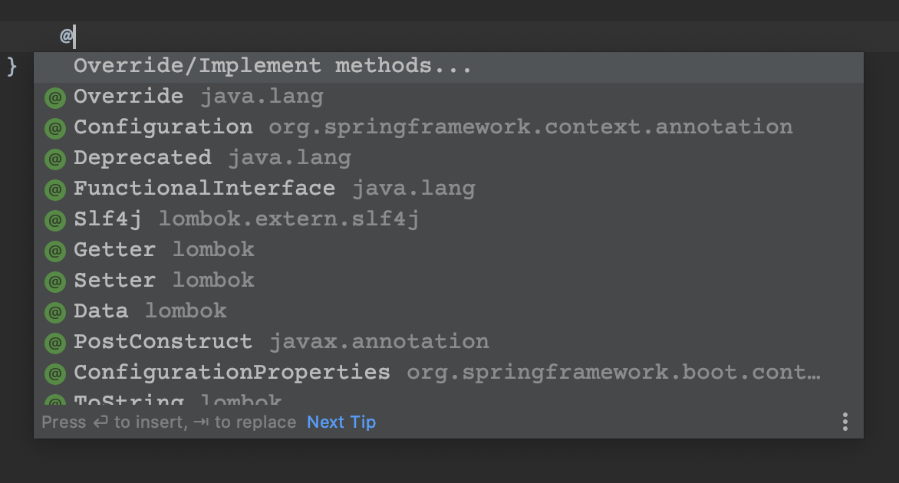

## REST API 개발하기 3 - Root 경로 설정

[GitHub 소스](https://github.com/sunghs/rest-api-example)

root 경로를 입력했을 때 redirect 시킬 수 있다.

예를 들어 http://localhost:8080/ 을 입력하게 되면 아무페이지도 나오지 않던가, tomcat과 같은 WAS를 사용하게 되면 컨테이너의 루트 페이지가 보이게 되는데, 이걸 redirect 시킨다.

REST API이니 swagger-ui 페이지로 보일 수 있도록 구성한다.


Config 패키지가 있다면 그곳에 설정 클래스를 만들고 WebMvcConfigurer를 구현한다.

### WebConfig
```java
package sunghs.rest.api.config;

import org.springframework.context.annotation.Configuration;
import org.springframework.web.servlet.config.annotation.ViewControllerRegistry;
import org.springframework.web.servlet.config.annotation.WebMvcConfigurer;

@Configuration
public class WebConfig implements WebMvcConfigurer {

    @Override
    public void addViewControllers(ViewControllerRegistry registry) {
        registry.addViewController("/").setViewName("redirect:/swagger-ui.html");
    }
}
```

Java 버전이 올라가면서 interface에서 default 메소드를 구현할 수 있어서 실제로는 아무것도 구현하지 않아도 오류가 나지 않는다. 그래서 뭘 구현할지 찾아서 구현해야 한다.

addViewControllers 메소드는 특정 경로로 들어왔을 때 view를 설정할 수 있는 메소드이다.

### IntelliJ에서 메소드 찾기
인터페이스를 상속받은 상태라면 @를 입력해서 구현 할 메소드를 가져올 수 있다.


맨 위에 Override.Implement methods... 를 누르면 메소드 목록이 나온다.


### 테스트
이후 http://localhost:8080을 입력하면 swagger 페이지로 이동된다.