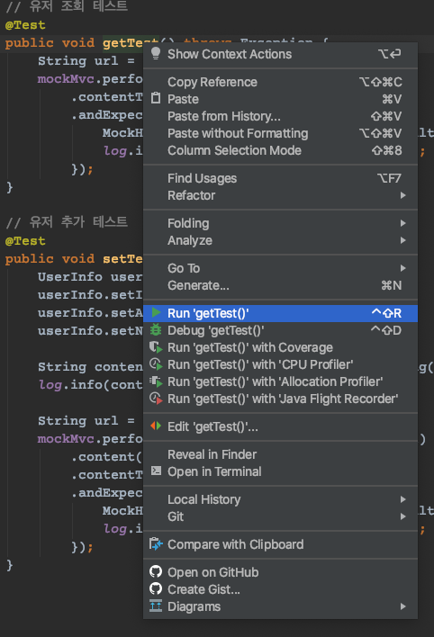
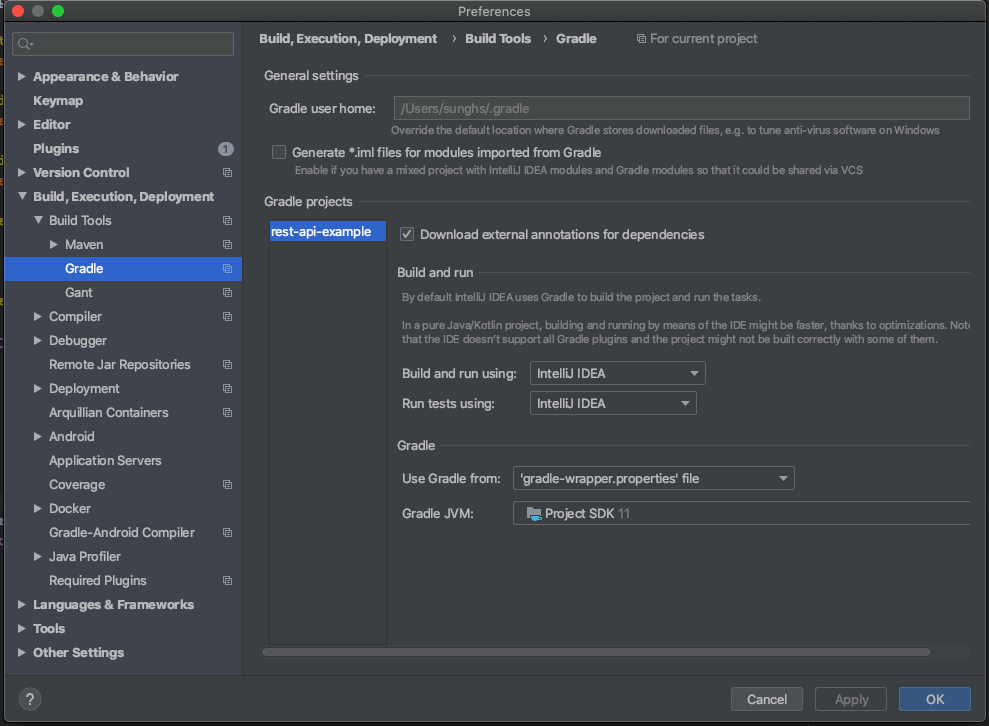

## REST API 개발하기 4 - JUnit 테스트

[GitHub 소스](https://github.com/sunghs/rest-api-example)

test 패키지에서 사용할 수 있도록 spring-boot-starter-test를 implementation으로 바꿔준다.

```
dependencies {
    implementation('org.projectlombok:lombok')
    annotationProcessor('org.projectlombok:lombok')

    implementation('org.springframework.boot:spring-boot-starter')
    implementation('org.springframework.boot:spring-boot-starter-web')

    // swagger2
    implementation('io.springfox:springfox-swagger2:2.9.2')
    implementation('io.springfox:springfox-swagger-ui:2.9.2')
    implementation("io.swagger:swagger-annotations:1.5.21")
    implementation("io.swagger:swagger-models:1.5.21")

    implementation('org.springframework.boot:spring-boot-starter-test')
}
```
SpringBoot 구조를 만들면 기본적으로 Test 클래스가 포함되어 있다. (네이밍룰은 프로젝트 명 + Application + Tests)  

기본으로 만들어진 클래스를 사용하거나 새로 만들어도 된다.  

테스트 클래스 위에는 기본적으로 어노테이션 3개가 필요하다.

#### @AutoConfigureMockMvc
MockMvc를 사용하기 위한 설정을 자동으로 주입해준다. (REST 관련 어노테이션)
#### @RunWith
JUnit으로 실행하지 않고, 선언한 클래스로 진입점을 정의한다.
#### @SpringBootTest
테스트 클래스임을 스프링에 알려준다. 스프링은 이 어노테이션을 가지고 실제 구동환경과 같은 context를 load한다.

### 테스트 클래스
```java
@AutoConfigureMockMvc
@NoArgsConstructor
@RunWith(SpringJUnit4ClassRunner.class)
@Slf4j
@SpringBootTest
public class RestApiExApplicationTests {

    @Autowired
    private MockMvc mockMvc;

    @Autowired
    private ObjectMapper objectMapper;

    @BeforeAll
    static void beforeAll() {
    }

    @BeforeEach
    public void beforeEach() {
        objectMapper = Jackson2ObjectMapperBuilder.json()
            .featuresToDisable(SerializationFeature.WRITE_DATES_AS_TIMESTAMPS)
            .modules(new JavaTimeModule())
            .build();
    }

    // 유저 조회 테스트
    @Test
    public void getTest() throws Exception {
        String url = "/user/get/1";

        mockMvc.perform(MockMvcRequestBuilders.get(url)
            .contentType(MediaType.APPLICATION_JSON))
            .andExpect(result -> {
                MockHttpServletResponse response = result.getResponse();
                log.info(response.getContentAsString());
            });
    }

    // 유저 추가 테스트
    @Test
    public void setTest() throws Exception {
        String url = "/user/set";
        UserInfo userInfo = new UserInfo();
        userInfo.setId(1);
        userInfo.setAddress("서울");
        userInfo.setName("name");

        String content = objectMapper.writeValueAsString(userInfo);
        log.info(content);

        mockMvc.perform(MockMvcRequestBuilders.post(url)
            .content(content)
            .contentType(MediaType.APPLICATION_JSON))
            .andExpect(result -> {
                MockHttpServletResponse response = result.getResponse();
                log.info(response.getContentAsString());
            });
    }
}
```

MockMvc는 HttpClient와 비슷한 request와 response를 해주는 JUnit 객체이고, 

BeforeAll과 BeforeEach Annotation은 JUnit Annotation인데 테스트 이전에 실행할 작업을 선언하는 메소드를 알려주는 것이다.

BeforeAll과 BeforeEach는 실행시점과 scope가 조금 다르다.

테스트는 다른 포스팅에서 다루도록 하고..

ObjectMapper는 Spring의 Rest Serialize, Deserialize를 기본적으로 Jackson이 하므로, Gson 대신 동일한 환경을 만들기 위해 선언되었다.

### IntelliJ 기준 테스트 할 메소드 명에 우클릭 -> run을 누르면 실행 할 수 있다.


그런데 lombok을 사용중이라면 이런에러가 뜰 수도 있다.
```
/Users/sunghs/PROJECT/rest-api-example/src/test/java/sunghs/rest/api/RestApiExApplicationTests.java:55: error: cannot find symbol
                log.info(response.getContentAsString());
                ^
  symbol:   variable log
  location: class RestApiExApplicationTests
1 error
FAILURE: Build failed with an exception.
* What went wrong:
Execution failed for task ':compileTestJava'.
> Compilation failed; see the compiler error output for details.
* Try:
```
annotation processor를 gradle이 처리해서 그렇다. 

인텔리제이라면 preference > Build, Execution, Deployment > Build Tools > Gradle 에서

Build and run using 및 Run tests using을 IntelliJ IDEA로 변경하면 된다.



### 테스트
```
INFO 13595 --- [           main] s.rest.api.RestApiExApplicationTests : {"id":1,"name":"name","address":"서울","userLog":null,"addData":null}
INFO 13595 --- [           main] sunghs.rest.api.service.UserService : Request User Info : UserInfo(id=1, name=name, address=서울, userLog=null, addData=null)
INFO 13595 --- [           main] s.rest.api.RestApiExApplicationTests : 200 OK
```