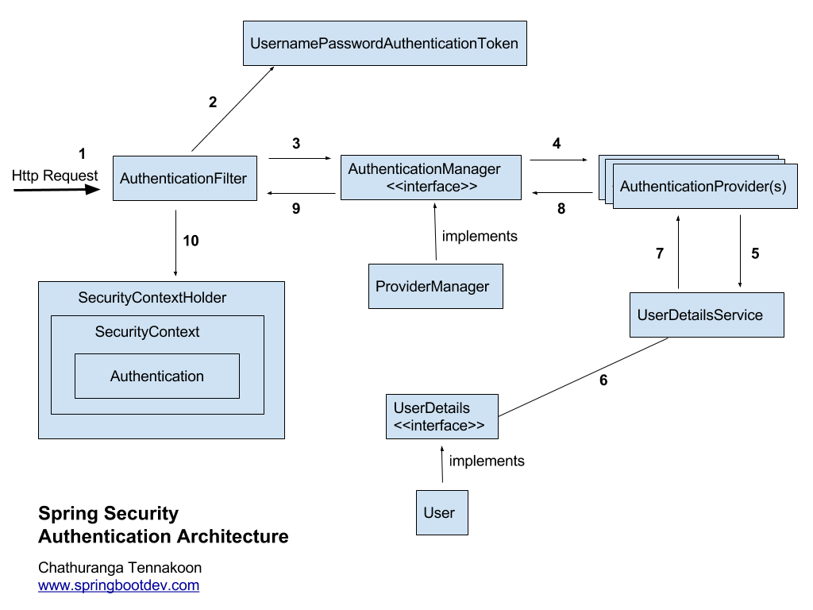

## REST API 개발하기 5 - Spring Security 설정

[GitHub 소스](https://github.com/sunghs/rest-api-example)

swagger-ui 페이지에 대해 접근 권한을 부여하도록 Spring Security 설정을 한다.


Spring Security는 위와 같이 흐름을 타는데 나머지는 Spring Security에 기본으로 구현되어 있는 구현체를 사용하고, WebSecurity를 재정의해서 사용할 수 있는 WebSecurityConfigurerAdapter 클래스를 재정의해서 사용한다. 

Spring Security는 기본 기능 자체는 막강하지만 실제로 입맛대로 재정의해서 사용해야 하는경우 생각보다 손을 대야하는 부분이 많기 때문에 최대한 기본기능 내에서 사용 할 수 있도록 구현해본다.

### spring-security 추가를 위한 build.gradle
```
implementation('org.springframework.boot:spring-boot-starter-security')
```
JWT 및 OAuth등을 제외한 시큐리티 기본 기능만 사용한다면 dependency는 하나만 필요하다.
버전을 뒤에 명시하지 않는다면 spring boot starter의 버전을 따르게 된다.

### WebSecurity를 재정의 할 Config 를 하나 만든다.
예제 클래스명은 대충 SecurityConfig 정도로 지었다.
WebSecurityConfigurerAdapter를 상속받아 재정의한다.
```java
import lombok.RequiredArgsConstructor;
import lombok.extern.slf4j.Slf4j;
import org.springframework.context.annotation.Configuration;
import org.springframework.security.config.annotation.authentication.builders.AuthenticationManagerBuilder;
import org.springframework.security.config.annotation.web.builders.HttpSecurity;
import org.springframework.security.config.annotation.web.configuration.EnableWebSecurity;
import org.springframework.security.config.annotation.web.configuration.WebSecurityConfigurerAdapter;
import org.springframework.security.crypto.factory.PasswordEncoderFactories;
import org.springframework.security.crypto.password.PasswordEncoder;

@Configuration
@EnableWebSecurity
@RequiredArgsConstructor
@Slf4j
public class SecurityConfig extends WebSecurityConfigurerAdapter {

    @Override
    protected void configure(AuthenticationManagerBuilder auth) throws Exception {
        PasswordEncoder passwordEncoder = PasswordEncoderFactories.createDelegatingPasswordEncoder();
        
        auth.inMemoryAuthentication()
            .withUser("sunghs")
            .password(passwordEncoder.encode("1234"))
            .roles("ADMIN", "USER")
            .and()
            .withUser("user")
            .password(passwordEncoder.encode("2345"))
            .roles("USER");
    }

    @Override
    protected void configure(HttpSecurity http) throws Exception {
        http.authorizeRequests()
            .antMatchers("/swagger-ui.html").hasAnyAuthority("USER", "ADMIN")
            .antMatchers("/admin/**").hasAuthority("ADMIN")
            .anyRequest()
            .authenticated()
            .and()
            .csrf()
            .disable()
            .httpBasic();
    }
}
```

#### EnableWebSecurity
해당 어노테이션을 추가해야 spring boot web application 실행 시 spring-security가 적용된다.

가장 간단하게 spring-security의 성능을 재정의하는 방법으로는 두가지 메소드를 구현하면 되는데
하나는 **사용자 권한 관련 인증 (protected void configure(AuthenticationManagerBuilder auth))** 재정의고 하나는 **URL 접근관련 인증 (protected void configure(HttpSecurity http))** 이다.

보통 두가지는 같이 가게 되는데 접근관련 인증에서 URL 별로 접근 가능한 권한을 줄 수 있기 떄문이다.

### protected void configure(AuthenticationManagerBuilder auth)
파라미터인 auth를 재정의 하면 된다.
대표적인 방법으로는 
- 접속할 수 있는 사용자를 미리 메모리에 정해놓는 방식
- JDBC로 DB에 가서 가져오는 방식
- Provider에 위임해서 Token을 발급하는 방식
이 있는데

그중에 JDBC를 제외하고 메모리, Provider 방식을 구현해본다.
Provider에서도 JDBC에 붙어서 가져올 수 있기 때문이기도 해서 확장성이 넓다.

#### 메모리에 올리는 권한 설정
```java
auth.inMemoryAuthentication()
    .withUser("sunghs")
    .password(passwordEncoder.encode("1234"))
    .roles("ADMIN", "USER")
    .and()
    .withUser("user")
    .password(passwordEncoder.encode("2345"))
    .roles("USER");
```
위와 같이 코드를 작성하면 실제로 web에 접근 가능한 id는
ADMIN, USER 권한을 가진 sunghs / 1234
USER 권한만 가진 user / 2345
두 가지 아이디만 생기게 된다.

#### Provider에 넘기는 권한 설정
AuthenticationProvider 클래스를 구현한 구현체에 권한 인증을 넘기는 방식이다.
```java
// autowired 또는 생성자 주입 방식
private final AuthenticationProvider userAuthenticationProvider;

@Override
protected void configure(AuthenticationManagerBuilder auth) throws Exception {
    auth.authenticationProvider(userAuthenticationProvider);
}
```

#### AuthenticationProvider 구현체 bean
```java
import java.util.ArrayList;
import java.util.List;
import lombok.extern.slf4j.Slf4j;
import org.springframework.security.authentication.AuthenticationProvider;
import org.springframework.security.authentication.UsernamePasswordAuthenticationToken;
import org.springframework.security.core.Authentication;
import org.springframework.security.core.AuthenticationException;
import org.springframework.security.core.GrantedAuthority;
import org.springframework.security.core.authority.SimpleGrantedAuthority;
import org.springframework.stereotype.Component;

@Component
@Slf4j
public class UserAuthenticationProvider implements AuthenticationProvider {

    @Override
    public Authentication authenticate(Authentication authentication) throws AuthenticationException {
        String name = authentication.getName();
        String password = authentication.getCredentials().toString();

        if(name.equals("sunghs") && password.equals("1234")) {
            List<GrantedAuthority> authorities = new ArrayList<>();
            authorities.add(new SimpleGrantedAuthority("ROLE_ADMIN"));
            authorities.add(new SimpleGrantedAuthority("ROLE_USER"));
            return new UsernamePasswordAuthenticationToken(name, password, authorities);
        } else {
            return null;
        }
    }

    @Override
    public boolean supports(Class<?> authentication) {
        return authentication.equals(UsernamePasswordAuthenticationToken.class);
    }
}
```
Authentication에는 사용자가 로그인 폼 등에서 입력한 id와 password가 들어있다.
auth.jdbcAuthentication()을 사용하지 않아도, 실제 이곳에서 DB 쿼리 방식으로 조회해서 확인 할 수 있다.

스프링 시큐리티에는 DB 조회 방식의 기본 인터페이스도 제공하는데 유저 정보가 들어있는 UserDetails, 유저 정보 조회 등에 관련된 서비스인 UserDetailsService가 있긴한데, 웹사이트 방식이 아닌 REST 방식이라면 크게 사용 빈도가 높진 않을 것 같다.

public boolean supports(Class<?> authentication) 메소드는 true/false를 반환하는데,
Token을 발급 받았는지에 대한 여부를 확인한다. 여기서 true를 반환하면 로그인에 성공한다.
따라서 sunghs / 1234 계정 이외에는 authenticate 메소드에서 null을 뱉고 supports가 false를 반환하여 로그인 할 수 없다.


### protected void configure(HttpSecurity http)
URL 요청 방식에 대해 권한을 설정한다.
```java
@Override
protected void configure(HttpSecurity http) throws Exception {
    http.authorizeRequests()
        .antMatchers("/swagger-ui.html").hasAnyAuthority("USER", "ADMIN")
        .antMatchers("/admin/**").hasAuthority("ADMIN")
        .anyRequest()
        .authenticated()
        .and()
        .csrf()
        .disable()
        .httpBasic();
}
```
위 코드와 같이 설정 되어있다면
- /swagger-ui.html URL은 USER 또는 ADMIN 권한이 있는 사람만
- /admin/ 아래 있는 모든 URL에 관해서는 ADMIN 권한이 있는 사람만 (USER만 가진사람은 불가능)

이런식으로 설정 가능 할 수 있다.

**REST가 아닌 화면이 있는 웹이라면, 로그인 시 이동할 URL, 로그아웃 시 이동할 URL 등의 자세한 설정도 가능하다.**
REST에서는 굳이 설정 할 필요가 없어 뺐다.
또한 spring-security는 기본적으로 csrf 공격을 방어하기 때문에 .csrf().disable()을 통해 끌 수 있다. (기본값 enable)

### ADMIN과 USER 등의 권한 관계
권한 별로 상하 관계는 없다. (예를들어 ADMIN이 USER보다 높다던지)

권한 별로 역할이 존재하기 때문에 권한 부여 체계가 List로 되어 있어 관리자 급의 높은 권한은 모든 ROLE을 부여 받는 형태로 가야한다.

이전 security 버전에는 ROLE_이 prefix로 반드시 있어야 했던 것 같은데, 지금은 필요하지 않은 듯 하다. 

> 예) 사용자 별 권한
* 관리자가 받는 권한 : admin, manager, user
* 부분 관리자가 받는 권한 : manager, user
* 일반 사용자가 받는 권한 : user
* 차단된 사용자가 받는 권한 : blocked
* 장기 미사용자가 받는 권한 : disabled
* 삭제된 사용자가 받는 권한 : deleted

이렇게 된다면 URL 별 역할은 대충 이렇게 될 것이다.
> 예) URL 별 권한
* 슈퍼관리자 페이지(/admin/**) = admin
* 부분 관리자 페이지 (/manager/**) = admin, manager
* 그 외 페이지 = admin, manager, user
* 차단 페이지로 이동 = blocked
* 아이디 없다는 alert 및 redirect 이벤트 = deleted
* 휴면 해제 페이지 이동 = disabled

등으로 이름은 원하는 대로 지어주면 된다.