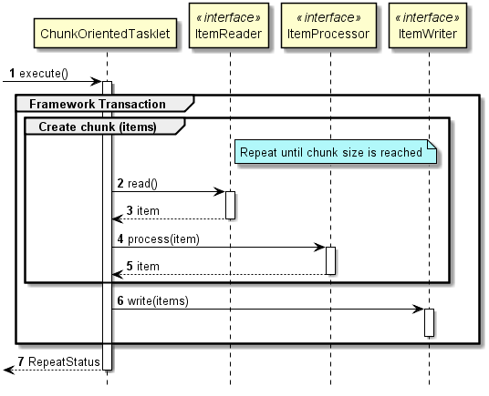

## [SPRING BOOT] 스프링부트로 개발하기 10 - Batch Chunk 처리

스프링부트에서 기존 SpringBatch 기능을 구현할 수 있다. 
스프링 배치 기존 처리방법이 Tasklet, Chunk (Reader, Processor, Writer) 방식이 존재하는데 Chunk 처리를 구현해본다.

---
### Spring Batch Chunk의 구동원리

사진출처 : https://terasoluna-batch.github.io/guideline/5.0.1.RELEASE/en/Ch02_SpringBatchArchitecture.html

---

### Dependency 추가
```xml
<!-- BATCH -->
<dependency>
	<groupId>org.springframework.boot</groupId>
	<artifactId>spring-boot-starter-batch</artifactId>
</dependency>
```

### Batch Meta Table 생성
스프링 배치는 실행 로그를 TX(기록), Ram(휘발성) 방식으로 관리 할 수 있는데 기록의 기본값은 TX이다
TX방식은 DB에 배치 메타 테이블을 생성하고, 스프링 배치가 해당 DB에 실행 로그, 파라미터, 시간, ITEM COUNT 등을 기록한다.
MAVEN Dependency 추가 시 Spring Boot Batch Library에 DDL Script를 포함하고 있다.

참조 : [Appendix B. Meta-Data Schema](https://docs.spring.io/spring-batch/docs/3.0.x/reference/html/metaDataSchema.html)

spring-batch-core-X.X.X.RELEASE.jar 안의 org.springframework.batch.core 안에 있다.

[사진]

이번 개발은 MySQL로 진행했으므로 스크립트를 여기다 올린다.
#### schema-mysql.sql
```sql
-- Autogenerated: do not edit this file

CREATE TABLE BATCH_JOB_INSTANCE  (
	JOB_INSTANCE_ID BIGINT  NOT NULL PRIMARY KEY ,
	VERSION BIGINT ,
	JOB_NAME VARCHAR(100) NOT NULL,
	JOB_KEY VARCHAR(32) NOT NULL,
	constraint JOB_INST_UN unique (JOB_NAME, JOB_KEY)
) ENGINE=InnoDB;

CREATE TABLE BATCH_JOB_EXECUTION  (
	JOB_EXECUTION_ID BIGINT  NOT NULL PRIMARY KEY ,
	VERSION BIGINT  ,
	JOB_INSTANCE_ID BIGINT NOT NULL,
	CREATE_TIME DATETIME NOT NULL,
	START_TIME DATETIME DEFAULT NULL ,
	END_TIME DATETIME DEFAULT NULL ,
	STATUS VARCHAR(10) ,
	EXIT_CODE VARCHAR(2500) ,
	EXIT_MESSAGE VARCHAR(2500) ,
	LAST_UPDATED DATETIME,
	JOB_CONFIGURATION_LOCATION VARCHAR(2500) NULL,
	constraint JOB_INST_EXEC_FK foreign key (JOB_INSTANCE_ID)
	references BATCH_JOB_INSTANCE(JOB_INSTANCE_ID)
) ENGINE=InnoDB;

CREATE TABLE BATCH_JOB_EXECUTION_PARAMS  (
	JOB_EXECUTION_ID BIGINT NOT NULL ,
	TYPE_CD VARCHAR(6) NOT NULL ,
	KEY_NAME VARCHAR(100) NOT NULL ,
	STRING_VAL VARCHAR(250) ,
	DATE_VAL DATETIME DEFAULT NULL ,
	LONG_VAL BIGINT ,
	DOUBLE_VAL DOUBLE PRECISION ,
	IDENTIFYING CHAR(1) NOT NULL ,
	constraint JOB_EXEC_PARAMS_FK foreign key (JOB_EXECUTION_ID)
	references BATCH_JOB_EXECUTION(JOB_EXECUTION_ID)
) ENGINE=InnoDB;

CREATE TABLE BATCH_STEP_EXECUTION  (
	STEP_EXECUTION_ID BIGINT  NOT NULL PRIMARY KEY ,
	VERSION BIGINT NOT NULL,
	STEP_NAME VARCHAR(100) NOT NULL,
	JOB_EXECUTION_ID BIGINT NOT NULL,
	START_TIME DATETIME NOT NULL ,
	END_TIME DATETIME DEFAULT NULL ,
	STATUS VARCHAR(10) ,
	COMMIT_COUNT BIGINT ,
	READ_COUNT BIGINT ,
	FILTER_COUNT BIGINT ,
	WRITE_COUNT BIGINT ,
	READ_SKIP_COUNT BIGINT ,
	WRITE_SKIP_COUNT BIGINT ,
	PROCESS_SKIP_COUNT BIGINT ,
	ROLLBACK_COUNT BIGINT ,
	EXIT_CODE VARCHAR(2500) ,
	EXIT_MESSAGE VARCHAR(2500) ,
	LAST_UPDATED DATETIME,
	constraint JOB_EXEC_STEP_FK foreign key (JOB_EXECUTION_ID)
	references BATCH_JOB_EXECUTION(JOB_EXECUTION_ID)
) ENGINE=InnoDB;

CREATE TABLE BATCH_STEP_EXECUTION_CONTEXT  (
	STEP_EXECUTION_ID BIGINT NOT NULL PRIMARY KEY,
	SHORT_CONTEXT VARCHAR(2500) NOT NULL,
	SERIALIZED_CONTEXT TEXT ,
	constraint STEP_EXEC_CTX_FK foreign key (STEP_EXECUTION_ID)
	references BATCH_STEP_EXECUTION(STEP_EXECUTION_ID)
) ENGINE=InnoDB;

CREATE TABLE BATCH_JOB_EXECUTION_CONTEXT  (
	JOB_EXECUTION_ID BIGINT NOT NULL PRIMARY KEY,
	SHORT_CONTEXT VARCHAR(2500) NOT NULL,
	SERIALIZED_CONTEXT TEXT ,
	constraint JOB_EXEC_CTX_FK foreign key (JOB_EXECUTION_ID)
	references BATCH_JOB_EXECUTION(JOB_EXECUTION_ID)
) ENGINE=InnoDB;

CREATE TABLE BATCH_STEP_EXECUTION_SEQ (
	ID BIGINT NOT NULL,
	UNIQUE_KEY CHAR(1) NOT NULL,
	constraint UNIQUE_KEY_UN unique (UNIQUE_KEY)
) ENGINE=InnoDB;

INSERT INTO BATCH_STEP_EXECUTION_SEQ (ID, UNIQUE_KEY) select * from (select 0 as ID, '0' as UNIQUE_KEY) as tmp where not exists(select * from BATCH_STEP_EXECUTION_SEQ);

CREATE TABLE BATCH_JOB_EXECUTION_SEQ (
	ID BIGINT NOT NULL,
	UNIQUE_KEY CHAR(1) NOT NULL,
	constraint UNIQUE_KEY_UN unique (UNIQUE_KEY)
) ENGINE=InnoDB;

INSERT INTO BATCH_JOB_EXECUTION_SEQ (ID, UNIQUE_KEY) select * from (select 0 as ID, '0' as UNIQUE_KEY) as tmp where not exists(select * from BATCH_JOB_EXECUTION_SEQ);

CREATE TABLE BATCH_JOB_SEQ (
	ID BIGINT NOT NULL,
	UNIQUE_KEY CHAR(1) NOT NULL,
	constraint UNIQUE_KEY_UN unique (UNIQUE_KEY)
) ENGINE=InnoDB;

INSERT INTO BATCH_JOB_SEQ (ID, UNIQUE_KEY) select * from (select 0 as ID, '0' as UNIQUE_KEY) as tmp where not exists(select * from BATCH_JOB_SEQ);

```

### BatchModel (POJO) Class
Reader가 읽어 Item으로 만들 Model 클래스를 예제로 만든다.
BatchModel 이라는 클래스를 만들고, 직접 사용 가능하며, 모든 Model은 해당 클래스를 상속받아 만들 수 있도록 한다.
```java
public @Data class BatchModel {

	public static final String KEYWORD_PACKET_FROM = "PACKET_FROM";
	
	public static final String KEYWORD_PACKET_TO = "PACKET_TO";
	
	public static final String KEYWORD_PACKET_STAT_DATE = "PACKET_STAT_DATE";
	
	public static final String KEYWORD_SORT_KEY = "ID";
	
	public static final Order SORT = Order.ASCENDING;
	
	private String packetFrom;
	
	private String packetTo;
}
```

Order 타입의 SORT 라는 상수는 해당 BatchModel에 Reader가 읽어올 때의 쿼리 정렬볍이다.
Order.ASCENDING 과 Order.DESCENDING이 사용 가능하다.

### Listener
listener는 필수는 아니다. Job의 실행 전과 실행 완료 후의 처리해야 할 로직에 대해 구현한다.
필수 구현 메소드는 beforeJob, afterJob이다.
```java
public @Component @Slf4j class CustomListener implements JobExecutionListener {

	@Override
	public void beforeJob(JobExecution jobExecution) {
		log.info("JOB START");
	}

	@Override
	public void afterJob(JobExecution jobExecution) {
		log.info("JOB END");
		if(jobExecution.getStatus() == BatchStatus.COMPLETED) {
			jobExecution.setExitStatus(ExitStatus.COMPLETED);
		}
		else {
			jobExecution.setExitStatus(ExitStatus.FAILED);
		}
	}
}
```

### Job - 공통 Job Class 구현
모든 Job Class가 공통으로 구현할 추상클래스를 만든다.
```java
public @Configuration abstract class JobInitializer<I extends BatchModel, O extends BatchModel> {

	protected @Autowired JobBuilderFactory jobBuilderFactory;
	
	protected @Autowired StepBuilderFactory stepBuilderFactory;
	
	protected @Autowired DataSource dataSource;
	
	protected String jobName;
	
	protected String stepName;
	
	protected boolean useJdbcWriter = true;
	
	protected int chunkSize = 1;
	
	protected void init(String jobName, String stepName, int chunkSize) {
		this.jobName = jobName;
		this.stepName = stepName;
		this.chunkSize = chunkSize;
	}
	
	protected abstract @Bean Job defineJob(JobExecutionListener listener);
	
	protected abstract @Bean Step step();
	
	protected abstract @Bean ItemReader<I> reader();
	
	protected abstract @Bean ItemWriter<O> writer();
	
	protected abstract @Bean ItemProcessor<I, O> processor();
}
```

Job과 Step을 정의하기 위해서 JobBuilderFactory 와 StepBuilderFactory가 필요하다. 스프링 부트에서는 @Autowired 시 자동으로 injection 된다.
chunkSize는 잡 수행 시 1회 처리 될 트랜잭션의 수 이다. 예를들어 chunkSize가 100이고 총 읽을 데이터가 530인 경우 commit/rollback 트랜잭션이 6회 일어난다.

하위 구현체에서는 멤버 값 4개에 대해 정의하기로 한다.
*jobName = 잡 이름
stepName = 스텝 이름
useJdbcWriter = ItemWriter의 구현체가 Jdbc를 사용할 것인지
chunkSize = commit 단위*

메소드 5개도 구현해야 한다.
*defineJob(listener) = Job Instance 정의
step() = Step Instance 정의
ItemReader , Processor, Writer = Chunk 유닛 구현*

### Job Class 구현체
JobInitializer 클래스의 실제 구현체를 만든다. 이름은 CustomJob으로 한다
```java
@Configuration
@EnableBatchProcessing
public @Slf4j class CustomJob extends JobInitializer<BatchModel, BatchModel>
```

실제 Job 구현체는 EnableBatchProcessing 어노테이션이 있어야 Spring Boot 에서 실행단위로 인식한다.

#### Initialize
```java
public CustomJob() {
	super.useJdbcWriter = false;
	super.init("customJob", "customStep", 10000);
}
```
writer의 Jdbc는 사용하지 않고, step, job, chunkSize를 정의한다.


#### Job, Step
```java
@Override @Bean
protected Job defineJob(JobExecutionListener listener) {
	Job customJob = jobBuilderFactory.get(jobName)
		.incrementer(new RunIdIncrementer())
		.listener(listener)
		.flow(step())
		.end()
		.build();
	return customJob;
}

@Override @Bean
protected Step step() {
	Step step = stepBuilderFactory.get(stepName)
			.<BatchModel, BatchModel>chunk(chunkSize)
			.reader(reader())
			.processor(processor())
			.writer(writer())
			.build();
	return step;
}
```

Job에서는 job의 이름과 step을 정의하고 listener의 사용 시 listener의 객체까지 정의한다.
Step에서는 reader, processor, writer의 bean을 정의 해 준다.
processor는 생략 가능하다.

1. reader -> writer
2. reader -> processor -> writer

의 구조로 선택할 수 있는데, processor에서는 reader의 item 1건에 대한 처리를 한다.
processor의 구현체가 없다면 그대로 writer로 전달되며, processor의 구현체가 있는데 return 값이 null 인 경우 item list에서 제외된다.

#### ItemReader
ItemReader의 구현체로는 Page방식(order by, limit, where id > ?)JdbcPagingItemReader, CursorItemReader 방식이 있는데,
CursorItemReader 속도는 PagingItemReader보다 빠를 수 있으나 멀티스레드 환경에서는 주의해서 사용해야 한다.
PagingItemReader를 사용하며 느린 속도는 쿼리 튜닝등으로 먼저 개선포인트를 잡고 사용 해 보는 것이 좋을 것 같다.
```java
@Override
protected ItemReader<BatchModel> reader() {
	Map<String, Order> sort = new LinkedHashMap<>();
	sort.put(BatchModel.KEYWORD_SORT_KEY, BatchModel.SORT);

	SqlPagingQueryProviderFactoryBean provider = new SqlPagingQueryProviderFactoryBean();
	provider.setDataSource(dataSource);
	provider.setSelectClause(BatchModel.KEYWORD_PACKET_FROM + ", " + BatchModel.KEYWORD_PACKET_TO + ", " + BatchModel.KEYWORD_SORT_KEY);
	provider.setFromClause("PS_PACKET_LIST");
	provider.setWhereClause("1=1");
	provider.setSortKeys(sort);

	try {
		return new JdbcPagingItemReaderBuilder<BatchModel>()
				.pageSize(chunkSize)
				.fetchSize(chunkSize)
				.dataSource(dataSource)
				.rowMapper(new BeanPropertyRowMapper<>(BatchModel.class))
				.queryProvider(provider.getObject())
				.parameterValues(new HashMap<String, Object>())
				.name("customItemReader")
				.build();	
	}
	catch(Exception e) {
		return null;
	}
}

```
SortKey는 Map을 구현한 구현체로 key에 컬럼명, value에 Order.DESC 또는 Order.ASC의 상수값이 포함된다.
sselectClause를 사용할 때 SortKey 컬럼이 반드시 같이 포함되어 있어야 한다.
왜냐하면, 첫 reader 이후 다음번 읽을 조건의 SortKey 값을 조건절에 포함시키기 때문이다.
따라서 select 조건에 해당 키를 포함시키지 않으면 첫 reader 수행 이후 두번째 reader에서 컬럼을 찾을 수 없다는 Exception이 발생한다.

*첫 reader 수행 쿼리*
SELECT PACKET_FROM, PACKET_TO, ID FROM PS_PACKET_LIST WHERE 1=1 ORDER BY PACKET_STAT_DATE DESC LIMIT 10000

*두번째 reader 수행 쿼리*
SELECT PACKET_FROM, PACKET_TO, ID FROM PS_PACKET_LIST WHERE (1=1) AND **((id > 10000))** ORDER BY PACKET_STAT_DATE DESC LIMIT 10000

#### ItemProcessor
reader의 item list를 그대로 writer로 전달 하는 경우 processor는 생략이 가능하다.
reader의 item 건당 처리를 진행하고, null 반환인 경우 list에서 제외, item을 반환하는 경우 list에 포함시킨다.
구현체가 없이 processor bean을 null로 넣는 경우에는 processor가 없이 reader -> writer와 같다.

```java
// packetFrom에 211이란 값이 포함된 경우 전부 제외
@Override
protected ItemProcessor<BatchModel, BatchModel> processor() {
	return new ItemProcessor<BatchModel, BatchModel>() {
		public @Override BatchModel process(BatchModel item) throws Exception {
			if(item.getPacketFrom().contains("211")) {
				return null;
			}
			else return item;
		}
	};
}
```

#### ItemWriter
reader에서 넘겨받은 item list를 처리할 로직을 구현한다.
상단의 useJdbcWriter 플래그를 설정하게 예제를 만들었는데, itemWriter의 경우 DB저장 하는 writer와 그럴 필요가 없는 writer가 따로 있다.
복잡한 경우 JdbcWriter를 구현해서 굳이 DB를 사용하지 않아도 된다.
```java
@Override
protected ItemWriter<BatchModel> writer() {
	if(useJdbcWriter) {
		return new JdbcBatchItemWriterBuilder<BatchModel>()
		.dataSource(dataSource)
		.sql("INSERT INTO WRITER_TABLE(PACKET_FROM, PACKET_TO) VALUES(:packetFrom, :packetTo)")
		.beanMapped()
		.build();
	}
	else {
		return new ItemWriter<BatchModel>() {
			public @Override void write(List<? extends BatchModel> items) throws Exception {
				for(BatchModel item : items) {
					log.info(item.getPacketFrom() + " : " + item.getPacketTo());
				}
			}
		};
	}
}
```
beanMapped 메소드 사용 시 바인딩 명칭이 Model의 객체 멤버명과 같은 POJO 방식으로 데이터를 바인딩한다.
columnMapped 방식도 있는데, 해당 방법은 NamedParameterJdbcTemplate과 비슷한 Key-Value 형식으로 바인딩한다.
ItemWriter interface를 return 하는 경우 write 메소드를 구현해야 하는데 Java1.8 이상 시 람다로 간단하게 구현이 가능하다.

```java
return items -> {
	for(BatchModel item : items) {
		log.info(item.getPacketFrom() + " : " + item.getPacketTo());
	}
};
```

