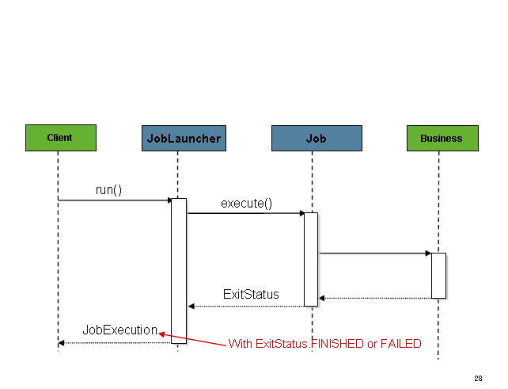

## [SPRING BOOT] 스프링부트로 개발하기 10 - Batch Tasklet 처리

Tasklet이 아니라 Dependency 추가 및 Table DDL, Chunk (Reader -> (Processor) -> Writer)처리는 [여기](https://sunghs.tistory.com/95)

**Chunk 처리에 이어서 진행하므로 Dependency, Table DDL Script, AbstractClass 생성 등은 진행하지 않는다.**

### Tasklet의 구조 (1회성)
Tasklet은 계속 진행할지, 그리고 끝낼지 두가지 경우만 제공한다.
Chunk와 같이 Reader, Processor, Writer 세 로직을 나눠 제공하는 형태가 아니라, 
1회성 처리 로직 또는 Reader, Processor, Writer를 한 로직에 모아놓는 방식의 비즈니스 로직을 구현할 때 쓴다.
따라서 Chunk와는 다르게 메타테이블에 Read-Count, Write-Count 등의 메타 정보가 남지 않아 Tasklet을 사용할 때에는 직접 기록하거나 해야한다.


[사진출처](https://docs.spring.io/spring-batch/docs/current/reference/html/index-single.html)

### Job 구현체 생성
기존 [여기](https://sunghs.tistory.com/95)의 JobInitializer<?, ?>를 상속받아 작성한다.
```java
@Configuration
@EnableBatchProcessing
public @Slf4j class Custom2Job extends JobInitializer<BatchModel, BatchModel> {
```

### Construct, Job, Step
생성자 로직이나 메소드 이름 등은 예제를 구현받아 사용하는 것이라 하는거지 실제 SpringBoot Batch와는 관련이없다.

```java
public Custom2Job() {
	super.useJdbcWriter = false;
	super.init("custom2Step", "custom2Job", 100);
}

@Override
protected Job defineJob(JobExecutionListener listener) {
	return jobBuilderFactory.get(jobName)
			.incrementer(new RunIdIncrementer())
			.start(step())
			.build();
}

@Override
protected Step step() {
	return stepBuilderFactory.get(stepName).tasklet(tasklet()).build();
}
```

### Tasklet
```java
protected Tasklet tasklet() {
	return new Tasklet() {
		public @Override RepeatStatus execute(StepContribution contribution, ChunkContext chunkContext) throws Exception {
			log.info("TASKLET STARTED");
			log.info("TASKLET END");
			return RepeatStatus.FINISHED;
		}
	};
}
```
Tasklet의 execute 메소드의 return 타입은 RepeatStatus인데, 상수값을 받는다.
RepeatStatus.FINISHED는 종료, RepeatStatus.CONTINUABLE은 다시 실행된다.
처리 건이 남았거나, 다시 로직이 실행되어야 하는 경우는 RepeatStatus.CONTINUABLE를 반환하면 다시 실행된다.

### RepeatStatus.FINISHED를 반환하는 경우
2020-02-03 15:23:32.648  INFO 112480 --- [           main] o.s.b.c.l.support.SimpleJobLauncher      : Job: [SimpleJob: [name=custom2Job]] launched with the following parameters: [{run.id=8, -spring.output.ansi.enabled=always}]
2020-02-03 15:23:32.713  INFO 112480 --- [           main] o.s.batch.core.job.SimpleStepHandler     : Executing step: [custom2Step]
2020-02-03 15:23:32.735  INFO 112480 --- [           main] sunghs.boot.batch.Custom2Job             : TASKLET STARTED
2020-02-03 15:23:32.735  INFO 112480 --- [           main] sunghs.boot.batch.Custom2Job             : TASKLET END
2020-02-03 15:23:32.756  INFO 112480 --- [           main] o.s.batch.core.step.AbstractStep         : Step: [custom2Step] executed in 43ms
2020-02-03 15:23:32.778  INFO 112480 --- [           main] o.s.b.c.l.support.SimpleJobLauncher      : Job: [SimpleJob: [name=custom2Job]] completed with the following parameters: [{run.id=8, -spring.output.ansi.enabled=always}] and the following status: [COMPLETED] in 96ms


### RepeatStatus.CONTINUABLE를 반환하는 경우
2020-02-03 14:29:11.479  INFO 55768 --- [           main] sunghs.boot.batch.Custom2Job             : TASKLET END
2020-02-03 14:29:11.484  INFO 55768 --- [           main] sunghs.boot.batch.Custom2Job             : TASKLET STARTED
2020-02-03 14:29:11.484  INFO 55768 --- [           main] sunghs.boot.batch.Custom2Job             : TASKLET END
2020-02-03 14:29:11.490  INFO 55768 --- [           main] sunghs.boot.batch.Custom2Job             : TASKLET STARTED
2020-02-03 14:29:11.490  INFO 55768 --- [           main] sunghs.boot.batch.Custom2Job             : TASKLET END
2020-02-03 14:29:11.497  INFO 55768 --- [           main] sunghs.boot.batch.Custom2Job             : TASKLET STARTED
2020-02-03 14:29:11.497  INFO 55768 --- [           main] sunghs.boot.batch.Custom2Job             : TASKLET END
2020-02-03 14:29:11.503  INFO 55768 --- [           main] sunghs.boot.batch.Custom2Job             : TASKLET STARTED
2020-02-03 14:29:11.503  INFO 55768 --- [           main] sunghs.boot.batch.Custom2Job             : TASKLET END
2020-02-03 14:29:11.508  INFO 55768 --- [           main] sunghs.boot.batch.Custom2Job             : TASKLET STARTED
2020-02-03 14:29:11.508  INFO 55768 --- [           main] sunghs.boot.batch.Custom2Job             : TASKLET END
2020-02-03 14:29:11.516  INFO 55768 --- [           main] sunghs.boot.batch.Custom2Job             : TASKLET STARTED
2020-02-03 14:29:11.516  INFO 55768 --- [           main] sunghs.boot.batch.Custom2Job             : TASKLET END
2020-02-03 14:29:11.523  INFO 55768 --- [           main] sunghs.boot.batch.Custom2Job             : TASKLET STARTED
2020-02-03 14:29:11.523  INFO 55768 --- [           main] sunghs.boot.batch.Custom2Job             : TASKLET END
2020-02-03 14:29:11.530  INFO 55768 --- [           main] sunghs.boot.batch.Custom2Job             : TASKLET STARTED
2020-02-03 14:29:11.530  INFO 55768 --- [           main] sunghs.boot.batch.Custom2Job             : TASKLET END
2020-02-03 14:29:11.536  INFO 55768 --- [           main] sunghs.boot.batch.Custom2Job             : TASKLET STARTED
2020-02-03 14:29:11.536  INFO 55768 --- [           main] sunghs.boot.batch.Custom2Job             : TASKLET END
2020-02-03 14:29:11.543  INFO 55768 --- [           main] sunghs.boot.batch.Custom2Job             : TASKLET STARTED
2020-02-03 14:29:11.543  INFO 55768 --- [           main] sunghs.boot.batch.Custom2Job             : TASKLET END
2020-02-03 14:29:11.550  INFO 55768 --- [           main] sunghs.boot.batch.Custom2Job             : TASKLET STARTED
2020-02-03 14:29:11.550  INFO 55768 --- [           main] sunghs.boot.batch.Custom2Job             : TASKLET END
2020-02-03 14:29:11.557  INFO 55768 --- [           main] sunghs.boot.batch.Custom2Job             : TASKLET STARTED
2020-02-03 14:29:11.557  INFO 55768 --- [           main] sunghs.boot.batch.Custom2Job             : TASKLET END
2020-02-03 14:29:11.564  INFO 55768 --- [           main] sunghs.boot.batch.Custom2Job             : TASKLET STARTED
2020-02-03 14:29:11.564  INFO 55768 --- [           main] sunghs.boot.batch.Custom2Job             : TASKLET END
2020-02-03 14:29:11.572  INFO 55768 --- [           main] sunghs.boot.batch.Custom2Job             : TASKLET STARTED
2020-02-03 14:29:11.572  INFO 55768 --- [           main] sunghs.boot.batch.Custom2Job             : TASKLET END

***무한반복***


### Tasklet을 FINISHED 상수로 끝내긴 하지만 정상적으로 끝나지 않았음을 ExitStatus Code로 MetaTable에 남겨 놓을 수 있다.
따로 ExitStatus를 지정하지 않으면 종료되는 시점에서 COMPLETED를 반환한다.
```java
protected Tasklet tasklet() {
	return new Tasklet() {
		public @Override RepeatStatus execute(StepContribution contribution, ChunkContext chunkContext) throws Exception {
			log.info("TASKLET STARTED");
			log.info("TASKLET END");
			contribution.setExitStatus(ExitStatus.FAILED);
			return RepeatStatus.FINISHED;
		}
	};
}
```

### ExitStatus 종료 상수는 총 6가지이다.
```java
public class ExitStatus implements Serializable, Comparable<ExitStatus> {

	/**
	 * Convenient constant value representing unknown state - assumed not
	 * continuable.
	 */
	public static final ExitStatus UNKNOWN = new ExitStatus("UNKNOWN");

	/**
	 * Convenient constant value representing continuable state where processing
	 * is still taking place, so no further action is required. Used for
	 * asynchronous execution scenarios where the processing is happening in
	 * another thread or process and the caller is not required to wait for the
	 * result.
	 */
	public static final ExitStatus EXECUTING = new ExitStatus("EXECUTING");

	/**
	 * Convenient constant value representing finished processing.
	 */
	public static final ExitStatus COMPLETED = new ExitStatus("COMPLETED");

	/**
	 * Convenient constant value representing job that did no processing (e.g.
	 * because it was already complete).
	 */
	public static final ExitStatus NOOP = new ExitStatus("NOOP");

	/**
	 * Convenient constant value representing finished processing with an error.
	 */
	public static final ExitStatus FAILED = new ExitStatus("FAILED");

	/**
	 * Convenient constant value representing finished processing with
	 * interrupted status.
	 */
	public static final ExitStatus STOPPED = new ExitStatus("STOPPED");
}
```
상황에 맞는 ExitStatus를 남겨 놓으면 될 것 같다.

### MetaTable 에서 JOB_INSTANCE 테이블과 JOB_EXECUTION 테이블로 상태 확인이 가능하다.

[사진]