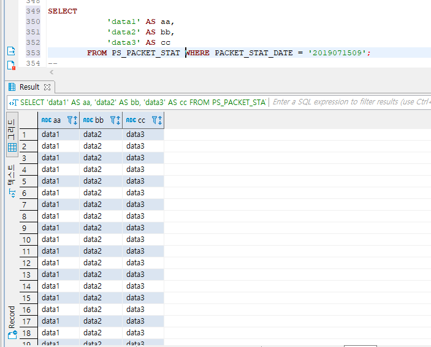

### [SPRING BOOT] 스프링부트로 개발하기 7 - Mybatis 연동 2

쿼리 바인딩 및 parameter 바인딩, result Model 사용하기
####  

#### 현재 TABLE에 이런 데이터가 있다고 할때

####  

#### SELECT 결과를 가져올 Model Class (DTO 또는 VO)
```java
package sunghs.boot.db;

public class Models {

	private String aa;
	
	private String bb;
	
	private String cc;
	
}

```
이런 클래스가 있다면, 쿼리 SELECT 결과 컬럼에 변수명과 동일하게 ALIAS를 주면 자동 값 주입이 된다.
####  

#### SQL 파일
```xml
<?xml version="1.0" encoding="UTF-8"?>
<!DOCTYPE mapper PUBLIC "-//mybatis.org//DTD Mapper 3.0//EN" "http://mybatis.org/dtd/mybatis-3-mapper.dtd">

<mapper namespace="sunghs.boot.db.Mappers">
    <select id="selectStringToVO" parameterType="String" resultType="sunghs.boot.db.Models">
    	SELECT 
    		'data1' AS aa,
    		'data2' AS bb,
    		'data3' AS cc
    	FROM PS_PACKET_STAT
    	WHERE PACKET_STAT_DATE = #{packetStatDate} 
    </select>
</mapper>
```
paramaterType은 바인딩 될 자료형이다. String, HashMap, Integer와 같이 알려진 클래스는 패키지명 생략이 가능하다.
resultType은 쿼리 결과가 들어갈 모델 클래스.
####  

예를들어 'data1' AS aa 로 ALIAS를 aa로 주었다. 이건 private String aa 값에 주입이 될 것이다.
####  

#### Mapper Class
```java
package sunghs.boot.db;

import java.util.List;

import org.apache.ibatis.annotations.Mapper;
import org.apache.ibatis.annotations.Param;
import org.springframework.stereotype.Repository;

public @Mapper @Repository interface Mappers {

	public List<Models> selectStringToVO(@Param("packetStatDate")String psd) throws Exception;
}

```
값이 들어갈 Parameter에 @Param 어노테이션을 주었다.
WHERE PACKET_STAT_DATE = #{packetStatDate} 의 바인딩 부분에 String psd의 값이 들어간다.
####  

값이 무조건 1 Row만 나오는게 아니라면, List<?> 형태로 반환타입을 만들어야 한다.
```java
public Model selectStringToVO ...
```
형태로 만들었을 때 SELECT 된 ROW 수가 1개가 넘는다면 아래와 같은 Exception이 발생한다.
***
*Caused by: org.mybatis.spring.MyBatisSystemException: nested exception is org.apache.ibatis.exceptions.TooManyResultsException: Expected one result (or null) to be returned by selectOne(), but found: 315* 
***
> 리턴 된 row가 315row인데 1row만 받으려고 해서 그렇다.
####  

#### ParameterType=HashMap으로 파라미터 받기
Map의 Key값이 바인딩 파라미터명이 된다.
map.put("key1", "value") 면 #{key1} 부분에 value가 들어간다.
####  

#### SQL 파일
TEST로 LIMIT 3정도 줘서 3개만 가져오도록 함.
```xml
<select id="selectMapToVO" parameterType="HashMap" resultType="sunghs.boot.db.Models">
    	SELECT 
    		'data1' AS aa,
    		'data2' AS bb,
    		'data3' AS cc
    	FROM PS_PACKET_STAT
    	WHERE PACKET_STAT_DATE = #{packetStatDate-map}
		LIMIT 3
    </select>
```
####  

##### MapperClass에 HashMap을 인자로 하는 추상메소드 추가
```java
public List<Models> selectMapToVO(Map<?, ?> map) throws Exception;
```
####  

#### 실행
```java
public void run(String... args) throws Exception {
		//STRING PARAM
		log.info("string params size : " + mappers.selectStringToVO("2019071509").size());
		
		//MAP PARAM
		Map<String, String> map = new HashMap<String, String>();
		map.put("packetStatDate-map", "2019071509");
		log.info("map params size : " + mappers.selectMapToVO(map).size());
		
		for(Models m : mappers.selectMapToVO(map)) {
			log.info("---------------------");
			log.info(m. toString());
		}
	}
```
####  

#### Console
2019-07-17 16:23:45.361  INFO 64120 --- [           main] sunghs.boot.BootExApplication            : string params size : 315
2019-07-17 16:23:45.363  INFO 64120 --- [           main] sunghs.boot.BootExApplication            : map params size : 3
2019-07-17 16:23:45.365  INFO 64120 --- [           main] sunghs.boot.BootExApplication            : ---------------------
2019-07-17 16:23:45.365  INFO 64120 --- [           main] sunghs.boot.BootExApplication            : Models(aa=data1, bb=data2, cc=data3)
2019-07-17 16:23:45.365  INFO 64120 --- [           main] sunghs.boot.BootExApplication            : ---------------------
2019-07-17 16:23:45.365  INFO 64120 --- [           main] sunghs.boot.BootExApplication            : Models(aa=data1, bb=data2, cc=data3)
2019-07-17 16:23:45.365  INFO 64120 --- [           main] sunghs.boot.BootExApplication            : ---------------------
2019-07-17 16:23:45.365  INFO 64120 --- [           main] sunghs.boot.BootExApplication            : Models(aa=data1, bb=data2, cc=data3)