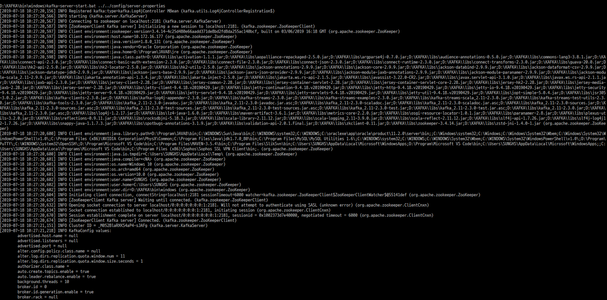

### [SPRING BOOT] 스프링부트로 개발하기 8 - Apache Kafka 연동 1

#### 아파치 카프카 설치

링크 : [Apache Kafka](https://kafka.apache.org/downloads)

리눅스의 경우 kafka/bin/ 안에 있는 sh를 실행하고  
윈도우의 경우 kafka/bin/windows/ 안에 있는 bat을 실행한다.  
여기서는 윈도우만 설명한다.
<br/>

zookeeper를 실행할때 사용되는 JAVA\_HOME을 windows/kafka-run-class.bat 에서 가져와 실행하므로 특정 JDK로 실행하려면 kafka-run-class를 수정하면 된다.

```
rem Which java to use
IF ["%JAVA_HOME%"] EQU [""] (
    set JAVA=java
) ELSE (
    set JAVA="D:/Program/JAVA8/bin/java"
)
```
####  

#### zookeeper 실행
zookeeper-server-start.bat 으로 실행하고, kafka/config/ 아래있는 zookeeper.properties를 인자로 구동된다.
***
windows bat파일 위치에서 zookeeper-server-start.bat ../../config/zookeeper.properties
***

####  

#### kafka 서버 실행
zookeeper가 실행된 상태에서만 kafka가 실행된다.
***
windows bat파일 위치에서 kafka-server-start.bat ../../config/server.properties
***


설정을 바꾸지 않았으면 2181포트로 zookeeper가 Listen한다.
####  

#### TOPIC 생성
***
kafka-topics.bat --create --zookeeper localhost:2181 --replication-factor 1 --partitions 1 --topic <토픽명>
***
####  

#### TOPIC 확인
***
kafka-topics.bat --list --zookeeper localhost:2181
***
