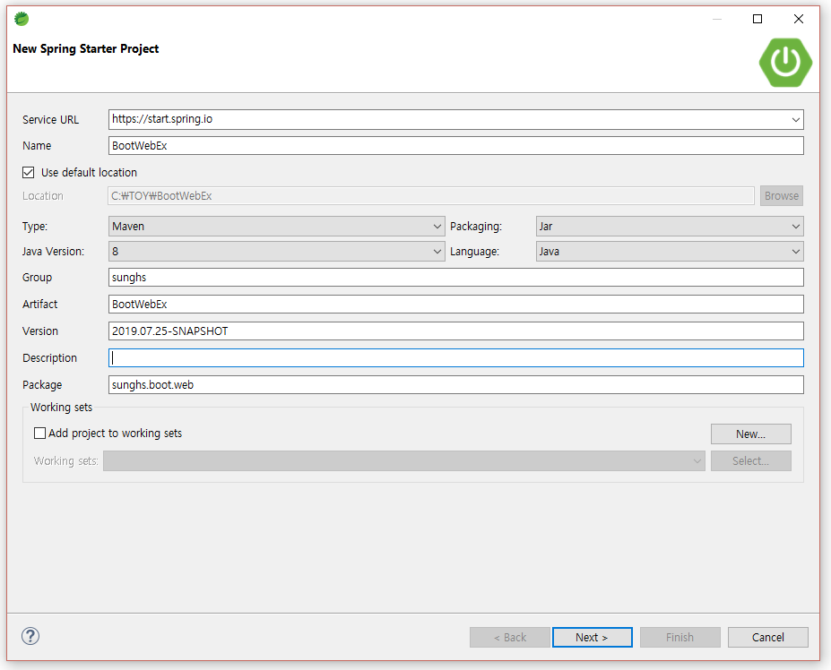
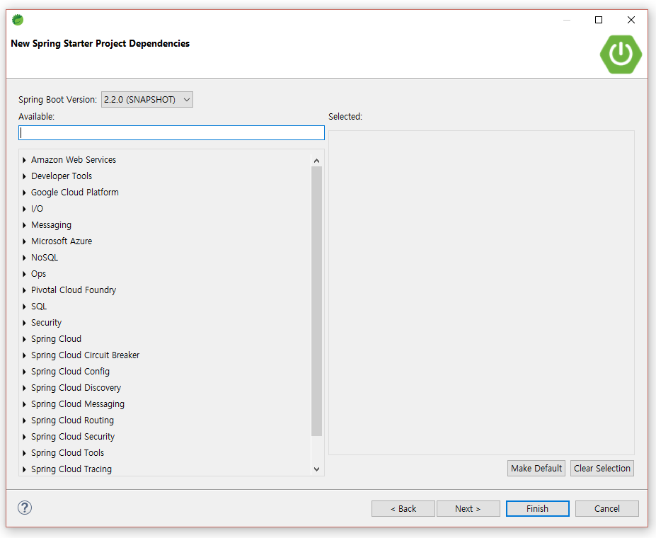

### [SPRING BOOT] 스프링부트로 웹 개발하기 1 - Thymeleaf 사용하기

#### Spring Boot 2.2.0 + Template Engine (Thymeleaf)

Spring Boot에서 JSP에 대한 지원을 줄이고 있다.
Server Side Template Engine은 JSP 외에 HTML로 뷰를 구성하고, 서버에서 가져온 데이터를 엔진이 html에 넣어 클라이언트에 전달하는 방식이다.
JSP에서는 스크립틀릿과 같은 방법으로 프론트엔드와 백엔드가 완전 분리가 안되었다면 템플릿 엔진으로 프론트엔드와 백엔드를 완전하게 분리 되도록 구성되었다.

####  

[스프링부트 템플릿엔진 - 제타위키](https://zetawiki.com/wiki/%EC%8A%A4%ED%94%84%EB%A7%81%EB%B6%80%ED%8A%B8_%ED%85%9C%ED%94%8C%EB%A6%BF%EC%97%94%EC%A7%84)

여러개의 템플릿 엔진 중 Thymeleaf (타임리프라고 읽음) 으로 웹을 구성한다.

#### 프로젝트 생성



####  application.properties
```xml
# 선언하지 않으면 8080포트가 기본
server.port=9071

# FOR JSP - jsp를 쓰는 경우 필요한 resolver 속성, 쓰지않으니 주석처리
#spring.mvc.view.prefix=/WEB-INF/view/
#spring.mvc.view.suffix=.jsp

# FOR THYMELEAF
spring.thymeleaf.enabled=true
spring.thymeleaf.encoding=UTF-8
spring.thymeleaf.prefix=/WEB-INF/view/
spring.thymeleaf.suffix=.html
spring.thymeleaf.cache=false
```

**spring.thymeleaf.enabled**
타임리프를 사용할건지
**spring.thymeleaf.encoding**
타임리프 전체 캐릭터셋을 지정한다.
**spring.thymeleaf.prefix**
view 파일이 위치하는 prefix, 전체경로는 src/main/webapp/${prefix}
**spring.thymeleaf.suffix**
파일의 확장자, return 값 + suffix가 붙어 view를 호출한다.
**spring.thymeleaf.cache**
html 소스 변경 시 바로 반영할지 여부
false = 소스 변경시 바로 반영 됨
true = 소스 변경시 바로 반영 안됨

#### pom.xml
가장 기본적으로 써야하는 dependency를 추가해준다.
```xml
<!-- WEB PROJECT -->
<dependency>
  <groupId>org.springframework.boot</groupId>
  <artifactId>spring-boot-starter-web</artifactId>
</dependency>
<!-- THYMELEAF TEMPLATE ENGINE -->
<dependency>
  <groupId>org.springframework.boot</groupId>
  <artifactId>spring-boot-starter-thymeleaf</artifactId>
</dependency>
<!-- LOMBOK -->
<dependency>
  <groupId>org.projectlombok</groupId>
  <artifactId>lombok</artifactId>
  <optional>true</optional>
</dependency>
```

#### TEST용 Model Class (DAO, DTO, VO 등)
```java
package sunghs.boot.web.model;

import lombok.Data;

public @Data class DataModel {

	private String d = "data_model_d_" + System.currentTimeMillis();
}

```
#### Controller Class
```java
package sunghs.boot.web.controller;

import java.util.ArrayList;
import java.util.HashMap;
import java.util.List;
import java.util.Map;

import org.springframework.stereotype.Controller;
import org.springframework.web.bind.annotation.RequestMapping;
import org.springframework.web.servlet.ModelAndView;

import sunghs.boot.web.model.DataModel;

public @Controller class MainController {

	@RequestMapping(value="/Main")
	public ModelAndView test() {
		Map<String, String> map = new HashMap<String, String>();
		map.put("key1", "value1_" + System.currentTimeMillis());
		map.put("key2", "value2_" + System.currentTimeMillis());
		map.put("key3", "value3_" + System.currentTimeMillis());
		
		List<String> list = new ArrayList<String>();
		list.add("list1_" + System.currentTimeMillis());
		list.add("list2_" + System.currentTimeMillis());
		list.add("list3_" + System.currentTimeMillis());
		
		DataModel dm = new DataModel();
		
		ModelAndView mav = new ModelAndView("test");
		
		mav.addObject("string", "string_value_1234567890");
		mav.addObject("map", map);
		mav.addObject("list", list);
		mav.addObject("object", dm);
		
		return mav;
	}
}
```
localhost:9071/Main 을 호출하게 되면 RequestMapping에 의해 test() 메소드가 호출된다.
ModelAndView 객체의 생성자로 들어가는 파라미터 명이 viewName이다.
ModelAndView("test") 이므로 메소드의 결과가 test.html로 넘어간다.

#### view (test.html) 구성
```html
<!DOCTYPE html>
<html>
<head>
<meta charset="UTF-8">
<title>TEST PAGE</title>
</head>
<body>
	<h1>TEST PAGE !</h1>
	<h1>MODEL AND VIEW DATA</h1>
	<p>model-and-view-string : <span th:text="${string}"></span><br/></p>
	<p>model-and-view-map : <span th:text="${map}"></span><br/></p>
	<p>model-and-view-list : <span th:text="${list}"></span><br/></p>
	<p>model-and-view-object : <span th:text="${object}"></span><br/></p>


	<h1>MAP GET DATA</h1>
	<p>map data1 : <span th:text="${map.get('key1')}"></span><br/></p>
	<p>map data2 : <span th:text="${map.get('key2')}"></span><br/></p>
	<p>map data3 : <span th:text="${map.get('key3')}"></span><br/></p>

	<h1>LIST GET DATA</h1>
	<p>list data1 : <span th:text="${list.get(0)}"></span><br/></p>
	<p>list data2 : <span th:text="${list.get(1)}"></span><br/></p>
	<p>list data3 : <span th:text="${list.get(2)}"></span><br/></p>

	<h1>OBJECT GET DATA</h1>
	<p>object data : <span th:text="${object.getD()}"></span><br/></p>

</body>
</html> 
```

#### localhost:9071/Main 호출 결과



#### RequestMapping 메소드의 파라미터에 Model 클래스를 넣어 사용해도 같은 결과를 만들 수 있다.
아래 보이는 로직은 위의 test()와 같다.
```java
@RequestMapping(value="/Main2")
public String test2(Model model) {
	Map<String, String> map = new HashMap<String, String>();
	map.put("key1", "value1_" + System.currentTimeMillis());
	map.put("key2", "value2_" + System.currentTimeMillis());
	map.put("key3", "value3_" + System.currentTimeMillis());

	List<String> list = new ArrayList<String>();
	list.add("list1_" + System.currentTimeMillis());
	list.add("list2_" + System.currentTimeMillis());
	list.add("list3_" + System.currentTimeMillis());

	DataModel dm = new DataModel();

	model.addAttribute("string", "string_value_1234567890");
	model.addAttribute("map", map);
	model.addAttribute("list", list);
	model.addAttribute("object", dm);

	return "test";
}
```