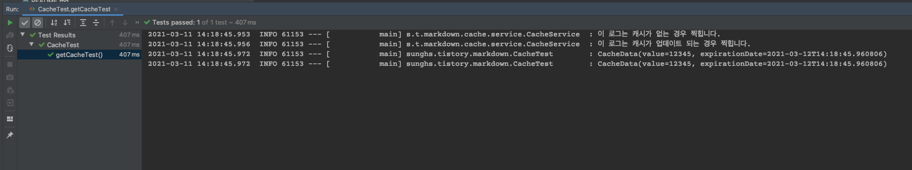

spring에서 cache 관련 된 기능을 지원한다.

기존 cache 처리라고 하면, Redis, memcached 등의 추가적인 memoryDB를 이용하거나, application 레벨에서 사용 가능한 EhCache 등이 많이 쓰이는데, 이 중 application 레벨에서 사용 가능한 spring cache에 대한 소개이다.

spring cache는 cache 기능의 추상화를 지원하는데, EhCache, Couchbase, Redis 등의 추가적인 캐시 저장소와 빠르게 연동하여 bean으로 설정 할 수 있도록 도와준다. 만일 추가적인 캐시 저장소와 연결하지 않는다면, ConcurrentHashMap 기반의 Map 저장소가 자동으로 추가된다. 캐시를 쓰긴 써야하는데, EhCache까지는 쓸 필요는 없고, 간단하게 몇몇 토큰 정도만 캐시처리가 필요 한 경우 빠르게 사용 할 수 있다.

로컬 캐시 저장소이니 주의해야 할 점은 application 간의 공유가 불가능하단 것이다. spring cache 를 사용하는 web application instance가 10대 인 경우, 10대가 각각 캐시 저장소를 구성한다. 만일 10대의 instance가 공유해야 하는 캐시 저장소인 경우, 외부의 Redis, MemCached를 이용하는게 맞다. 따라서 여러대의 instance가 존재하는 웹 서비스 등의 경우에는 이 내용을 보고 구성하면 안된다.

### dependency 추가
```
implementation("org.springframework.boot:spring-boot-starter-cache")
```

사실 이 dependency를 추가하는 것으로 bean 설정까지 끝난다. 하지만 이후 추가적인 커스터마이징이 있을 수 있으니 bean 설정을 직접 하도록 하자.

### bean 설정
```java
@EnableCaching
@Configuration
public class LocalCacheConfig {

    @Bean
    public CacheManager cacheManager() {
        SimpleCacheManager simpleCacheManager = new SimpleCacheManager();
        simpleCacheManager.setCaches(List.of(new ConcurrentMapCache("exampleStore")));
        return simpleCacheManager;
    }
}
```

exampleStore은 저장소의 이름이라고 보면 되며 캐시 사용을 알리는 @EnableCaching 어노테이션도 꼭 추가해야한다. 

만약 저장소를 여러개 추가 할 경우 아래와 같이 설정하면 된다.

```java
@EnableCaching
@Configuration
public class LocalCacheConfig {

    @Bean
    public CacheManager cacheManager() {
        SimpleCacheManager simpleCacheManager = new SimpleCacheManager();
        simpleCacheManager.setCaches(List.of(new ConcurrentMapCache("exampleStore1"), new ConcurrentMapCache("exampleStore2")));
        return simpleCacheManager;
    }
}
```

ConcurrentMapCache 클래스는 ConcurrentHashMap 기반으로 동작한다. 생성자는 대표적으로 3개가 있는데 null 값을 캐싱할지에 대해 strict 하게 생성 한다면 아래 생성자를 보고 골라 인스턴스하면 된다.

```java
public class ConcurrentMapCache extends AbstractValueAdaptingCache {

	private final String name;

	private final ConcurrentMap<Object, Object> store;

	@Nullable
	private final SerializationDelegate serialization;


	/**
	 * Create a new ConcurrentMapCache with the specified name.
	 * @param name the name of the cache
	 */
	public ConcurrentMapCache(String name) {
		this(name, new ConcurrentHashMap<>(256), true);
	}

	/**
	 * Create a new ConcurrentMapCache with the specified name.
	 * @param name the name of the cache
	 * @param allowNullValues whether to accept and convert {@code null}
	 * values for this cache
	 */
	public ConcurrentMapCache(String name, boolean allowNullValues) {
		this(name, new ConcurrentHashMap<>(256), allowNullValues);
	}

	/**
	 * Create a new ConcurrentMapCache with the specified name and the
	 * given internal {@link ConcurrentMap} to use.
	 * @param name the name of the cache
	 * @param store the ConcurrentMap to use as an internal store
	 * @param allowNullValues whether to allow {@code null} values
	 * (adapting them to an internal null holder value)
	 */
	public ConcurrentMapCache(String name, ConcurrentMap<Object, Object> store, boolean allowNullValues) {
		this(name, store, allowNullValues, null);
	}
}
```

bean 설정까지 끝났으니 이제 기능을 추가하기만 하면 된다.
ConcurrentCache는 만료시간에 의한 자동 만료 기능이 없으므로, 만료가 필요한 캐싱이라면 Scheduling 또는, 만료시간을 지정해서 검사 하는 방향으로 만들어야 한다.

### 캐싱 될 객체 (예)
```java
@Data
public class CacheData {

    private String value;

    private LocalDateTime expirationDate;
}
```

### Cache 관련 Service
```java
@Service
@Slf4j
public class CacheService {

    private static final CacheData EMPTY_DATA = new CacheData();

    @Cacheable(cacheNames = "exampleStore", key = "#key")
    public CacheData getCacheData(final String key) {
        log.info("이 로그는 해당 key에 대한 캐시가 없는 경우 찍힙니다.");
        return EMPTY_DATA;
    }

    @CachePut(cacheNames = "exampleStore", key = "#key")
    public CacheData updateCacheData(final String key, final String value) {
        log.info("이 로그는 해당 key에 대한 캐시가 업데이트 되는 경우 찍힙니다.");
        CacheData cacheData = new CacheData();
        cacheData.setValue(value);
        cacheData.setExpirationDate(LocalDateTime.now().plusDays(1));
        return cacheData;
    }

    @CacheEvict(cacheNames = "exampleStore", key = "#key")
    public boolean expireCacheData(final String key) {
        log.info("이 로그는 해당 key에 대한 캐시를 지울 경우 찍힙니다.");
        return true;
    }
}
```

#### @Cacheable
##### 캐시를 가져오는 메소드에 붙이는 어노테이션
cacheNames는 아까 bean 설정에 ConcurrentMapCache의 저장소 명이 들어가며, value도 같은 역할을 한다. (AliasFor)
key의 경우 캐시데이터가 들어있는 key 값이며 ConcurrentHashMap 의 key 값으로 봐도 된다.
해당 key값에 대한 value가 존재한다면, `getCacheData(final String key)` 메소드는 수행되지 않고, 기존 value가 return 된다. 따라서 캐시 데이터가 있다면 `log.info("이 로그는 캐시가 없는 경우 찍힙니다.");` 로그는 출력되지 않는다.

#### @CachePut
exampleStore 저장소의 key 에 대한 value를 업데이트 할 때 사용한다.

#### @CacheEvict
exampleStore 저장소의 key 에 대한 value를 삭제할 때 사용한다.

### key = '#key' 인 이유
`SpEL(Spring Expression Language)` 문법을 사용한다.
String, Integer, Long 등의 값은 #변수명 형태로 사용하면 되며, 객체 안의 멤버변수를 비교해야 하는 경우 아래와 같이 #객체명.멤버명 형태로 사용한다.

```java
@CachePut(cacheNames = "exampleStore", key = "#cacheData.value")
public CacheData updateCacheData(CacheData cacheData) {
    return cacheData;
}
```

### 조건부여
condition 속성을 이용하면 가능하다.

```java
@CachePut(cacheNames = "exampleStore", key = "#cacheData.value", condition = "#cacheData.value.length() > 5")
public CacheData updateCacheData(CacheData cacheData) {
    return cacheData;
}
```

이렇게 설정하는 경우, cacheData 객체의 value 길이가 5자리를 넘는 경우에만 캐싱된다.

### key 값을 설정하지 않는 경우
파라미터를 보고 KeyGenerator에 의해 default key를 생성한다. 
- 파라미터가 없는경우 : 빈 값
- 하나인 경우 : 그 값
- 여러개인 경우 : 모든 파라미터를 포함 한 키 생성 (모든 파라미터 및 해시코드를 조합)

side effect가 있을 수 있으니 key를 반드시 명시하도록 하자.

### 테스트
만료가 필요하다면 scheduling 처리를 하여 캐시를 갱신하거나, 캐시를 가져와 검사하는 방법을 사용해야 한다.
validation 메소드는 CacheService에 예시로 아래와 같이 추가했다.
```java
public boolean isValidation(final CacheData cacheData) {
    return ObjectUtils.isNotEmpty(cacheData)
        && ObjectUtils.isNotEmpty(cacheData.getExpirationDate())
        && StringUtils.isNotEmpty(cacheData.getValue())
        && cacheData.getExpirationDate().isAfter(LocalDateTime.now());
}
```

```java
@SpringBootTest
@Slf4j
public class CacheTest {

    @Autowired
    private CacheService cacheService;

    @Test
    public void getCacheTest() {
        // 캐시가 없으므로 getCacheData 메소드의 "이 로그는 캐시가 없는 경우 찍힙니다." 가 출력 됨
        CacheData cacheData = cacheService.getCacheData("cacheDataKey");
        if (!cacheService.isValidation(cacheData)) {
            // 캐시 업데이트 되므로 updateCacheData 메소드의 "이 로그는 캐시가 업데이트 되는 경우 찍힙니다." 가 출력 됨
            cacheData = cacheService.updateCacheData("cacheDataKey", this.selectValue());
        }
        log.info(cacheData.toString());

        // 이미 캐시가 있으므로 getCacheData 메소드를 타지않고 바로 값을 가져옴
        CacheData newCacheData = cacheService.getCacheData("cacheDataKey");
        log.info(newCacheData.toString());

        Assertions.assertEquals(cacheData.getValue(), newCacheData.getValue());
        Assertions.assertEquals(cacheData.getExpirationDate(), newCacheData.getExpirationDate());
    }

    /**
     * value를 얻어오는 메소드... RestTemplate, Select, Subscribe 등
     * @return String value
     */
    private String selectValue() {
        return "12345";
    }
}
```




### 아래는 spring.io 에서 직접 제공하는 spring-cache 문서
[링크](https://docs.spring.io/spring-framework/docs/current/reference/html/integration.html#cache)