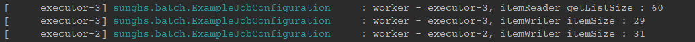
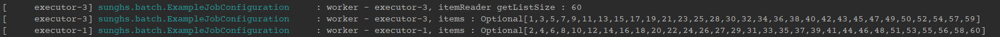
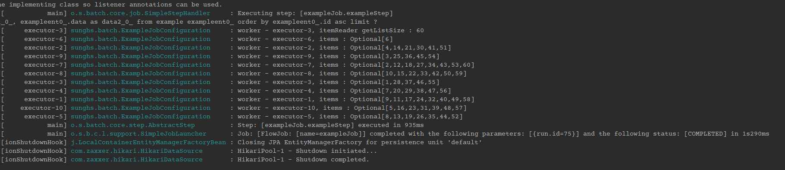

# Spring Batch Multi Thread 처리 시 Thread 를 최대한 이용한다 (1 reader & multiple writer)

일반적으로 Thread-safe 한 PagingItemReader를 사용하면서, ItemProcessor, ItemWriter를 사용하며 Multi-Thread 처리를 할때 다음과 같이 생각하게 됩니다.

> ThreadPoolTaskExecutor 에서 꺼낸 1개의 worker 가 Reader-Processor-Writer 처리를 다 할 것이다.

즉, `ThreadPoolTaskExecutor` 에서 생성 된 1개의 worker 가 CHUNK SIZE 만큼 DB를 읽어 현재 worker 가 process, write 를 같이 할 것이라고 생각합니다.

## 하지만 다른 결과가 나옵니다.

아래처럼 예제를 구성하겠습니다.

## 현재 DB에는 읽을 아이템이 60개 입니다.
DB와 연결 후 mysql에 batch 메타 테이블과 예제 데이터를 넣어놨습니다.

얘는 따로 예제를 추가 하지 않겠습니다.

## Reader 구성
`JpaPagingItemReader` 도 있지만, 제 의도대로 정확히 돌리기 위해 `AbstractPagingItemReader` 를 직접 구현하여 돌려보겠습니다.

아래 구성은 `AbstractPagingItemReader` 가 `ChunkOrientedTasklet` 에서 process 하기 전에 한방에 리스트를 넘기기 위함입니다.

```java
@Bean
@StepScope
public AbstractPagingItemReader<ExampleEntity> itemReader() {
    return new AbstractPagingItemReader<>() {
        @Override
        protected void doReadPage() {
            if (CollectionUtils.isEmpty(results)) {
                results = new ArrayList<>();
            } else {
                results.clear();
            }

            setPageSize(PAGE_SIZE);

            PageRequest page = PageRequest.of(getPage(), getPageSize(), Sort.by("id").ascending());
            List<ExampleEntity> list = dataRepository.findAll(page).getContent();
            log.info("worker - {}, itemReader getListSize : {}", Thread.currentThread().getName(), list.size());
            results.addAll(list);
        }

        @Override
        protected void doJumpToPage(int itemIndex) {
        }
    };
}
```

Processor 구성은 필수가 아니니 건너 뛰고, Writer 구성을 하겠습니다.

## Writer 구성

들고 온 item이 몇개인지 찍는 로직입니다.

```java
@Bean
@StepScope
public ItemWriter<ExampleEntity> itemWriter() {
    return items -> log.info("worker - {}, itemWriter itemSize : {}", Thread.currentThread().getName(), items.size());
}
```

Multi-Thread를 돌려줄 TaskExecutor 구성입니다.

### ThreadPoolTaskExecutor
```java
@Bean
public TaskExecutor taskExecutor() {
    ThreadPoolTaskExecutor threadPoolTaskExecutor = new ThreadPoolTaskExecutor();
    threadPoolTaskExecutor.setCorePoolSize(WORKER_SIZE);
    threadPoolTaskExecutor.setMaxPoolSize(WORKER_SIZE);
    threadPoolTaskExecutor.setThreadNamePrefix("executor-");
    threadPoolTaskExecutor.setWaitForTasksToCompleteOnShutdown(true);
    threadPoolTaskExecutor.setAllowCoreThreadTimeOut(true);
    threadPoolTaskExecutor.setKeepAliveSeconds(1);
    threadPoolTaskExecutor.initialize();
    return threadPoolTaskExecutor;
}
```

그리고 Step 과 Job 구성입니다.

Listener도 하나 달아줍시다. ThreadPoolTaskExecutor를 종료해 줍니다.

### Job, Step 구성
```java
@Bean
public Job exampleJob() {
    return jobBuilderFactory.get("exampleJob")
            .incrementer(new RunIdIncrementer())
            .start(exampleStep())
            .on("*")
            .end()
            .end()
            .preventRestart()
            .build();
}

@Bean
@JobScope
public Step exampleStep() {
    return stepBuilderFactory.get("exampleJob.exampleStep")
            .<ExampleEntity, ExampleEntity>chunk(CHUNK_SIZE)
            .reader(itemReader())
            .writer(itemWriter())
            .listener(jobExecutionListener(taskExecutor()))
            .taskExecutor(taskExecutor())
            .throttleLimit(WORKER_SIZE)
            .build();
}

public JobExecutionListener jobExecutionListener(TaskExecutor taskExecutor) {
    return new JobExecutionListener() {
        @Override
        public void beforeJob(JobExecution jobExecution) {
            log.info("exampleJob start");
        }

        @Override
        public void afterJob(JobExecution jobExecution) {
            ((ThreadPoolTaskExecutor) taskExecutor).shutdown();
        }
    };
}
```

## CHUNK_SIZE, PAGE_SIZE, WORKER_SIZE
- CHUNK_SIZE, PAGE_SIZE = 100 으로 commit-interval 이 됩니다.
- WORKER_SIZE = ThreadPoolTaskExecutor core,max size 로 10입니다.

```java
private static final int CHUNK_SIZE = 100;

private static final int PAGE_SIZE = 100;

private static final int WORKER_SIZE = 10;
```

## 결과를 보니 이렇습니다.



worker-3이 돌아서 가져온 item 60 개를, 자기 자신이 29개, 다른 worker에 31개를 나눠 주었습니다.

그럼 아래처럼 세팅 된 걸까요?

```
worker-3 -> 1,2,3,4 ... 29
worker-4 -> 30,31,32 ... 60
```

실제로 ItemWriter에서 id만 추출해서 돌려보겠습니다.

## 변형 된 ItemWriter
```java
@Bean
@StepScope
public ItemWriter<ExampleEntity> itemWriter() {
    return items -> {
        String itemList = items.stream()
            .map(exampleEntity -> String.valueOf(exampleEntity.getId()))
            .reduce((s, s2) -> s + "," + s2)
            .toString();
        log.info("worker - {}, items : {}", Thread.currentThread().getName(), itemList);
    };
}
```

자기 자신한테 할당 된 entity의 id 값만 모아 comma를 붙이고 하나의 문자열로 계속 append 해서 한번에 출력하는 로직입니다.



재 실행으로 인한 worker 번호가 바뀌긴 했지만, 결국 id를 확인 하면

**나 하나 쟤 하나** 이런식으로 분배 된 걸 볼 수 있습니다.

## 왜 그런걸까?

`Chunk` 는 `TaskletStep`의 `ChunkOrientedTasklet` 에 실행 됩니다.

### TaskletStep 과 ChunkOrientedTasklet

```java
@Nullable
@Override
public RepeatStatus execute(StepContribution contribution, ChunkContext chunkContext) throws Exception {

    @SuppressWarnings("unchecked")
    Chunk<I> inputs = (Chunk<I>) chunkContext.getAttribute(INPUTS_KEY);
    if (inputs == null) {
        inputs = chunkProvider.provide(contribution);
        if (buffering) {
            chunkContext.setAttribute(INPUTS_KEY, inputs);
        }
    }

    chunkProcessor.process(contribution, inputs);
    chunkProvider.postProcess(contribution, inputs);
    ...
}
```

`chunkContext` 에 의해 item 을 가져오고 `chunkProcessor`에 의해 process, write 됩니다.

이 때 `PagingItemReader` 가 list를 한방에 넘겨도, doRead() 에 의해 item 단위로 분해되는데, 이때 `ThreadPoolTaskExecutor` 로 분배 됩니다.

또한 `ThreadPoolTaskExecutor` 가 아무리 많다 하더라도, `ChunkOrientedTasklet` 의 `semaphore` 에 의해 동시에 처리 할 숫자가 결정 되는데, 
이 semaphore 는 `chunkContext` 가 Connection 을 얻었는지에 대해 RUNNING / MONITOR / WAIT 상태가 결정되는 것으로 보입니다.

즉 Connection 을 얻고 난 뒤 라는 건 `chunkProcessor`가 제 일을 할 수 있을 때, `ThreadPoolTaskExecutor` 에 의해 호출되어 item을 받는 듯 합니다.

따라서, Connection Pool Resource와 Thread Worker 만 충분하다면, 하나의 Chunk가 단일 워커의 Reader-Processor-Writer 구조가 아닌,
하나의 Reader가 CHUNK_SIZE 이하 혹은 그만큼 가져온 itemList 를 여러 Worker 의 Processor-Writer 구조로 처리 될 수 있는 것 입니다.

따라서 `1 Reader Multiple Writer` 같은 키워드의 구현 방법은 필요가 없게 됩니다.

아래는 같은 60개 item 의 숫자를 좀 더 많은 방식으로 분배하는 방식입니다.



Connection 숫자를 Worker Thread 가 충분히 가져 갈 수 있도록 사이즈를 크게 추가한 상태입니다.

로그를 보면 Worker-3 에 의해 가져온 item 60 개를 나머지 Worker 들이 분배하여 들고 있는 걸 볼 수 있습니다.


### 예제 코드 Github
[Github 소스](https://github.com/sunghs/spring-batch-example)