# Redis 큰 따옴표 (더블 쿼테이션) 한번 더 들어가는 문제

업무를 진행하다가 아래와 같은 형태로 묶인 데이터를 한번에 가져와야 할 일이 있었습니다.
데이터는 레디스에 있고, 해시셋(HashSet) 형태로 그룹핑 되어 있습니다.

## 레디스 내부 데이터 구조
```
GroupA 
- data1
- data2
- data3

GroupB 
- data4
- data5
- data6
```

GroupA 와 GroupB 는 각각 해시셋 구조입니다. 그 밑에 data 를 멤버로 가지고 있습니다,
그리고 각각의 그룹 데이터의 세부적인 사항은 key-value 형태로 가지고 있었습니다.

```
 data1
 - value1
 data2
 - value2
 data3
 - value3
 ...
```

데이터는 그룹은 약 20개 정도 되며, 한개의 그룹에는 보통 멤버가 70 ~ 120만개 정도 되었습니다.

명령어 성능 자체가 O(1) 시간복잡도라도 어떤 그룹에 해시셋 멤버를 받아 일일히 레디스에 던져서 값을 가져오는 방식은 효율적이지 않은 것 같아서 DB의 조인 같은 기능이 레디스에 있길래 사용했습니다.(set 멤버가 1000000개면 토탈 1000001번의 요청이 레디스에 날아가야 하는 구조입니다.)

근데 아무리 명령어를 날려도 나오지 않길래 유심히 보니, hashSet 형태의 value에 쿼테이션이 들어가고 있었습니다.

결론부터 얘기하면 Redis ValueSerializer 가 GenericJackson2JsonRedisSerializer 를 사용할때 value 통째로 앞뒤에 더블 쿼테이션이 한번 더 붙게 됩니다. 그리고 기존의 쿼테이션에는 백슬래시(\\) 문제가 붙어서 value 멤버라고 붙여 알려주고 있었습니다,

## 재현
Embedded Redis 를 사용하지 않을 것이기 때문에 테스트 코드보다는 어플리케이션을 돌려 테스트하는 방식입니다.

### Spring Redis Configuration


### 레디스에 넣을 데이터 세팅
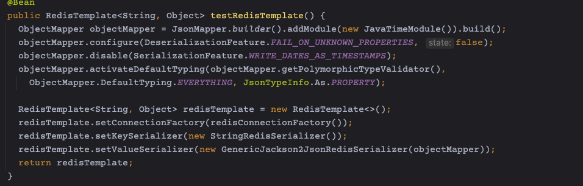

Spring 에서 Redis 연결시 사용하는 Lettuce Connection, 그리고 RedisTemplate 세팅을 해줍니다.

### 레디스 insert 세팅
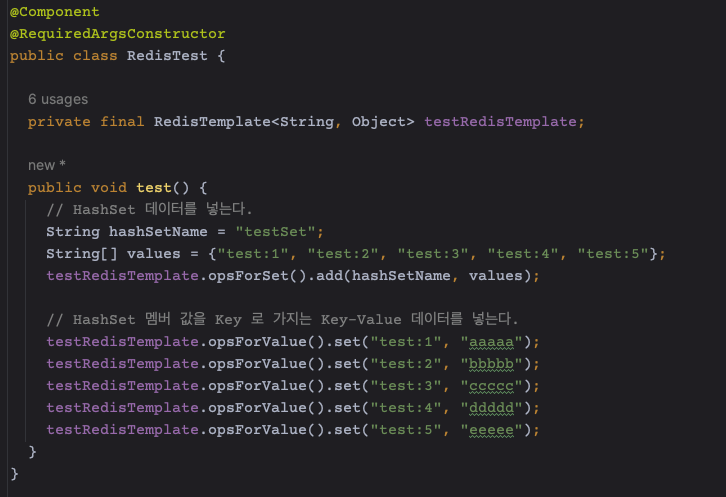

그리고 레디스에 데이터를 넣어줄 테스트 코드 입니다.

### 레디스 insert 결과
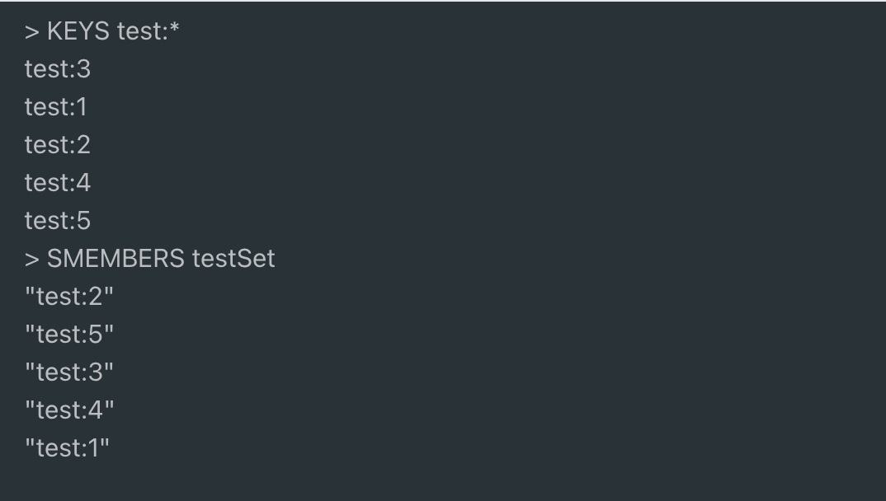
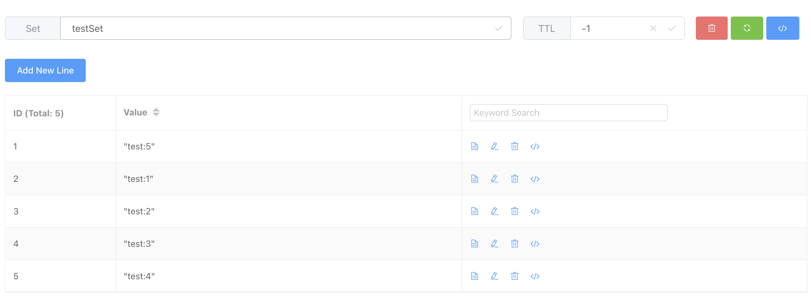
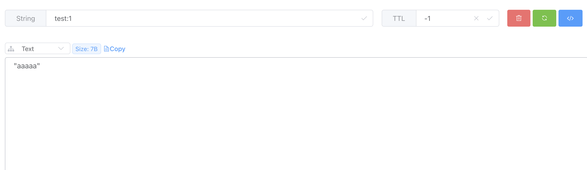


레디스 내부에 cli를 날려서 정상적으로 세팅 되었습니다.
데이터는 해시 멤버가 다시 레디스 키 값이고, 그 키 값으로 밸류를 들고 오는 방식입니다.


**레디스 세팅에 보면 관례적으로 KeySerializer는 StringSerializer를 사용하고 있었습니다.**
**그래서 Key는 더블 쿼테이션이 붙지 않았기 때문에 장시간 삽질을 하게 되었습니다.**

### HASH SET 멤버 조인해서 value 가져오기
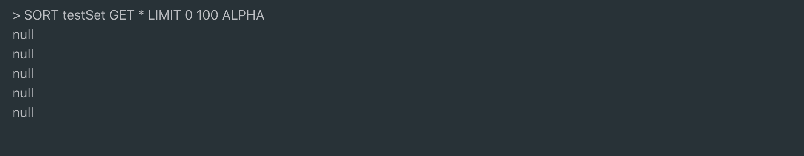

역시 아무것도 생기지 않았습니다.
왜냐하면 SORT 로 가져온 데이터가 test:1 이 아닌 "test:1" 이었고, keySerializer를 StringRedisSerializer를 사용했기에 키 부분엔 더블쿼테이션이 없어 완전 일치 검색 방법으로는 검색이 안되었던 겁니다.


### 레디스 세팅 변경
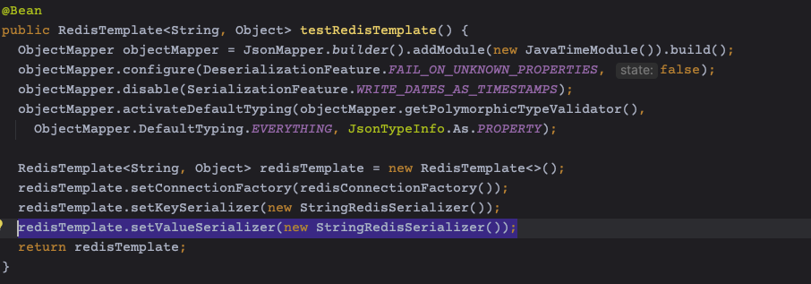

블럭 쳐진 부분(GenericJackson2JsonRedisSerializer -> StringRedisSerializer)이 변경되었습니다.

### 레디스 insert 결과

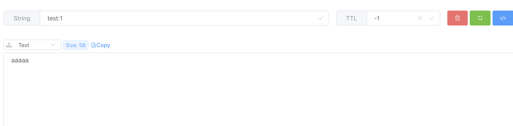

지금 사진을 보면 hashSet value 부분에 더블쿼테이션이 빠진 걸 볼 수 있습니다.
이 상태로 HashSet 조인으로 데이터를 가져오면 제대로 가져오는 걸 볼 수 있습니다.

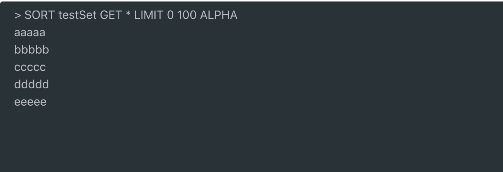

## 그럼 원인이 뭐냐
GenericJackson2JsonRedisSerializer 를 사용하면 serialize 시에 맨 앞과 뒤에 더블 쿼테이션을 붙입니다.
따라서 해시셋 조인을 이용하거나 할때는 set 의 멤버가 키로 들어가야 하므로, keySerializer 와 맞춰주어야 합니다.

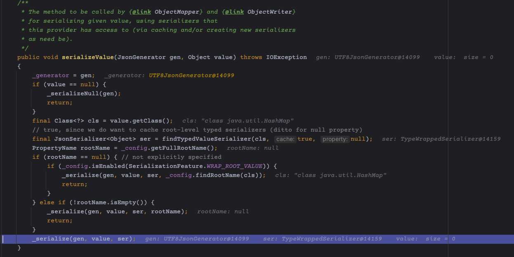
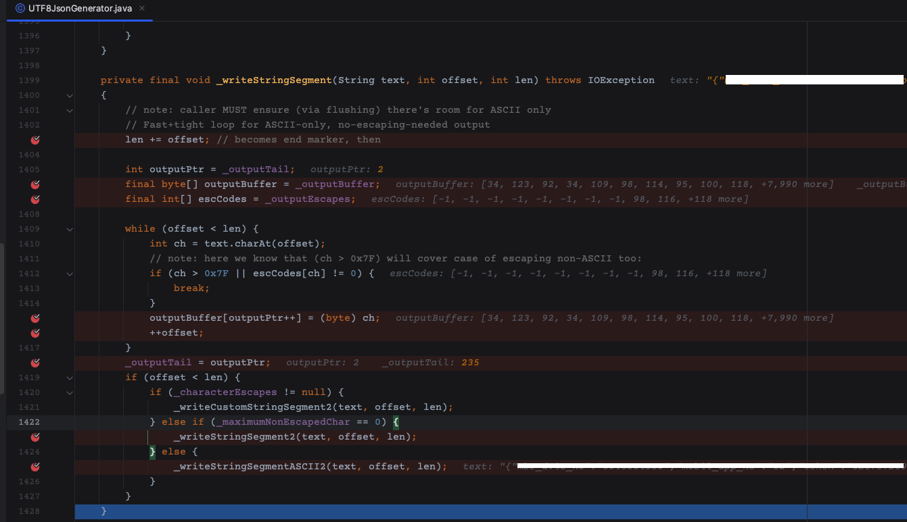

**GenericJackson2JsonRedisSerializer 에서는 DefaultSerializerProvider 로 부터 UTF8JsonGenerator serializer를 주입받아 value를 통째로 byte array로 만드는데, 맨 앞과 맨 뒤에 quote 문자를, 그리고 발견된 segment 문자 중 quote 문자가 있으면 그 앞에 backSlash를 붙여줍니다.**

따라서 일반적인 SORT - GET 구문을 쓸일이 없다면 대부분 GenericJackson2JsonRedisSerializer 를 사용하는게 좋긴 합니다. (시리얼라이즈 된 DTO 클래스 정보를 담아줍니다.)
