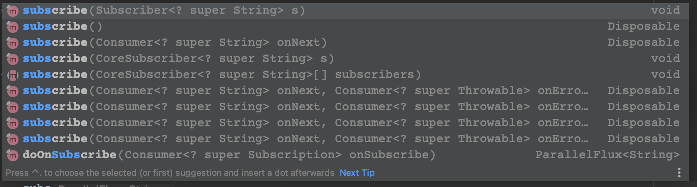
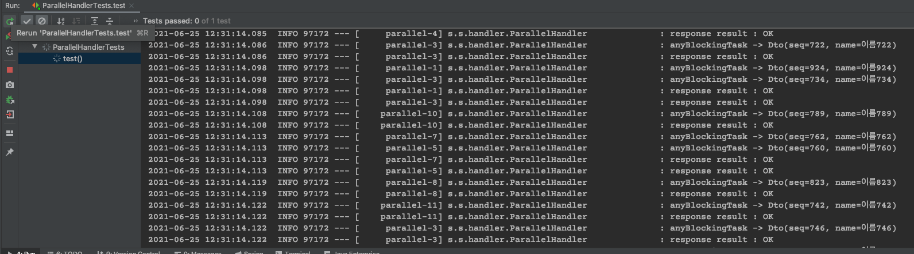
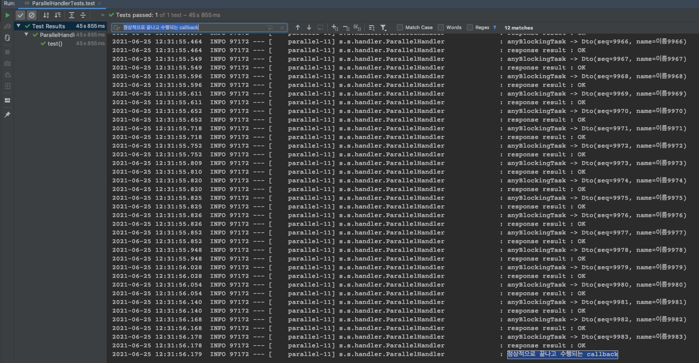

## Spring webflux 대용량 List 처리

Mono와 Flux의 back-pressure를 이용한 publish, subscribe 를 이용하는 방법 외에 이미 만들어진 대용량 리스트를 병렬로 처리하고 싶은 경우가 있습니다.

이런 경우 ThreadPoolExecutor 등을 이용하여 처리 할 수 있겠습니다만, Config를 추가적으로 설정해야 하고, 실제로 사용하지 않는다 하여도 ThreadPool이 유지되어야 하기 때문에 사용하지 않는 자원이 낭비 될 수 있습니다.

예를들어 어떤 List의 사이즈가 10000개인데, 각 데이터에 대해 무엇인가 작업을 하고 싶은 경우 (예를들어 restTemplate으로 request 한다거나, DB에서 조회를 한다거나) 사용할 수 있습니다.

**asyncRestTemplte의 경우 Spring 5에서 reactor를 사용하도록 deprecated 되었습니다.** 따라서 asyncRestTemplate도 하나의 방법일 수 있겠으나 가이드 하는대로 Flux를 이용해 진행합니다.

소스는 [spring-webflux-example](https://github.com/sunghs/spring-webflux-example) 의 ParallelHandler 클래스를 보시면 되겠습니다.

### 예제코드
```java
public void parallelTask() {
    List<Dto> taskList = new ArrayList<>();

    for (int i = 0; i < 10000; i++) {
        taskList.add(new Dto(i, "이름" + i));
    }

    Flux.fromIterable(taskList)
        .parallel()
        .runOn(Schedulers.parallel())
        .map(this::anyBlockingTask)
        .subscribe(s -> {
            log.info("response result : {}", s);
        }, throwable -> {
            log.info("flux parallel에 문제가 생긴 경우");
            log.error("flux error", throwable);
        }, () -> {
            log.info("정상적으로 끝나고 수행되는 callback");
        });
}
```
주석은 github에 달아놓았습니다. 
데이터 1만개가 들어있는 ArrayList 를 Flux 로 처리하여 구독 하는 방법입니다.

1. `parallel()` 은 Flux를 병렬로 처리하여 ParallelFlux 형태로 반환합니다.
2. `runOn()` 은 어떤 스펙을 가지고 진행할지 선언합니다. 이전에는 Schedules.elastic()이 대부분이었지만, deprecated 되며 parallel() 메소드로 대체합니다. Scheduler의 실행 전략에 대해 간략히 보자면
   1. elastic : Thread의 숫자를 알아서 조정합니다. 블로킹 시간이 오래걸리거나 하면 계속해서 증가 할 수 있습니다.
   2. parallel : 고정 크기를 만듭니다.
   3. single : Thread 한개입니다.
   4. immediate : 현재 Thread에서 실행합니다.

    이 중 parallel의 기본 고정 크기는 실행 서버의 thread 수에 종속됩니다. 즉, 제 컴퓨터 현재 CPU는 6core 12thread 인데, 이따 12개가 도는지 보겠습니다.

    또한, newParallel(name, parallelism) 을 이용해 원하는 크기로 만들 수 있습니다. `parallelism` 파라미터가 병렬처리 thread의 수가 됩니다.

3. `map()` 부분에서 실제 실행 할 blocking 작업을 수행하면 됩니다. `publisher`를 구현한 경우에 따라서는 `flatMap()`을 사용하는 편이 더 나을 수 있습니다. 
4. mapper를 이용해 `subscribe()`로 데이터를 변환하였으니 구독할 로직을 작성합니다. `subscribe()` 로직은 인자가 3개짜리가 있는데, `onNext`, `onError`, `onComplete` 를 구현 할 수 있습니다.
   1. onNext : subscribe 할 내용
   2. onError : Flux 처리 에러 발생 시 입니다. onNext 에러가 아니라, Flux 전체가 에러입니다.
   3. onComplete : Flux 처리가 종료 되었을 시 실행 할 callback 입니다.
   


`.map(this::anyBlockingTask)` 부분의 메소드를 보면

### 블로킹 코드
```java
/**
* 어떤 블로킹 작업입니다. taskList의 각 객체마다 수행됩니다.
* ex) restTemplate request, DB 조회 등
*
* @param dto Dto
* @return String response 등
*/
private String anyBlockingTask(Dto dto) {
    try {
        // 0~100ms 사이로 블로킹됩니다.
        Thread.sleep(new SecureRandom().nextInt(100));
        log.info("anyBlockingTask -> {}", dto.toString());
        return "OK";
    } catch (Exception e) {
        Thread.currentThread().interrupt();
        return "FAIL";
    }
}
```
0~100ms 사이의 blocking이 걸리는 작업을 예제로 만든것이고, 이부분의 로직이 restTemplate, webClient의 Block, DB 작업, IO 작업등이 있겠습니다.

---

### CountDownLatch
subscribe가 완료될 수 있도록 도와줄 수 있도록 사용할 클래스입니다. 초기 숫자를 지정하여 숫자를 하나씩 내려 0이 되면 완료되는 클래스입니다. 기본적으로 `CountDownLatch`는 Thread 의 숫자를 countdown 하기 위해 만들어졌습니다. 

기존 REST 웹 서비스의 http/https 통신의 경우 블로킹 되므로 Thread 종료 전 반드시 subscribe가 구독될 것 입니다. 하지만 배치성이나 1회성으로 수행되고 종료되는 프로그램의 경우 메인 Thread가 종료되는 순간 모든 Paarallel Thread가 종료되어 subscribe 할 수 없습니다. (데몬쓰레드이기 때문에 그렇습니다.) 이런 경우 사용할 수 있습니다.

### 선언
```java
CountDownLatch countDownLatch = new CountDownLatch(초기숫자);
```
초기숫자를 입력합니다.

### 사용
```java
countDownLatch.countDown();
```
countDown 시 초기숫자에서 1씩 내려갑니다.

### 대기
```java
try {
    countDownLatch.await();
} catch (Exception e) {
    // ...
}
```
await를 통해 `CountDownLatch`가 0이 될때 까지 현재 Thread를 블로킹합니다. 이 방법을 통해 전체 subscribe를 구독할 수 있습니다.


## CountDownLatch를 이용한 전체 구독

```java
public void parallelTask() {
    List<Dto> taskList = new ArrayList<>();

    for (int i = 0; i < 10000; i++) {
        taskList.add(new Dto(i, "이름" + i));
    }

    CountDownLatch countDownLatch = new CountDownLatch(taskList.size());

    Flux.fromIterable(taskList)
        .parallel()
        .runOn(Schedulers.parallel())
        .map(this::anyBlockingTask)
        .subscribe(s -> {
            log.info("response result : {}", s);
            countDownLatch.countDown();
        }, throwable -> {
            log.info("flux parallel에 문제가 생긴 경우");
            log.error("flux error", throwable);
        }, () -> {
            log.info("정상적으로 끝나고 수행되는 callback");
        });

    try {
        countDownLatch.await();
    } catch (Exception e) {
        e.printStackTrace();
    }
}
```
Thread 숫자를 세는 용도로 사용하지 않고, 각 구독시마다 countDown 하는 방식으로 조금 변경했습니다. Parallel Thread의 구독 종료시로 바꾸려면 아래와 같은 형태가 될겁니다.

```java
public void parallelTask() {
    List<Dto> taskList = new ArrayList<>();

    // 1만개의 데이터를 추가
    for (int i = 0; i < 10000; i++) {
        taskList.add(new Dto(i, "이름" + i));
    }

    CountDownLatch countDownLatch = new CountDownLatch(12);

    Flux.fromIterable(taskList)
        .parallel()
        .runOn(Schedulers.parallel())
        .map(this::anyBlockingTask)
        .subscribe(s -> {
            log.info("response result : {}", s);
        }, throwable -> {
            log.info("flux parallel에 문제가 생긴 경우");
            log.error("flux error", throwable);
            countDownLatch.countDown();
        }, () -> {
            log.info("정상적으로 끝나고 수행되는 callback");
            countDownLatch.countDown();
        });

    try {
        countDownLatch.await();
    } catch (Exception e) {
        e.printStackTrace();
    }
}
```
`subscribe`의 onError 에도 countDown 해야 합니다.

### 테스트
[spring-webflux-example](https://github.com/sunghs/spring-webflux-example) 의 ParallelHandlerTests 에도 있습니다.

```java
@SpringBootTest(webEnvironment = WebEnvironment.DEFINED_PORT)
@TestConstructor(autowireMode = AutowireMode.ALL)
@RequiredArgsConstructor
public class ParallelHandlerTests {

    private final ParallelHandler parallelHandler;

    @Test
    void test() {
        parallelHandler.parallelTask();
    }
}
```


이처럼 parallel-숫자 형태의 thread가 병렬처리를 진행합니다.


실제 콘솔에서 찾아보니 12개의 complete log가 찍혔습니다. 6core 12thread CPU 이니 맞습니다.