# @ActiveProfiles 와 spring.profiles.active 가 일치하지 않는 현상

테스트코드를 작성할 때 profile 주입을 위해서 아래와 같이 주입하고는 했습니다.

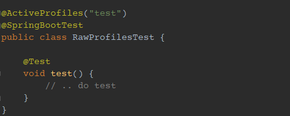

그런데 뭔가 이상한 현상을 발견했는데, 사내 프로젝트 소스에서 profile 에 따른 통합 테스트 진행 시 의도한 바와 같이 진행되지 않는 걸 발견했습니다.

## 테스트 1) application.yml 프로퍼티 로드
`application.yml` 에는 profile에 따라 프로퍼티를 override 합니다. 

즉 default profile 로 작성된 프로퍼티를 가져오고, 그 뒤 세팅한 profile 값으로 덮어 씌우는 방식입니다.

그래서 아래처럼 테스트를 진행했습니다.

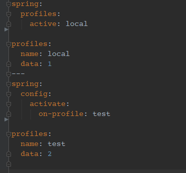

그리고 테스트 프로퍼티를 가져 올 bean을 작성합니다.

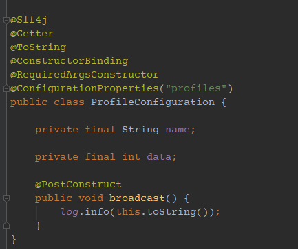

그리고 앞으로 계속 사용할 test 코드를 아래처럼 작성합니다.

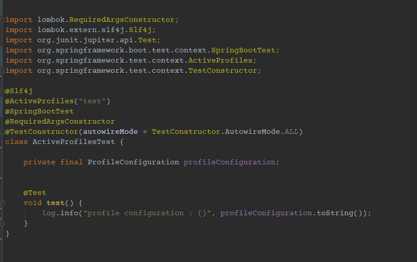

아래는 테스트 로그 입니다.

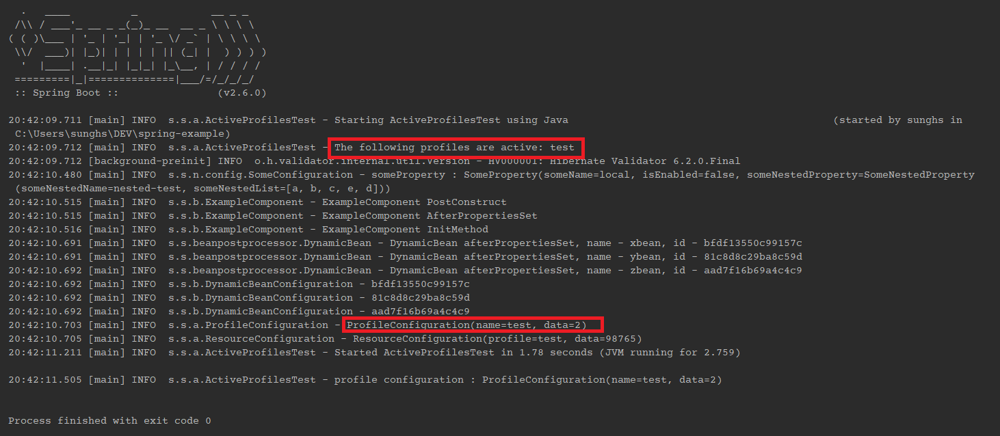

**여기까지는 문제가 없습니다.**

그래서 `spring.config.import`를 이용해서 profile 설정과 동일한 값을 가져오는지 테스트 했습니다.

## 테스트 2) spring.config.import 프로퍼티 로드

`spring.config.import` 를 이용해서 값을 가져올 `resource-local.yml` 과 `resource-test.yml` 을 두개 만들었습니다.

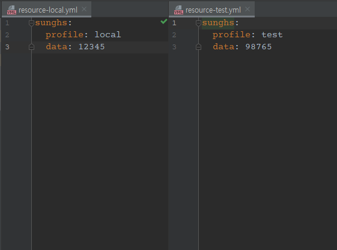

그리고 아래처럼 `ResourceConfiguration` 이라는 ConfigurationProperties 를 이용해 값을 가져옵니다.

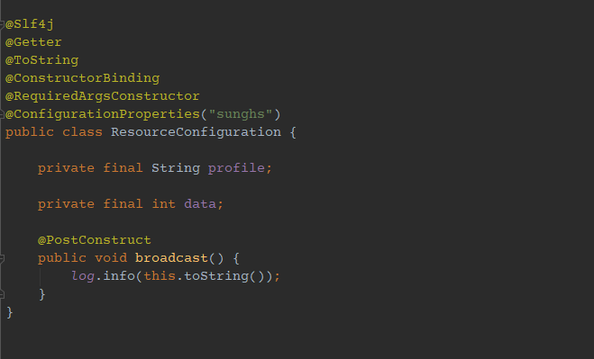

테스트 해볼 값은 sunghs.profile 과 sunghs.data 입니다.

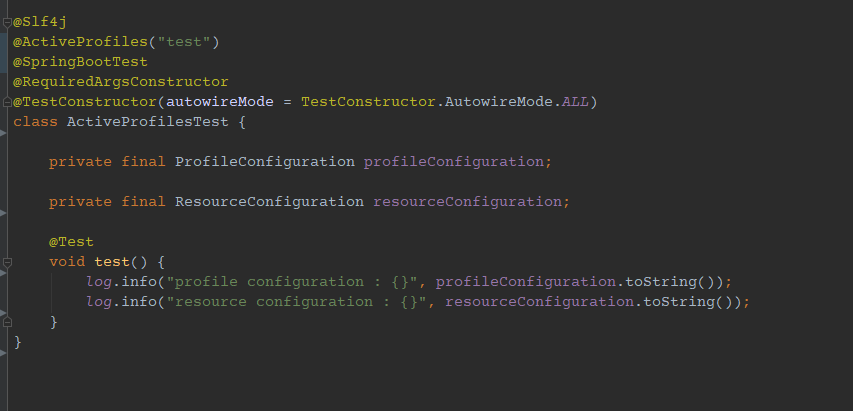

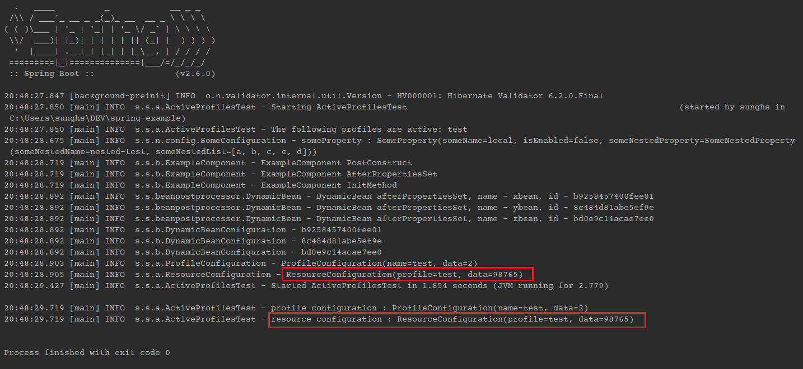

정확히 매핑되어 있네요. 하지만 `ActiveProfiles`는 Environment 객체의 `spring.profiles.active` 에 값을 주입하지 않습니다.

아래 코드를 보면 됩니다.

## 테스트 3) spring.profiles.active는 어떻게 나올까

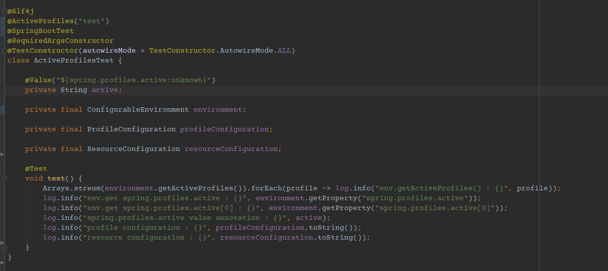


위의 테스트코드와 실행결과를 보면 모든 profile이 test로 나와야 하지만, local 로 나오는 값이 있는걸 알 수 있습니다.

## 테스트코드에서 local로 나오는 결과
```java

// 1
private final ConfigurableEnvironment environment;
environment.getProperty("spring.profiles.active");
// 2
@Value("${spring.profiles.active:unknown}")
private String active;
```

이게 왜 문제가 될 수 있냐면, 통합 테스트 진행시 서비스의 값을 mockBean, spyBean 으로 세팅하지 않고 실제 서비스 bean을 구성하는 작업을 많이 하는데,

profile 조건에 따른 비즈니스 로직을 처리할 때 아래와 같이 처리하면 문제가 될 수 있습니다.


### 이런 예시

```java
@Slf4j
@Service
@RequiredArgsConstructor
public class ProfileConditionalService {

    @Value("${spring.profiles.active:unknown}")
    private String profile;

    public void doSomething() {
        log.info("current profile : {}", profile);
    }
}
```

이 `ProfileConditionalService` 은 `@ActiveProfiles("test")` 에도 실제로는 local 로 매핑되고 있습니다. 심지어 profile이 없는 경우의 기본값을 unknown으로 주었지만 local 로 매핑되었다는 말은, application.yml 의 default profile 로 override 되었다는 말과 같습니다.

이런 상황의 이슈가 **spring github issue** 로 등록되어 있습니다. 

issue ) https://github.com/spring-projects/spring-boot/issues/19788

spring contributor 의 말에 원인을 찾을 수 있었습니다.

```
#19556 is the cause. Prior to that change, @ActiveProfiles("test") was mapped onto adding a property source to the environment that sets spring.profiles.active. This overrode the property in application.properties. 
With the change for #19556 in place, @ActiveProfiles("test") now maps onto a call to Environment.setActiveProfiles("test"). 
This leaves the value of spring.profiles.active in application.properties to be processed by ConfigFileApplicationListener which results in a call to addActiveProfile("prod"). As a result, both the test and prod profiles are active.
You can get 2.2.2's behaviour in 2.2.3 by removing @ActiveProfiles("test") and configuring spring.profiles.active instead:

@SpringBootTest(properties = "spring.profiles.active:test")
```

이상하게 stack overflow 에는 이 내용이 없네요. 이런 비슷한 맥락의 질문글들은 있지만 정확히 제가 원하는 내용은 아니었습니다. (2022-08-05 기준) 아직 인지하지 못한건지, 아니면 제가 못찾은건지 모르겠습니다.

아무튼 spring boot test를 진행할 때 System Property로 주입하는 properties 어노테이션 필드를 이용해 값을 주입하면 된다 하니, 그렇게 진행하겠습니다.

## 테스트 4) @SpringBootTest(properties = "spring.profiles.active=test")

`ActiveProfiles` 는 주석처리 하고, `SpringBootTest`로만 진행했습니다.

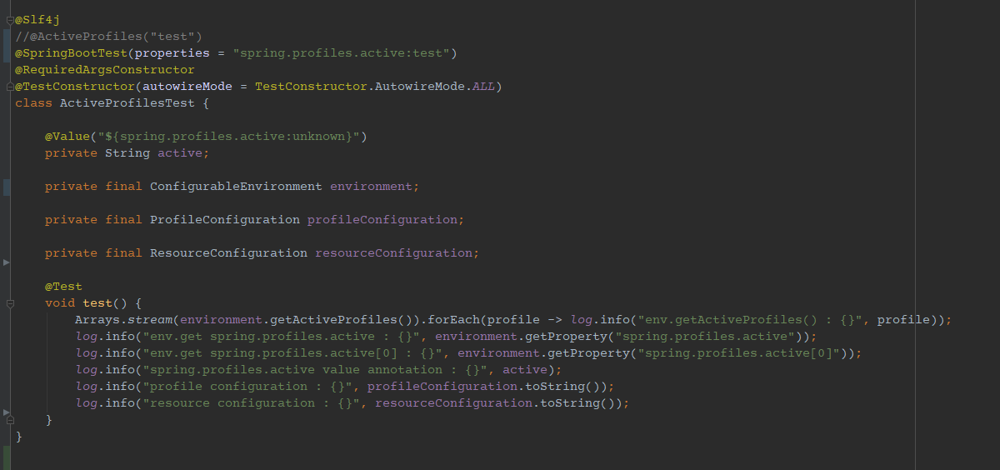

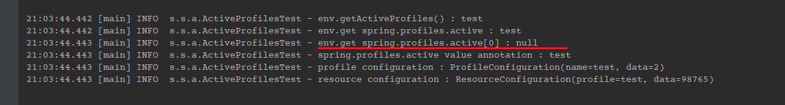

이번에는 spring.profiles.active가 정확히 매핑되었습니다. 또한 각종 프로퍼티 로드도 test profile 을 기준으로 가져왔습니다만, 문제가 `environment.getProperty("spring.profiles.active[0]")` 코드는 이번에는 null 로 가져오게 되었습니다.

대부분 상황에서 이슈가 마무리 될 것으로 보이지만, 하나가 null이라니 찝찝하네요. 이후 버그 생성되기 좋을 것 같습니다.

관련된 이슈를 살펴보니 spring boot 이전 버전에서는 `ActiveProfiles`가 `spring.profiles.active` 를 전부 오버라이딩 하였으나 `ActiveProfiles`에 multi profile을 넣기 위해 ({"test","qa","prod"} 형태의..) 일부 구조가 바뀌며 변경된 것으로 보입니다.

즉 이 문제를 전부 해결하려면 아래처럼 테스트 코드를 작성해야 겠습니다.

## 테스트 5) @ActiveProfiles + @SpringBootTest(properties)

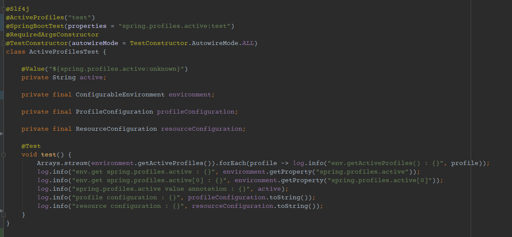

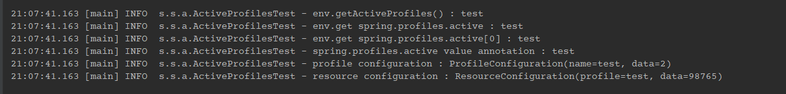

이처럼 두개 모두에 profiles를 넣으니 모든 경우에서 test profile을 가져오게 되었습니다.

이렇게 써도 되지만 매번 두개씩 번거롭게 쓰기는 좀 그래서 (통합테스트 코드는 많아야 몇개 안되겠지만..) 저는 아래처럼 하나의 어노테이션으로 만들어서 사용하는게 좋아 보여서 그렇게 했습니다.

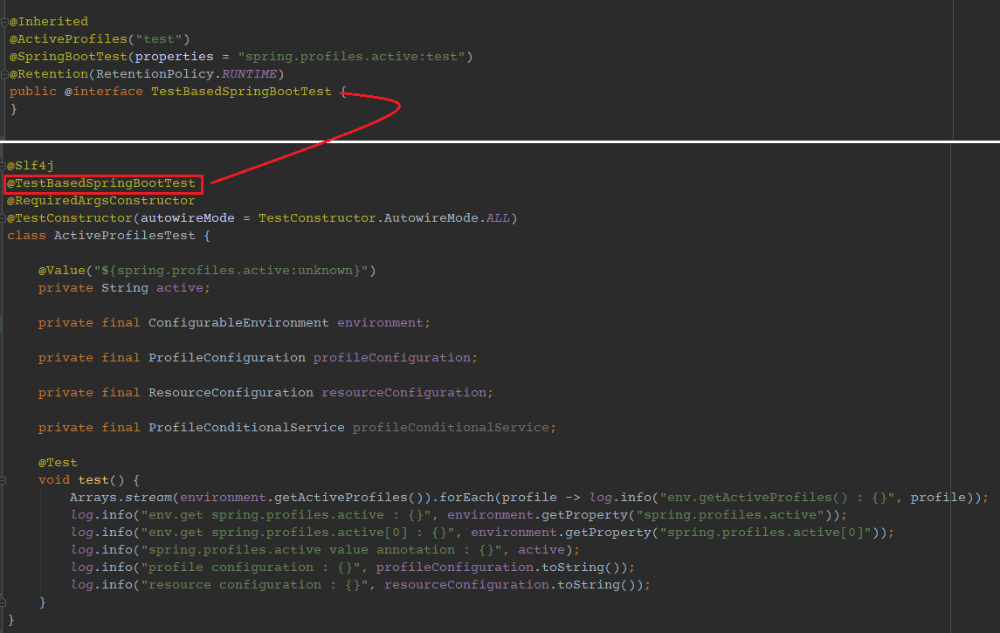


#### 이 ActiveProfiles & spring.profiles.active does not match issue 이 내용에 관한게 왜이렇게 없는건지 모르겠네요. 분명히 개인 블로그 등에 있을법 한데..

**관련 코드들은 [github](https://github.com/sunghs/spring-example) 주소에 있습니다.**