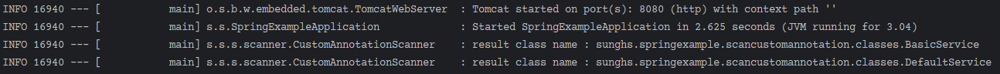

# 커스텀 어노테이션 스캔하기 (Scan Custom Annotation)

마커 인터페이스와 비슷한 기능으로 커스텀으로 마커 어노테이션도 만들 수 있다.

또는 기능이 담긴 어노테이션을 만들 때, Aspect를 이용해 특정 어노테이션이 붙은 클래스나, 메소드를 weaving 할 수 있게 만들 수 있다.

그런데 이 방법은 커스텀 어노테이션이 어느 클래스에 붙어있는지 특정할 수 있어야 하는데, (해당 클래스나 메소드가 호출 될 때 등)

특정 할 수 없다면 모든 클래스를 대상으로 특정 어노테이션이 붙어있는지 검사하는 방법밖에 없다.

이러한 기능이 필요한 케이스를 예를 들면 다음과 같다.

- 특정 어노테이션이 붙은 클래스들을 알고 있어야 할 때

- 특정 어노테이션이 붙은 클래스가 특정 타입의 인터페이스, (추상)클래스를 상속했는지 검사해야 할 때

그래서 위 두 예시의 케이스를 혼합해서 아래와 같은 요건이 들어왔을 때를 예를들어 구현 해본다.

- A라는 인터페이스를 상속한 클래스는 B라는 어노테이션이 붙을 수 있다. 만약 A 인터페이스를 구현하지 않았다면 제외한다.


즉 스프링의 ComponentScan 기능과 비슷한 기능을 만든다.

이 기능을 구현하는 방법은 크게 2가지 정도가 있는데

1. Reflection을 이용하는 방법
2. Spring에서 제공하는 Provider 사용

둘 중 리플렉션 보다는 `Spring에서 제공하는 Provider 사용` 을 이용해서 찾을 것이다.

이 방법의 장점은 스프링이 기능을 제공하기에 별 다른 dependency를 가져오거나 할 필요가 없으나 단점으로는 Spring Component가 대상이 된다.

왜냐하면 Spring BeanDefinition을 상대로만 타입 검색을 하기 때문이다. 따라서 `Spring Bean Factory`에 연관되지 않는 Utils 와 같이 static method를 제공하는 형태의 클래스를 스캔해야 한다면 Reflection을 이용하는 방법이 더 맞다.


## 먼저 타입을 제한하는 인터페이스와 어노테이션을 만든다.

### 인터페이스
```java
public interface SomeInterface {

    void some();
}
```

### 어노테이션
```java
@Documented
@Inherited
@Target({ElementType.TYPE})
@Retention(RetentionPolicy.RUNTIME)
public @interface CustomAnnotation {
    ...
}
```

우리가 찾을 클래스는 이제 다음과 같다.

- SomeInterface를 구현했으면서 CustomAnnotation 이 붙은 클래스

## SomeInterface를 구현한 클래스 2개와 구현하지 않은 클래스 1개
```java
@CustomAnnotation
@Slf4j
@Service
@RequiredArgsConstructor
public class BasicService implements SomeInterface {

    @Override
    public void some() {
        log.info("BasicService do some");
    }
}
```

```java
@CustomAnnotation
@Slf4j
@Service
@RequiredArgsConstructor
public class DefaultService implements SomeInterface {

    @Override
    public void some() {
        log.info("DefaultService do some");
    }
}
```

위 `BasicService` 와 `DefaultService`는 `SomeInterface`를 구현했기 때문에 추후 진행 할 스캐너에 스캔 대상이 되어야 한다.

```java
@CustomAnnotation
@Slf4j
@Service
@RequiredArgsConstructor
public class NotImplementationService {

}
```

위 `NotImplementationService`는 `CustomAnnotation`은 있지만 `SomeInterface` 은 구현하지 않았기에 제외되어야 한다.

## ClassPath 내 특정 타입을 걸러 BeanDefinition으로 반환하는 Provider

이름 그대로 스프링에서는 `ClassPath 내 특정 타입을 걸러 BeanDefinition으로 반환하는 Provider` 라는 이름의 클래스를 제공한다.

### Custom Annotation Scanner

```java
@Slf4j
@Component
public class CustomAnnotationScanner {

    /**
     * application ready event 발생 시 컴포넌트들을 스캔한다.
     */
    @EventListener(ApplicationReadyEvent.class)
    public void scan() {
        ClassPathScanningCandidateComponentProvider provider = new ClassPathScanningCandidateComponentProvider(false);
        provider.addIncludeFilter(new AnnotationTypeFilter(CustomAnnotation.class));

        List<String> list = provider.findCandidateComponents("sunghs.springexample.scancustomannotation")
                .stream()
                .filter(this::isSomeInterfaceImplement)
                .map(BeanDefinition::getBeanClassName)
                .toList();

        // 결과
        list.forEach(className -> log.info("result class name : {}", className));
    }

    /**
     * SomeInterface 를 구현했는지 확인 후 반환한다.
     */
    private boolean isSomeInterfaceImplement(BeanDefinition beanDefinition) {
        try {
            Class<?> type = Class.forName(beanDefinition.getBeanClassName());
            return SomeInterface.class.isAssignableFrom(type);
        } catch (ClassNotFoundException e) {
            log.error("isSomeInterfaceImplement error cause : ", e);
            return false;
        }
    }
}
```

`ClassPathScanningCandidateComponentProvider` 를 사용한다. Provider 생성 시 constructor argument 는 기본 제공 필터를 사용할지 여부이다.
- `false` 처리 하는 경우 기본 세팅되는 타입필터를 사용하지 않게된다. 즉, 우리가 설정한 필터를 사용하게 된다.

`addIncludeFilter` 메소드를 통해 추가된 타입만 걸러서 반환해 줄것을 명시한다. 우리는 CustomAnnotation 이 붙은 클래스만 찾아오도록 설정한다.

그리고 `findCandidateComponents` 를 사용하게 되면 `Set<BeanDefinition>` 형태로 BeanDefinition을 반환한다. Set을 사용하기에 중복은 일어나지 않으며, 인자값으로는 어디서부터 스캔할지 Base Package를 설정한다. 명시한 패키지부터 스캔하게 된다.

이를 통해 받은 Collection을 filter 스트림 체이닝을 통해 `isSomeInterfaceImplement` 메소드를 호출한다. 해당 메소드는 특정 타입 (SomeInterface)를 구현했는지에 따라 true/false 를 반환한다.

이 클래스는 `ApplicationReadyEvent`가 발생할 때 수행되도록 한다. 스프링 라이프 사이클 중간에 끼어들어 수행해야 하는 작업이 필요하다면 Event 시점을 바꾸어야 한다. 이 예제는 시스템이 모두 준비 완료 된 다음 수행해서 메모리에 올려만 놓아도 되기 때문에 `ApplicationReadyEvent` 를 사용했다. 또는 Bean 생성 시점에 호출되어야 한다면 PostConstruct, InitMethod 호출과 같이 개입해야 할 시점을 잘 체크해서 사용하면 된다.

## 결과

예상되는 결과는 `BasicService` 와 `DefaultService` 두 개만 출력되어야 한다.



소스 예제 : https://github.com/sunghs/spring-example/tree/master/src/main/java/sunghs/springexample/scancustomannotation