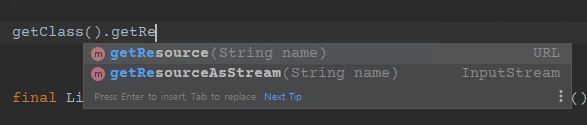

# IDE에서는 되고, jar 파일에서는 안되는 파일 접근

### 특정 파일을 빌드 당시 반드시 포함시켜야 할 때

보통 필요한 파일들은 static 영역에 있거나, DB에 저장하거나, 아니면 공통으로 집중시키기 마련입니다만 특수한 상황에서는 jar 안에 포함시켜 배포해야 하는 경우가 있습니다.

보통 IDE (이클립스, 인텔리제이) 등에서 개발할 때 gradle, maven 등으로 빌드하게 되면 build/resources/main/.. 클래스 파일들과 경로로 특정 파일이 떨어지면서 파일 읽기에 문제가 없는데, 이 파일을 jar 안에 포함시켜 배포해야 한다면 기존 파일 접근 코드로는 문제가 생깁니다.

그 이유가 유효하지 않은 경로가 되어버리는 것인데, 파일에 접근할 때 사용되는 프로토콜과 경로는 아래처럼 읽히게 됩니다.

### IDE에서 settings.config 라는 파일에 접근할 때
```
file:/user/.../build/resources/main./../settings.config
```

### jar 안에 포함시킨 settings.config 라는 파일에 접근할 때
```
file:/user/.../배포된jar.jar!/.../settings.config

또는 구현 방법에 따라 아래같이 보일 수도 있습니다.

jar:file:/user/.........../settings.config
```

jar 파일 내부로 들어갈 때 파일 경로에 !가 포함되게 됩니다. 그래서 기존 코드를 사용하게 되면 ```FileNotFoundException```이나, ```NullPointerException```이 발생하면서 읽을 수 없습니다.

### getResource() -> getResourceAsStream()

```getResourceAsStream```은 ```InputStream```을 반환하는데, 해당 메소드를 사용하면 ```jar!```가 포함되지 않습니다. 

하지만 이 방법은 ```inputStream```을 열어 사용해야 하기 때문에, 폴더를 통째로 검사해야 하는 경우에는 코드가 매우 길어지게 됩니다.

즉, 떨어지는 파일의 파일명을 무조건 알고 있어야 한다는 것이죠. (이 경우가 일반적이긴 합니다.)

여기서 ```Spring``` 프레임워크에서는 jar 내부의 Resource 들을 접근 할 수 있도록 패턴 리졸버를 제공합니다.

spring boot의 기본 jar 구조는 아래와 같은데, 

```
app.jar
    - BOOT-INF
        - classes
            ...
        - lib
            ...
    - META-INF
        - MANIFEST.MF
    - org
        - springframework
            ...
```

예를 들기 위해 커스텀 설정 등의 파일을 추가하기 위해 gradle, maven 등으로 추가했다고 하면

```
app.jar
    - BOOT-INF
        - classes
            ...
        - lib
            ...
    - META-INF
        - MANIFEST.MF
    - org
        - springframework
            ...
    - custom
        - settings.config
        - custom.config
        - env.config
        - connection.config
        - init.data
```

이런 구조처럼 변했다고 한다면, jar 안의 내부 파일은 아래 *메소드* 접근할 수 있습니다.

```java
public void getResources() {
    try {
        String configPattern = "custom/*.config";
        PathMatchingResourcePatternResolver patternResolver = new PathMatchingResourcePatternResolver();
        Resource[] resources = patternResolver.getResources(configPattern);

        if(resources.length == 0) {
            log.info("Resources Not Found");
        }

        for(Resource resource : resources) {
            log.info("resource name : {}", resource.getFilename()); // 경로를 제외한 파일명만 돌려줍니다. custom.config 등
        }
    } catch (IOException e) {
        log.error("Resource Found Error", e);
    }
}
```

```PathMatchingResourcePatternResolver``` 메소드가 경로 패턴을 토대로 Resource의 리스트를 돌려줍니다. 즉, init.data를 제외한 4개의 config 파일이 Resource[] 로 반환됩니다.
즉 파일명을 정확히 알 필요가 없습니다. 이후에는 루프를 돌면서 파일 내용을 가져오던지 등의 세팅을 추가적으로 구현 할 수 있습니다.

```java
for (Resource resource : resources) {
    BufferedReader bufferedReader = new BufferedReader(new InputStreamReader(resource.getInputStream()));
    String buffer;
    while ((buffer = bufferedReader.readLine()) != null) {
        log.info("Current Read Buffer : {}", buffer);
    }
    bufferedReader.close();
}
```

이 방법을 사용하면 jar는 물론 IDE에서 실행할때도 가능합니다. 즉, IDE에서 패턴리졸버로 Resource를 찾는 위치는 ```build/resources/main``` 아래가 됩니다.

즉 try 문에서 jar 내부 가져와보고, 예외 떨어지면 catch에서 IDE로 간주해서 무언가 처리하는 등의 방법이 필요 없어집니다.
