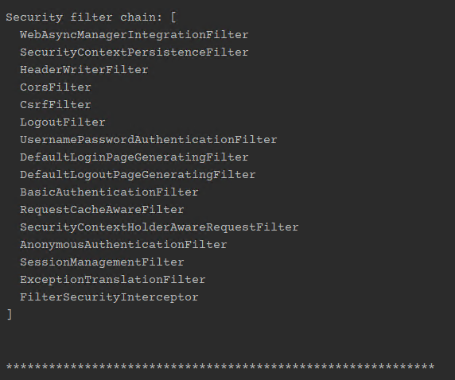
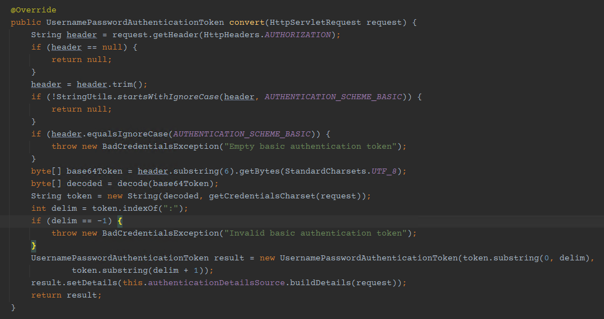
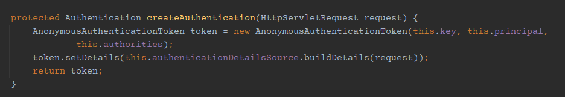
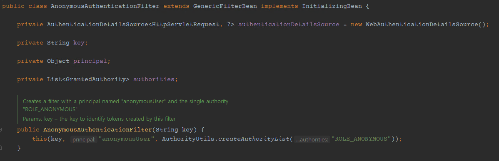

# JWT 사용 시 Spring Security Filter 흐름 분석(?)

타 포스팅들 보면 JWT (Json Web Token) + Spring Security 이용해서 권한 인증 글들이 많은데 넘어가는 로직을 보려고 합니다.

JWT 토큰을 파싱하거나 내려주어 헤더에 저장하는 `JwtFilter` 등을 `OncePerRequestFilter` 또는 `GenericFilterBean`을 상속받아 구현하고 있을 겁니다. (같은 클라이언트 안에서는 같은 서블릿 서빙이 되어야 이상적이나 다른 서블릿 객체가 생성되는 경우가 있습니다. 이 때 GenericFilterBean은 새 필터로직을 수행하므로 oncePerRequestFilter를 이용해서 동일 클라이언트 = 동일 서블릿 서빙 할 수 있도록 구현하는게 이상적 입니다.)

이 JwtFilter 등에서 하는 일이 보통 헤더(Authorization)에 들어있는 토큰을 꺼내 이상이 없는 경우 `SecurityContextHolder.getContext().setAuthentication(..)` 로 SecurityContextHolder에 저장하게 됩니다.

그리고 JwtFilter를 `UsernamePasswordAuthenticationFilter` 이전에 수행 되도록 Configuration에서 등록하고는 하는데 이 원리를 보려고 합니다.

대충 JwtFilter는 아래와 같이 생겼을 겁니다. (OncePerRequestFilter 가 더 좋습니다.)
```java
@RequiredArgsConstructor
public class TokenVerificationFilter extends GenericFilterBean {

    private final TokenProvideService tokenProvideService;

    @Override
    public void doFilter(ServletRequest request, ServletResponse response, FilterChain chain)
        throws IOException, ServletException {
        final String token = ((HttpServletRequest) request).getHeader("Authorization");

        if (StringUtils.isNotEmpty(token) && tokenProvideService.isValidToken(token)) {
            RoleTypes roleTypes = tokenProvideService.getUserRole(token);

            final UserInfo userInfo = UserInfo.builder()
                .seq(Long.parseLong(tokenProvideService.getUserInfoSeq(token)))
                .userId(tokenProvideService.getUsername(token))
                .userRole(roleTypes)
                .build();

            Authentication authentication = new UsernamePasswordAuthenticationToken(userInfo, "", roleTypes.getAuthorities());
            SecurityContextHolder.getContext().setAuthentication(authentication);
        }
        chain.doFilter(request, response);
    }
}
```
## 순서
Spring Security의 FilterChain은 아래 순서로 동작합니다.




JwtFilter를 UsernamePasswordAuthenticationFilter 이전에 태우도록 등록다면, UsernamePasswordAuthenticationFilter 에서는 Authentication 객체가 있는지 여부를 검사하고 넘어가는데, JwtFilter에서 반드시 생성되므로 바로 통과됩니다. 기본 로그인 페이지를 사용하지 않는다고 설정했을 경우 이후 동작하는 주요 Filter는 
basicAuthenticationFilter -> 
RequestCacheAwareFilter -> 
SecurityContextHolderAwareRequestFilter -> 
AnonymousAuthenticationFilter -> 
SessionManagementFilter -> 
ExceptionTranslationFilter

입니다.  

## basicAuthenticationFilter

Authorization 헤더에 값이 있으면 그걸 앞 6자리를 BASE64로 말아 UsernamePasswordAuthenticationToken 에 세팅합니다. 헤더가 없으면 null 처리되고 다음필터로 넘어갑니다. 그리고 꺼내서 존재한 username이 SecurityContextHolder에 존재하고 권한이 있다면 그냥 넘어가고, 권한이 없거나 AnonymousAuthenticationToken인 경우 AuthenticationManager에 의해 권한을 부여받고 SecurityContextHolder에 저장됩니다.

## RequestCacheAwareFilter
쿠키 또는 세션에 값이 있는지 보고 넘깁니다. 값이 있다면 래핑된 Request가 날아가고, 없다면 기존의 request 객체로 다음 필터로 위임합니다.

## SecurityContextHolderAwareRequestFilter
ROLE_ 이란 prefix 를 세팅하여 req, res를 가공하고 다음 필터로 넘깁니다.

## AnonymousAuthenticationFilter

SecurityContextHolder 에 Authentication 값이 없으면 anonymous 권한을 세팅해서 넘기고, 값이 있는 경우 바로 필터로 위임합니다.

- principal : anonymousUser
- authorities : ROLE_ANONYMOUS

JwtToken이 세팅 되어있기 때문에 바로 넘어갑니다. 이부분이 가장 중요한 부분이라 보는데, ROLE_ANONYMOUS 세팅을 피해야 로그인 처리가 성공하기 때문입니다.

## SessionManagementFilter
세션이 있는지 보고 없다면 SecurityContextHolder에 anonymous로 세팅된 권한인지 확인합니다. 맞다면 다음 필터로 위임하고, 아니라면 `HttpSessionSecurityContextRepository`에 현재 컨텍스트(SecurityContextHolder.getContext)를 세션으로 저장합니다.
결국 이 부분에서 jwt 토큰이 튀어나오기 때문에 세션으로 저장되어 모든 필터를 통과하게 됩니다. 아닌 경우 session 값 세팅이 안되었기 때문에 마지막 FilterSecurityInterceptor에서 Exception이 발생하게 됩니다.

모든 Filter를 통과하여 로그인 또는 권한 인증에 성공하게 됩니다.

## FilterChainProxy
모든 필터는 `FilterChainProxy`를 거치게 됩니다.
basicAuthenticationFilter -> FilterChainProxy -> RequestCacheAwareFilter ...