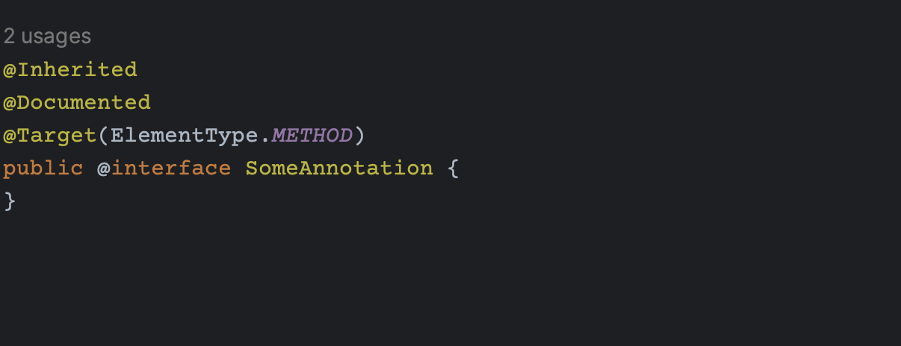
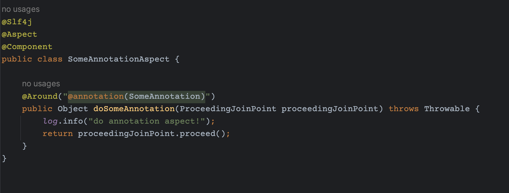
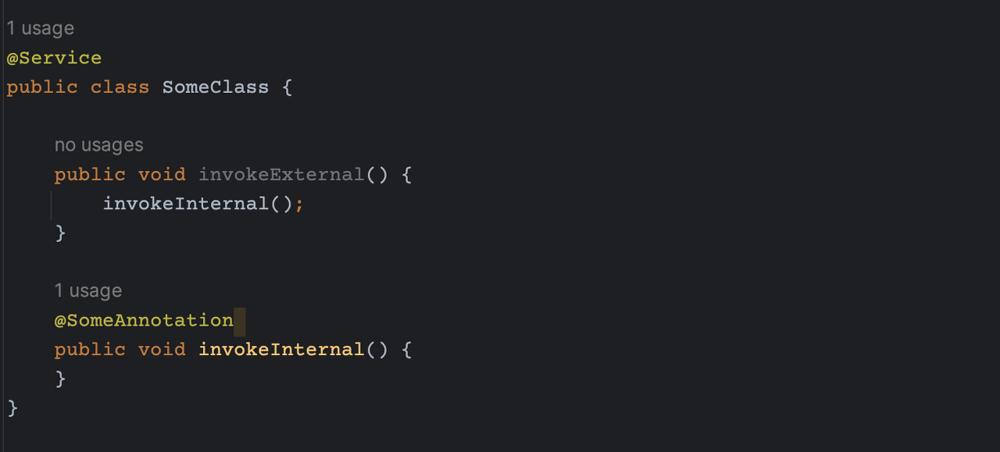
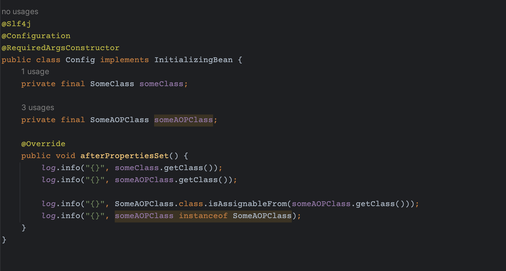
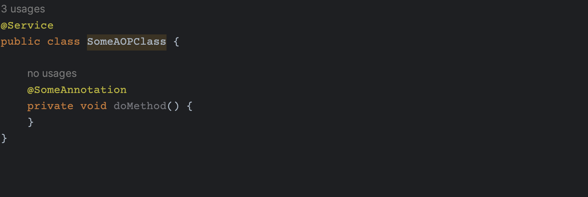

# Spring AOP 사용시 주의 점

Spring AOP는 기존에 JDK Dynamic Proxy 를 사용하다가, 
Spring boot 2.0, Spring framework 4.3 에 올라와서 기본 프록시 라이브러리로 CGLib을 사용한다.

## 뭐가 다른거지
JDK Dynamic Proxy 와 CGLib 의 가장 큰 차이는 프록시 대상 객체가 인터페이스를 구현했느냐 여부이다.

신입 시절에 백엔드를 개발하다보면 회사 코드가 Service-ServiceImpl 로 구현되어 있었는데, 
이게 Loose Coupling을 해결하기 위한 것인가 보다 했으나, 다형성을 위해 구현되는 경우가 거의 없었다.
(interface : class = 1 : N 이 거의 없고 대부분 1 : 1)

아마 JDK Dynamic Proxy 이던 시절에는 interface 구현이 반드시 필요하다보니 다형성과 루즈커플링 해결을 위함보다는 저런식의 개발이 고착화 된게 아닌가 한다..


### JDK Dynamic Proxy
```java
public class SomeClass implements SomeInterface {
    ...
}
```

### CGLib
```java
public class SomeClass {
    ...
}
```

## CGLib 몇가지 특징
기존에 CGLib이 사용되지 않고 JDK Dynamic Proxy가 사용되던 이유는 몇 가지가 있었는데, 그 중 대표적인 내용은
- default 생성자가 반드시 필요함
- 생성자 호출을 두번 해야함

이 두가지가 대표적(?)인 것 같다. 초기에는 이 치명적인 단점으로 인해 사용되지 않았지만 이 점이 개선되어 CGLib 이 기본 프록시 라이브러리로 채택된 듯 하다.

대표적인 AOP 기능으로 `@Transactional` 이 있는데, Spring AOP로 구현된 대표적인 어노테이션이다.

Spring Aspect 사용법에 대해선 설명하지 않고, Spring AOP 를 쓰면서 주의해야 할 점 (CGLib 주의점) 에 대해서만 말해보면..

---

## 0. Aspect 세팅하기
annotation 과 해당 annotation이 붙은 메소드를 런타임 시 weaving 하는 aspect를 만든다.






## 1. self-invocation
자기 자신을 호출 할 때는 proxy를 태울 수 없다. 

아래와 같은 코드를 확인하면 된다.



코드를 보면, 외부에서 `invokeExternal()` 메소드를 호출하고, `invokeExternal()` 호출 당시에 `SomeAnnotation` 이 붙은 `invokeInternal()` 메소드를 호출한다.

해당 코드는 invokeInternal() 를 호출 할때 프록시 객체를 가져오게 되면 $proxy.invokeInternal() 형태로 호출되어야 하지만, invokeExternal() 메소드는 AOP 적용이 되지 않았다. 따라서 타겟을 직접 참조해서 아래처럼 호출된다.

```
... at invokeInternal()
... at invokeExternal()
```

다른 컴포넌트로 위임해서 프록시 객체를 참조하게 만들거나, 현재 AopContext 가 들고 있는 프록시 객체를 직접 가져와 invoke 할 수 있다. 이는 스타일에 따라 다를 수 있을 것 같은데, 다른 컴포넌트로 위임해서 프록시 객체를 참조할 수 있도록 하는 방법이 좋은 것 같다.

## 2. Spring Bean 이 아닌 경우
Spring Bean 이 아닌 클래스는 Spring AOP를 태울 수 없다.

Spring Bean 이 생성 될 때 프록시 객체로 생성되기 때문이다. 아래의 코드는 그냥 타겟을 직접 호출한다.

## 코드
```java
// service, component, configuration 에서 bean 생성 등이 없는 경우
public class SomeClass {

    @SomeAnnotation
    public void someMethod() {
        // AOP 적용 안됨.
    }
}
```

굳이 사용해야 한다면 AspectJ 라이브러리를 직접 추가해서 특정 클래스가 AOP 와 비슷한 형태의 기능을 사용하도록 구현해야 한다.


## 3. 클래스 이름 불일치
AOP가 적용된 Bean 은 Enhancer에 의해 참조되므로 클래스 이름을 확정 지을 수 없다.




```java
log.info("{}", someClass.getClass());
log.info("{}", someAOPClass.getClass());
```

`afterPropertiesSet()` 메소드의 1~2라인을 보면 클래스 이름을 로깅한다.

```
sunghs.spring.Config                     : class sunghs.spring.SomeClass
sunghs.spring.Config                     : class sunghs.spring.SomeAOPClass$$EnhancerBySpringCGLIB$$afbdb0a5
```

SomeAOPClass 또한 sunghs.spring.SomeAOPClass로 나올것 같았지만, SomeAnnotation 을 붙이게 되면 `sunghs.spring.SomeAOPClass$$EnhancerBySpringCGLIB`에 의해 프록시 객체로 생성된다.

다만, 클래스 타입을 체크하는 부분에서는 체크가 가능하다. (4~5라인)

```java
log.info("{}", SomeAOPClass.class.isAssignableFrom(someAOPClass.getClass()));
log.info("{}", someAOPClass instanceof SomeAOPClass);
```

타입을 캐스팅하게 되면 정상적으로 가능하다고 나온다.

```
sunghs.spring.Config                     : true
sunghs.spring.Config                     : true
```

## 4. protected, private method
protected 와 private 메소드에서 사용이 불가능하고, public만 가능하다.

Spring AOP는 runtime-weaving (바이트코드 조작이 가능한 컴파일이 끝난 이후 실행 단계에서 weaving) 방식이라고 한다. 

Spring AOP에서 타겟 클래스를 동적으로 상속받아 타겟 메소드에 weaving 하는 방식이다. 따라서 private 메소드는 가려진 채로 상속되므로 프록시 객체에서 사용할 수 없게 된다.



이 코드는 이렇게 실행 될 것이다.

```
sunghs.spring.SomeAOPClass$$EnhancerBySpringCGLIB$$afbdb0a5.doMethod()
```

해당 메소드는 private 이므로 프록시 객체가 접근할 수 없게 된다. 

따라서 프록시 객체는 생성되지만 private 메소드는 내부에서 호출되므로 타겟을 직접 참조해서 실행하게 된다.

## 결론

***프록시 객체로 생성 된 bean 으로 호출하는 public 메소드에만 적용 된다는 사항이 가장 중요하다. !***