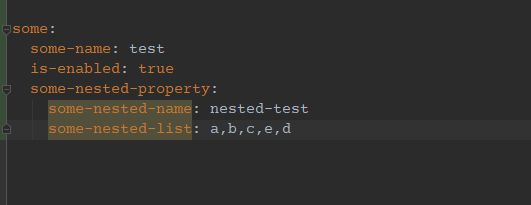
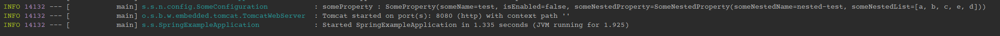
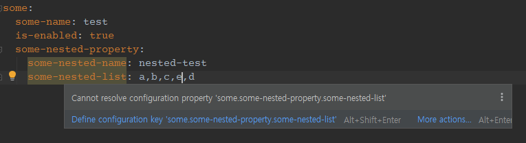
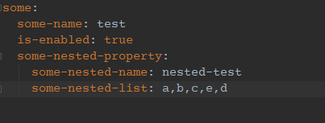
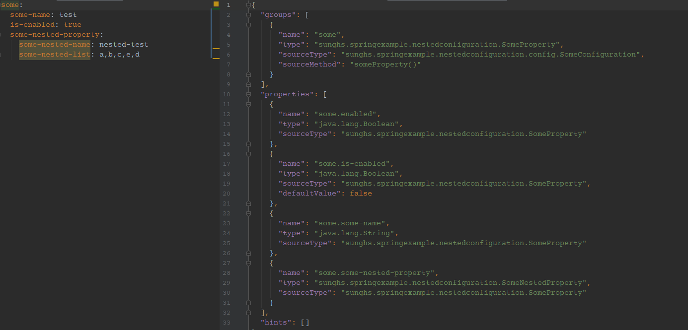
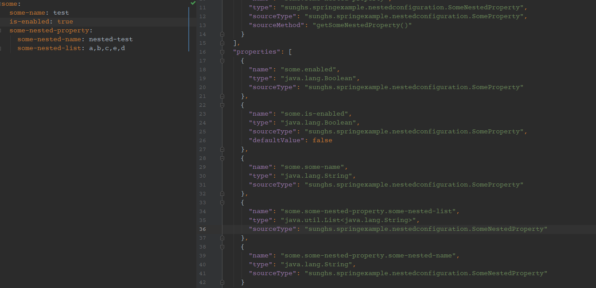

# Spring Configuration 의 Cannot resolve configuration property 문제

spring에서 제공하는 configuration 말고도 따로 properties/yml의 configuration을 추가해서 쓸때가 많습니다.

Configuration Property 내부의 Nested Property, 즉 중첩된 Property가 있는 경우에는 Spring 에서 그 데이터 타입에 대한 정의를 하라고 하는데요.

아래 사진을 보면 밝게 표시된 property 입니다.



특히 개발 IDE 중 인텔리제이를 쓰시는분들중 저처럼 이게 거슬리는 분들이 많을 것 같습니다.

일단 이걸 재현하기 위해 예제를 보시게 되면

## property model 만들기

yml에서 설정이 바인딩 될 모델입니다.
```java
import lombok.Getter;
import lombok.Setter;
import lombok.ToString;

@Getter
@Setter
@ToString
public class SomeProperty {

    private String someName;

    private boolean isEnabled;

    private SomeNestedProperty someNestedProperty;
}
```
`SomeNestedProperty` 라는 타입이 있는데 설정 안의 설정 필드로 쓰기 위해 만든 Object 입니다.

아래처럼 간단하게 세팅했습니다.

```java
import lombok.Getter;
import lombok.Setter;
import lombok.ToString;

import java.util.List;

@Getter
@Setter
@ToString
public class SomeNestedProperty {

    private String someNestedName;

    private List<String> someNestedList;
}
```

그리고 이걸 Configuration 에서 주입하게 되면

## configuration
```java
import lombok.extern.slf4j.Slf4j;
import org.springframework.beans.factory.InitializingBean;
import org.springframework.boot.context.properties.ConfigurationProperties;
import org.springframework.context.annotation.Bean;
import org.springframework.context.annotation.Configuration;
import org.springframework.util.Assert;
import sunghs.springexample.nestedconfiguration.SomeProperty;

@Slf4j
@Configuration
public class SomeConfiguration implements InitializingBean {

    @Bean
    @ConfigurationProperties("some")
    public SomeProperty someProperty() {
        return new SomeProperty();
    }

    @Override
    public void afterPropertiesSet() {
        SomeProperty someProperty = someProperty();
        Assert.notNull(someProperty, "someProperty must not be null");
        log.info("someProperty : {}", someProperty);
    }
}
```

대강 이런식으로 사용할 수 있게 될 것 인데요,

`@ConfigurationProperties("some")` 이니 application.yml에 작성해보겠습니다.

## application.yml
```yml
some:
  some-name: test
  is-enabled: true
  some-nested-property:
    some-nested-name: nested-test
    some-nested-list: a,b,c,e,d
```

설정 객체(SomeProperty) 안의 객체(SomeNestedProperty)에 바인딩이 되는지 보겠습니다.




정확히 됩니다. 하지만 인텔리제이에는 아래 사진처럼 저 속성에 대해 타입을 알아낼 수 없다고 나옵니다.



이걸 해결하는 방법에는 두가지가 있는데, 첫번째 방법은 많이 알려졌는데 두번째 방법은 많이 안알려져 있는것 같습니다.

## 1. spring-configuration-metadata.json 에 직접 쓰기

src/main/resources/META-INF/spring-configuration-metadata.json 위치에 key-value에 대한 정의를 만들라고 합니다.

예를들면 아래 처럼 작성하면 됩니다.

```json
{
    "properties": [
        {
        "name": "key",
        "type": "java.lang.String"
        },
        {
            ...
        },
        ...
    ]
}
```

근데 1번 방법은 굉장히 번거롭고, `@ConfigurationProperties`를 쓰게 되면 원래 자동 생성되서 인텔리제이 같은 IDE에서 cannot resolve... 가 뜨지 않는 것인데

NestedProperty를 위해 하나하나 쓰고 있기가 힘듭니다. 그래서 아래 두번째 방법으로 해결 할 수 있습니다.

## 2. @NestedConfigurationProperty

이게 잘 안알려진 방법 같은데, 어노테이션 이름부터가 중첩 설정프로퍼티에 사용하는 거라고 써 있습니다.

이걸 아래처럼 세팅하게 되면

```java
import lombok.Getter;
import lombok.Setter;
import lombok.ToString;
import org.springframework.boot.context.properties.NestedConfigurationProperty;

@Getter
@Setter
@ToString
public class SomeProperty {

    private String someName;

    private boolean isEnabled;

    @NestedConfigurationProperty
    private SomeNestedProperty someNestedProperty;
}
```

그 후 compile 진행 시 yml에서 cannot resolve.. 메시지가 사라집니다.



어노테이션을 보고 내부의 SomeNestedProperty 객체의 metadata.json을 자동으로 작성 한 걸 알 수 있습니다.


## NestedConfigurationProperty 없을 때 metadata.json



## NestedConfigurationProperty 있을 때 metadata.json



metadata.json에 자동으로 생성 된 게 보이네요.


## 결론
크게 중요한 건 아니긴 한데, 실제 resolve 되지 않더라도 자동 바인딩은 되나 저처럼 저런거 신경 거슬리는 분들은 `NestedConfigurationProperty` 어노테이션을 잘 쓰면 될 것 같습니다.