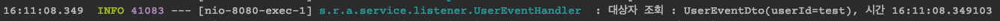

## Spring의 @EventListener

### 쓰는 이유?
의존성이 강한 로직들의 레이어를 분리할 수 있습니다.

예를 들어 A 서비스의 a 비즈니스 로직을 실행 할 때 B 서비스의 b 추가 로직을 같이 실행해야 하는 경우 A 서비스에 B 서비스를 주입시켜 a 로직 안에 b 로직을 녹이는 경우가 많습니다.

이렇게 점점 강해지는 결합을 이벤트 핸들러라는 레이어로 분리한 뒤 다시 핸들링 하는 느슨한 결합 형태로 만들 수 있습니다.

**A 서비스의 a 로직 실행 -> 이벤트 발행 -> B 서비스의 b 로직 실행**

이렇게 되면 A 서비스는 B 서비스의 변경사항과 관련없이 수정이 필요없게 됩니다.


### Spring 4 버전 이상으로 올라오며 쓰기가 많이 편해졌습니다.

기존의 이벤트 객체는 ApplicationEvent 와, 이벤트 핸들러는 ApplicationListener를 구현해야 했는데, 현재는 어노테이션 설정으로 바로 해결됩니다.

예제는 [rest-api-example](https://github.com/sunghs/rest-api-example) 에 있습니다.

### 이벤트를 전달할 객체 생성

이 객체가 이벤트 실행의 기준점이 됩니다.

```java
@AllArgsConstructor
@ToString
public class UserEventDto {

    private String userId;
}
```

### 이벤트리스너를 정의할 핸들러 생성

특정 대상자를 조회하는 경우 로깅하도록 이벤트를 생성해 보겠습니다.

```java
@Component
@Slf4j
public class UserEventHandler {

    @EventListener
    public void process(UserEventDto userEventDto) {
        log.info("대상자 조회 : {}, 시간 {}", userEventDto, LocalTime.now());
    }
}
```

구독자에게 UserEventDto 객체를 넘기게 되면, 이벤트가 실행되는 구조입니다.


### 기존 서비스에 이벤트 발행자 정의

ApplicationEventPublisher 를 선언합니다. 해당 객체에 이벤트 객체를 넘기게 되면 이벤트가 수행됩니다.

Spring에서 컴포넌트 주입을 수행하므로 생성자 주입, setter 주입, autowired 등 원하는 방식으로 주입받으면 됩니다.

```java
@RequiredArgsConstructor
@Service
@Slf4j
public class UserService {

    private final ApplicationEventPublisher applicationEventPublisher;

```

기존의 유저 정보를 return 하는 메소드에 이벤트를 발행하겠습니다.

```java
public UserInfo get(final String userId) {
    applicationEventPublisher.publishEvent(new UserEventDto(userId));
    return userMapper.selectUserInfo(userId);
}
```

`new UserEventDto(userId)` 인자를 넘기게 되면 Spring 에서 UserEventDto를 파라미터로 받는 이벤트 리스너가 수행됩니다.

### 테스트



위 방식은 `applicationEventPublisher.publishEvent`가 선언된 시점에만 수행할 수 있습니다.  
그렇다면 어떤 프로세스가 수행 될 때 마다 시점을 지정하여 `applicationEventPublisher.publishEvent` 메소드를 호출해야 한다는 건데 트랜잭션 처리를 수행하는 부분에서는 미리 이벤트를 발행해 놓으면, 트랜잭션이나 commit 이 수행되는 시점 전후에 이벤트를 수행 시킬 수 있습니다.

### 트랜잭션 처리시 이벤트를 발행

구현하는 쪽에서 행동을 정의하도록 `callback` 방식으로 구현하겠습니다. 아래와 같이 인터페이스를 선언합니다.

```java
public interface AbstractTransactionEvent {

    void callback();
}
```

### 각 시점 별로 이벤트 인터페이스 생성

```java
public interface BeforeTransactionEvent extends AbstractTransactionEvent {

}

public interface AfterTransactionEvent extends AbstractTransactionEvent {

    void completed();
}
```

각각 AbstractTransactionEvent 를 상속받는 인터페이스 BeforeTransactionEvent 와 AfterTransactionEvent 는 COMMIT이 일어나기 전, 후, 그리고 트랜잭션이 모두 완료 된 뒤 수행 할 수 있도록 만든 인터페이스 입니다. 그래서 `AfterTransactionEvent`는 트랜잭션이 모두 완료 된 뒤 실행할 `completed` 콜백 메소드를 따로 추가했습니다.

### 이벤트 핸들러 내용 추가

```java
@Component
@Slf4j
public class UserEventHandler {

    @EventListener
    public void process(UserEventDto userEventDto) {
        log.info("대상자 조회 : {}, 시간 {}", userEventDto, LocalDateTime.now());
    }

    @TransactionalEventListener(phase = TransactionPhase.BEFORE_COMMIT)
    public void beforeTransactionProcess(BeforeTransactionEvent beforeTransactionEvent) {
        beforeTransactionEvent.callback();
    }

    @TransactionalEventListener(phase = TransactionPhase.AFTER_COMMIT)
    public void afterTransactionProcess(AfterTransactionEvent afterTransactionEvent) {
        afterTransactionEvent.callback();
    }

    @TransactionalEventListener(phase = TransactionPhase.AFTER_COMPLETION)
    public void completedTransactionProcess(AfterTransactionEvent afterTransactionEvent) {
        afterTransactionEvent.completed();
    }
}
```

`TransactionalEventListener`는 트랜잭션 관련 이벤트를 수행해주는 리스너입니다. 속성으로 phase 값을 받는데, 지정하지 않는다면 기본값으로 TransactionPhase.AFTER_COMMIT이 지정됩니다. TransactionPhase를 설명하자면

- BEFORE_COMMIT : 커밋 직전에 수행됩니다. 트랜잭션 진입 전이 아닙니다. 헷갈리면 안됩니다.
- AFTER_COMMIT : 커밋 직후 수행됩니다.
- AFTER_ROLLBACK : 롤백 직후 수행됩니다.
- AFTER_COMPLETION : 트랜잭션이 완료 된 뒤 수행됩니다.

따라서 데이터를 insert 하는 트랜잭션이 있다면 아래와 같이 수행됩니다.

1. 트랜잭션 시작

2. 데이터 insert

**3. before_commit**

4. 데이터 commit

**5. after_commit**

6. 트랜잭션 종료

**7. after_completion**


### 유저 정보를 insert 하는 곳에 이벤트 리스너 추가

원래 이렇게 생긴 메소드를
```java
@Transactional(rollbackFor = UserException.class)
public boolean set(final UserInfo userInfo) {
    final int insertCount = userMapper.insertUserInfo(userInfo);
    if (insertCount == 1) {
        return true;
    }
    throw new UserException("user info insert error, insertCount : " + insertCount);
}
```

아래와 같이 바꿨습니다.

```java
@Transactional(rollbackFor = UserException.class)
public boolean set(final UserInfo userInfo) {
    final int insertCount = userMapper.insertUserInfo(userInfo);

    // beforeTransactionEvent 생성
    BeforeTransactionEvent beforeTransactionEvent = () -> log.info("commit 시작, {}", LocalTime.now());
    // afterTransactionEvent 생성
    AfterTransactionEvent afterTransactionEvent = new AfterTransactionEvent() {
        @Override
        public void completed() {
            log.info("트랜잭션 끝, {}", LocalTime.now());
        }

        @Override
        public void callback() {
            log.info("commit 종료, {}", LocalTime.now());
        }
    };
    // 이벤트 발행
    applicationEventPublisher.publishEvent(beforeTransactionEvent);
    applicationEventPublisher.publishEvent(afterTransactionEvent);

    if (insertCount == 1) {
        log.info("실제 인서트가 완료되는 시점, {}", LocalTime.now());
        return true;
    }
    throw new UserException("user info insert error, insertCount : " + insertCount);
}
```

### 테스트


### 비동기로 실행하기

만약 DB INSERT, 서버로 전송 등으로 이벤트 리스너가 시간이 오래걸리는 작업이 생기는 경우 Blocking 하기 때문에 비즈니스 로직 전체가 다 같이 밀리게 됩니다. 이런 경우 비동기 처리를 해주도록 합니다.

```java
@EnableAsync
@Configuration
public class AsyncConfig {

    // ThreadPoolExecutor Bean 생성 등..
}
```

그리고 각 이벤트 리스너 위에 `@Async` 비동기를 심어주면 됩니다.

```java
@Async
@TransactionalEventListener(phase = TransactionPhase.BEFORE_COMMIT)
public void beforeTransactionProcess(BeforeTransactionEvent beforeTransactionEvent) {
    beforeTransactionEvent.callback();
}

@Async
@TransactionalEventListener(phase = TransactionPhase.AFTER_COMMIT)
public void afterTransactionProcess(AfterTransactionEvent afterTransactionEvent) {
    afterTransactionEvent.callback();
}

@Async
@TransactionalEventListener(phase = TransactionPhase.AFTER_COMPLETION)
public void completedTransactionProcess(AfterTransactionEvent afterTransactionEvent) {
    afterTransactionEvent.completed();
}
```
각각 모든 이벤트가 taskExecutor Worker가 실행해 줍니다.

비동기로 처리하는 경우 순서의 보장이 확실하지 않으므로 항상 순서를 확실히 보장할 필요가 없는곳에 써야 합니다.

다만 `TransactionalEventListener` 의 경우 실행 시점이 명확하기 때문에 굳이 보장받을 필요는 없습니다.

### 테스트


