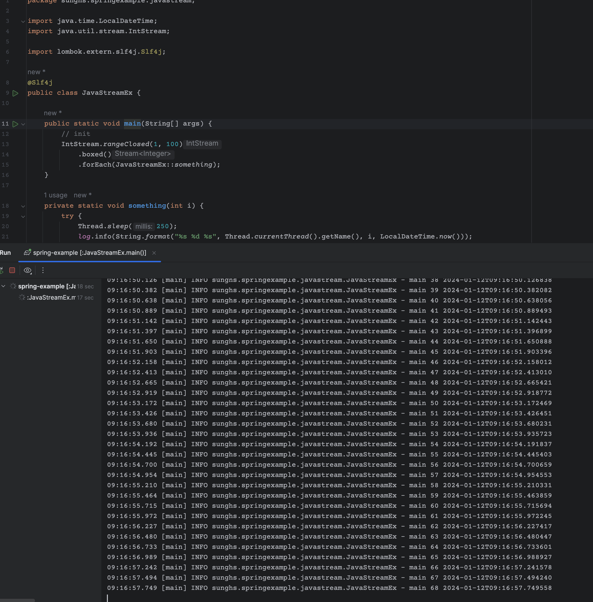
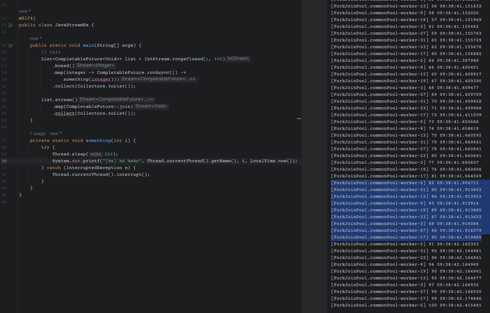
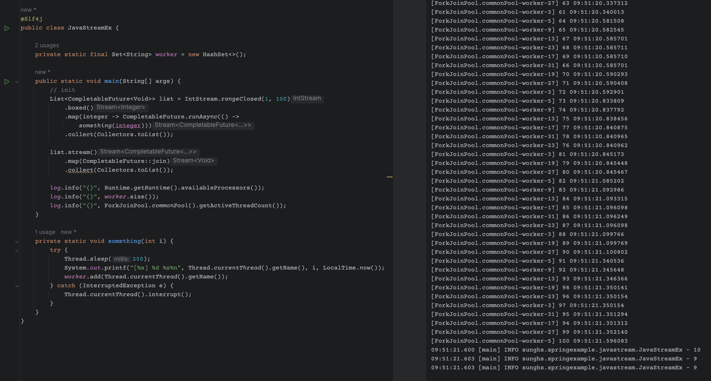
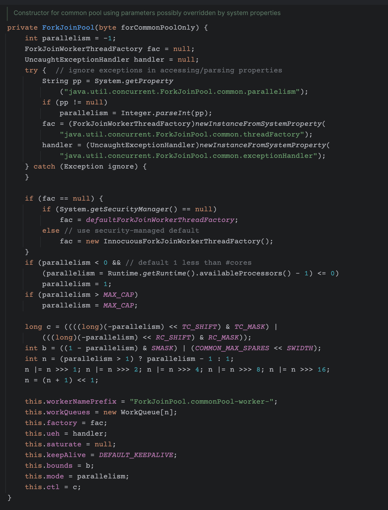
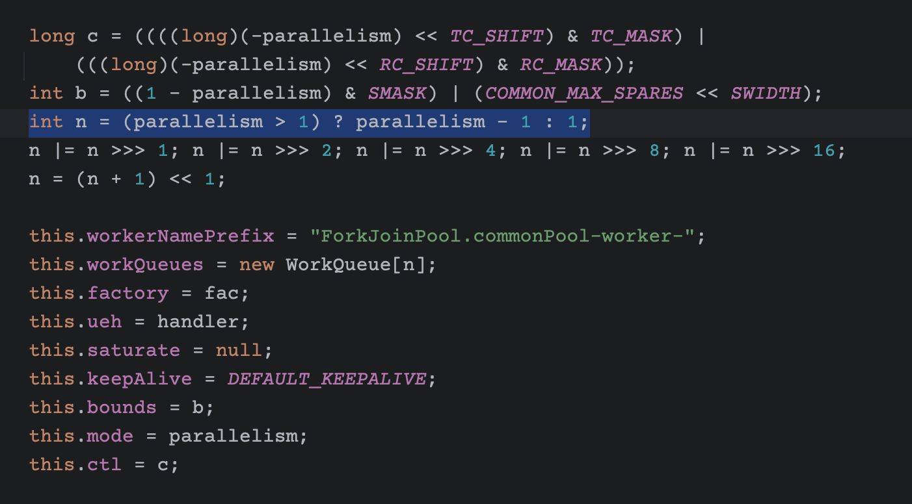
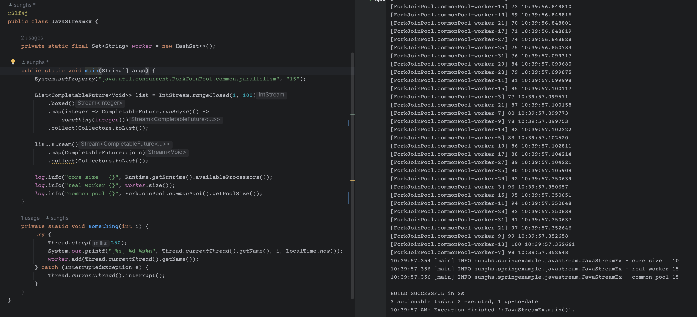
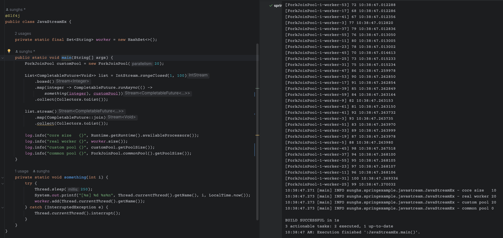

# Stream, Future 사용시 주의해야 할 점 (커넥션 풀이 남는 이슈)

얼마 전 코드에서 Stream 을 수행하면서 그 안에 DB 를 조회해서 데이터를 가져오는 로직이 있었는데, 트래픽이 많은데도 불구하고, 커넥션을 다 사용하지 못했다.

## 환경과 증상은 이러했다.

- 서버는 spring boot의 Hikari Connection Pool 사용함
- min, max connection은 동일하게 20개로 설정
- 하지만 APM으로 확인 시, 실제 사용되는 커넥션은 9개였고, 노는(idle) 커넥션이 11개정도 였다.
- 트래픽이 몰리는 순간에도 hikaricp_connections_acquire_seconds_sum, hikaricp_connections_pending 수치만 증가할 뿐 idle 커넥션은 일정하게 8~11개정도를 유지했다.
- 메트릭이 잘못 된 줄 알고 HikariCP 로깅을 debug로 찍어봐도 커넥션은 절반밖에 사용하지 않았다.

---


원인을 찾다보니 의외의 곳에서 찾았는데 혹시나 같은 증상(?)을 겪고 있다면 한번 확인 해 보면 좋을 것 같다.

먼저 Java ParallelStream 또는 CompletableFuture 내부에서 DB를 수행하는게 문제가 되었는데,

**결론부터 말하자면 ParallelStream이나 CompletableFuture는 서버의 CPU CORE 수 - 1 개의 사이즈로 생성되는 Pool에서 병렬로 진행하기 때문이다.**

코어수가 10개라면, 9개짜리 풀을 만들어서 그 안에서만 사용되는데 이것이 문제가 되었던 것이다.

풀이 9개이고, 그 안에서 DB를 조회하니 동시에 일을 하고 있는 워커는 9개인 것이고, 실제로도 커넥션은 9개 이상 쓸 수 없었기 때문이다.

## ParallelStream을 사용하지 않는 Stream



첨부 사진의 콘솔을 보면 250ms 마다 일정하게 순차적으로 진행하는 것을 알 수 있다.

## Stream 내부에서 CompletableFuture 수행

처음부터 ParallelStream을 사용했다면 조금 더 빨리 찾을 수 있었을 것 같은데 Stream 내부에서 CompletableFuture를 사용해서 처음엔 뭐가 문제인지 못찾았다.



이 로직처럼 생긴 구조인데, `something` 메소드에서 DB를 조회하는 로직이 들어있었다. 사진의 오른쪽 콘솔에서 블럭잡힌 부분을 보면 시간상 동시에 수행되는 유닛이다.

***ParallelStream이나 CompletableFuture는 내부에서 병렬로 수행하는 공용 ForkJoinPool을 생성하는데, 별도의 size 지정이 없다면 코어 수 - 1 개만큼 생성하기 때문이다.**

하필 코어 수인 이유는, 물리적 코어 수를 넘기게 되면 불필요한 Context Swtiching Overhead가 발생하기 때문인데, 최적의 값을 코어 수 -1로 잡은 것이다.




main 메소드 하단에 3종류의 로그를 찍었다.
```java
log.info("{}", Runtime.getRuntime().availableProcessors()); #1
log.info("{}", worker.size());                              #2
log.info("{}", ForkJoinPool.commonPool().getPoolSize());    #3
```

- 1번은 현재 JVM이 사용가능한 코어의 수
- 2번은 일하는 Thread의 이름을 static HashSet에 저장했다. 중복저장 되지 않으며 새로운 이름만 저장되기 때문에, 실제로 총 몇개의 Thread가 있었는지 계산하기 위함이다.
- 3번은 ParallelStream이나 CompletableFuture에서 사용하는 공용 포크조인풀의 크기

오른쪽 콘솔 하단에 보이듯, 예상과 같이 코어는 10개, HashSet에 등록된 Thread 이름은 9개, 포크조인풀의 사이즈도 9개였다.

spring boot는 기본적 서블릿 서빙하는 thread 사이즈가 200으로 설정 되어있다. 즉 200개의 worker가 DispatherServlet을 통해 넘어와 커넥션풀을 정상적으로 사용했다면 hikari에 설정한 20개를 모두 사용했을 것이다.
그러나 was worker에서 다시 커넥션에 붙는 역할을 공용 포크조인풀에 넘기기 때문에, 실제로는 포크조인풀 사이즈만큼만 사용되는 것이다.

## 그럼 ParallelStream이나 CompletableFuture에서 DB 사용하려면 커넥션풀을 코어수만큼만 설정해야 하는가?

그것도 아니다. 아래 ForkJoinPool 생성자 로직을 보면, size를 결정하는 인자가 있다.



이 사진을 보면 System 변수에 `java.util.concurrent.ForkJoinPool.common.parallelism` 의 키값으로 값이 없는 경우 `Runtime.getRuntime().availableProcessors()` 값을 가져와 parallelism 에 담고, 최종적으로 n이라는 WorkQueue 사이즈 변수에 담는것이 보인다.



이제 로직을 알았으니 해결하면 되는데 해결법은 2개가 있다.

### 1. java.util.concurrent.ForkJoinPool.common.parallelism 값 설정

`System.setProperty("java.util.concurrent.ForkJoinPool.common.parallelism", "15")`과 같이 시스템 변수 선언을 포크조인 풀 로직이 수행되기 전에 해주면 된다.
공용 포크조인풀은 실행되기 전에는 0개이다. 즉 처음 필요할 때 인스턴스 된다.

하지만 이 방법은 추천되지 않는데, 시스템 변수를 세팅하여 공용 포크조인풀을 생성하게 되면, 서버의 모든 영역에서 같은 크기를 사용한다.

즉 A메소드에서 ParallelStream 사용 시 풀을 15개 사용하고, B메소드에서 CompletableFuture 사용 시 풀을 15개 사용하게 되는데, 이 공용풀은 HikariCP 처럼 같은 객체를 참조하기 때문에, A메소드에서 10개를 현재 사용중이라면, B메소드에서는 5개밖에 사용하지 못하게 된다. 퍼포먼스 상의 이슈가 발생 할 가능성이 있다.



`System.setProperty("java.util.concurrent.ForkJoinPool.common.parallelism", "15")` 을 설정하고 수행 한 로그이다. 정상적으로 15개로 수행된 것이 보인다.


### 2. 개별 ForkJoinPool 생성

이 방법을 추천하는데, ExecutorService와 동일하게 submit으로 넘겨주는 방법이다. 또한 CompletableFuture의 경우에는 SupplyAsync(), RunAsync() 메소드를 수행할 때 TaskExecutor를 지정해서 해당 worker에 넘겨 줄 수 있다. 아래 그림으로 보게 되면



포크조인풀을 20개로 생성하고, runAsync() 인자로 해당 풀을 같이 넘겨주었다. 오른쪽 로그에서도 확인이 가능한데, 정상적으로 20개로 수행되었다.

그리고 추가적으로 CommonPool 도 로깅했더니, 0개였다. CommonPool이 사용되지 않았기에 인스턴스 되지 않은 것이다.

이 방법은 `memory leak` 발생 가능성이 높은데, 포크조인풀은 GC에 의해 수거되지 않기 때문이다.

따라서 메모리 참조를 해제 시켜주어 GC에 의해 수거되게 해야한다. 포크조인 풀 사용이 끝난 경우 아래 메소드를 실행 해주면 된다.
```java
customPool.shutdown();
```