# 동적으로 Bean 생성 또는 개입하기 (Dynamic Bean Create, BeanPostProcessor)

application yml 에 List 형태로 어떤 프로퍼티를 추가하거나 했을 때 추가적으로 Bean 생성 메소드를 만들지 않아도, 자동으로 만들어 놓게 할 수 있습니다.

스프링에서는 개발자가 직접 지정한 Bean을 만들기 전에, 만들어지는 중에, 만들어진 후에 개입 할 수 있도록 추상체를 제공하고 있습니다.

즉 어떤 시점에 개입해서 추가 로직 처리를 할지 (= 추가적인 bean 을 생성할지) 추상체를 구현하기만 하면 되고, 

그걸 ApplicationContext 에 등록하면 ApplicationContext는 알아서 구현체를 찾아 적절한 시점에 후킹해 줍니다. 

**BeanPostProcessor** 와 **BeanFactoryPostProcessor** 를 제공하는데요. 둘은 약간 차이점이 있습니다. 
(**BeanDefinitionRegistryPostProcessor** 도 있습니다만, 여기서는 사용하지 않음)

## BeanPostProcessor
- bean 이 생성 되고 나서, 초기화 메소드 전후에 개입하는 메소드를 두개 제공
- postProcessBeforeInitialization : bean 의 init method 호출 전에 개입
- postProcessAfterInitialization : bean 의 init method 호출 이후에 개입

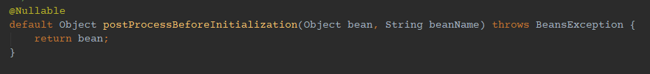

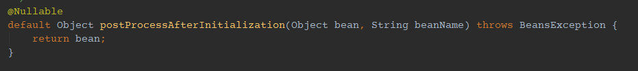

init method 로는 @PostConstruct, 또는 @Bean 필드중의 init method, InitializingBean 의 구현메소드가 있는데요, Spring LifeCycle에 따르면
- PostConstruct
- InitializingBean 의 afterPropertiesSet
- InitMethod

순서 입니다.

## BeanFactoryPostProcessor 
- bean 이 생성완료 되기 이전에 개입 할 수 있음
- bean 이 저장되어 있는 beanFactory를 제공. 그래서 빈 정의 자체를 재정의 할 때 사용할 수 있음
- bean 생성 이전에 개입하므로 BeanPostProcessor 보다 먼저 수행
- postProcessBeanFactory 메소드와, beanFactory를 argument로 제공

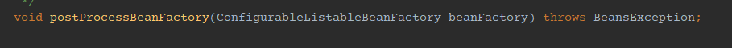

따라서 특정 bean 생성 시점에 동적으로 bean을 만들어 내기 위해선 BeanPostProcessor 가 좀더 적합합니다.

일단 라이프 사이클이 맞는지 확인 해보면

```java
@Slf4j
public class ExampleComponent implements InitializingBean {

    public void initMethod() {
        log.info("ExampleComponent InitMethod");
    }

    @PostConstruct
    public void postConstruct() {
        log.info("ExampleComponent PostConstruct");
    }

    @Override
    public void afterPropertiesSet() {
        log.info("ExampleComponent AfterPropertiesSet");
    }
}
```

이런 컴포넌트를 하나 만들고, 이걸 외부에서 주입해 보겠습니다.

```java
@Configuration
public class ExampleBeanConfiguration {

    @Bean(initMethod = "initMethod")
    public ExampleComponent exampleComponent() {
        return new ExampleComponent();
    }
}
```

실행 해보면 아래처럼 라이프사이클처럼 순서대로 로그가 찍힙니다.

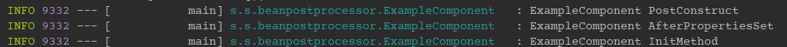

그리고 beanPostProcessor 로 ExampleComponent Bean 이 생성되는 전후에 개입 해 보겠습니다.

```java
@Slf4j
@Component
public class DynamicBeanConfiguration implements BeanPostProcessor {

    @Override
    public Object postProcessBeforeInitialization(Object bean, String beanName) 
    throws BeansException {
        if (bean instanceof ExampleComponent) {
            log.info("ExampleComponent postProcessBeforeInitialization");
        }
        return bean;
    }

    @Override
    public Object postProcessAfterInitialization(Object bean, String beanName) 
    throws BeansException {
        if (bean instanceof ExampleComponent) {
            log.info("ExampleComponent postProcessAfterInitialization");
        }
        return bean;
    }
}
```

Spring은 제가 어떤 Bean을 타겟으로 BeanPostProcessor 를 구현했는지 모르니까 매 Bean 생성 시점에 모든 ApplicationContext PostProcessor 가 동작할 것 입니다. 

즉, 만들어진 Bean 이 우리의 타겟 클래스면, 로그를 찍고, 아닌경우 그냥 원래 bean을 return 해 주면 됩니다.

AbstractAutowireCapableBeanFactory 에서는 아래처럼 Bean 생성 시점에 개입합니다.

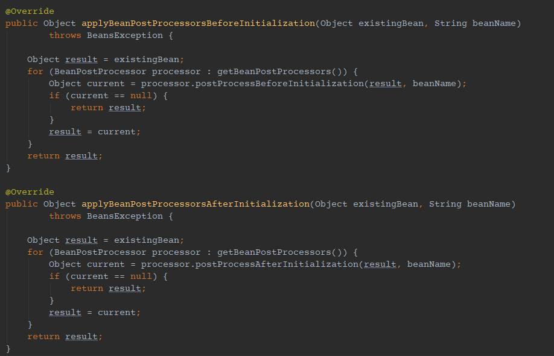

그리고 로그를 찍어보면 순서가 이럽니다.

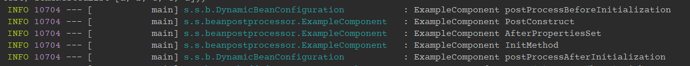

정말 init method 실행 전과 후에 개입한 걸 알 수 있습니다.

이걸 토대로 특정 Bean이 생성되고 나서 특정 Bean을 생성해 보겠습니다.

## example-bean.list 값을 DynamicBean 이라는 모델에 담아 beanFacotry에 저장

application.yml 에 있는 값을 받아 올 모델입니다.

### exampleBean

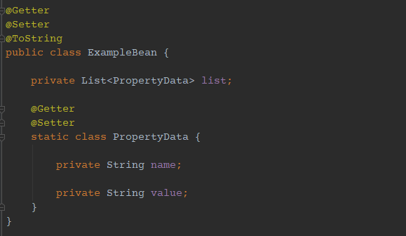

그리고 beanFactory에 저장 될 실제 모델입니다.

### dynamicBean

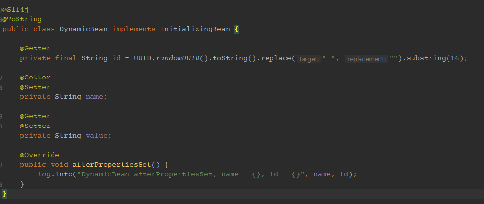

그리고 아래는 exampleBean을 외부에 만드는 Configuration 입니다.

```java
@Configuration
@EnableConfigurationProperties
public class ExampleBeanConfiguration {

    @Bean
    @ConfigurationProperties("example-bean")
    public ExampleBean exampleBean() {
        return new ExampleBean();
    }
}
```

### 설정값을 담을 yaml

```yaml
example-bean:
  list:
    - name: xbean
      value: 11111
    - name: ybean
      value: 22222
    - name: zbean
      value: 33333
```
이렇게 만들면, List 형태로 example-bean.list 를 담을 순 있습니다만, 각각 Object를 Bean으로 등록하는건 못하니, 이걸 해보겠습니다.

exampleBean 이 생성되고 나면, application.yml 데이터가 바인딩 되었을 것이니, 그 데이터를 가지고 dynamicBean을 만들어서 beanFactory에 저장하는 로직입니다.

그리고 아래처럼 BeanPostProcessor 를 변경했습니다.

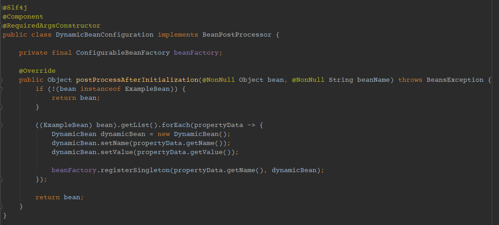

BeanFactory는 ApplicationContext에서 제공합니다. 따라서 ApplicationContextAware를 구현해서, ApplicationContext를 주입받고, BeanFactory를 꺼내 쓰는 방법도 있고, 직접 Constructor Injection 해도 됩니다. 여기서는 직접 주입받고 사용 하겠습니다.


그리고 수행하면 정상적으로 bean이 만들어지는걸 확인 할 수 있습니다.

다만 dynamicBean 에는 afterPropertiesSet 메소드가 있는데 이걸 수행하질 않습니다. 

왜냐하면, Spring이 직접 bean 생성 후 라이프사이클에 따라 처리를 해주었던 건데, 우리가 직접 Bean을 만드니 해당 라이프사이클을 타지 않습니다. 그래서 우리가 아래처럼 직접 후처리를 해주어야 합니다.

그리고 beanFactory에 등록하는 방법으로는 BeanDefinition 과 같은 등록 객체도 있으나, BeanDefinition은 타 객체의 의존 관계(Autowired 등) 등과 Bean Scope 를 정의할 때 사용하기 좋은데, 실제 인스턴스 완료 된 Object를 등록할 수 없는 단점이 있습니다. (실체를 등록하는게 아닌 메타 정보를 등록하는 객체입니다.)

그래서 여기서는 registerSingleton 메소드로 진행했습니다.

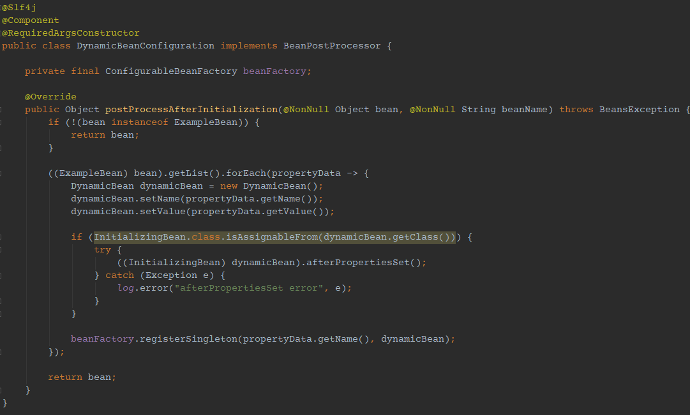

인텔리제이는 DynamicBean.class 가 항상 InitializingBean을 구현하므로 조건식이 always true 라 노랗게 표시해서 보여주고 있는건데, 동적으로 여러 Object 타입이 생겨야 하는 조건이 있을 수 있으므로 반드시 **조건 체크가 필요 할 겁니다.**

그리고 수행하면 아래처럼 로그가 나오게 됩니다.

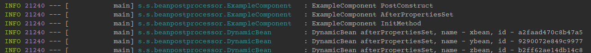

그리고 런타임 실행 완료 후 다른곳에서 bean factory에 아래 코드처럼 꺼내보면 정상적으로 들어있는걸 확인 할 수 있습니다.

```java
Object x = beanFactory.getBean("xbean");
Object y = beanFactory.getBean("ybean");
Object z = beanFactory.getBean("zbean");

log.info(((DynamicBean) x).getId());
log.info(((DynamicBean) y).getId());
log.info(((DynamicBean) z).getId());
```