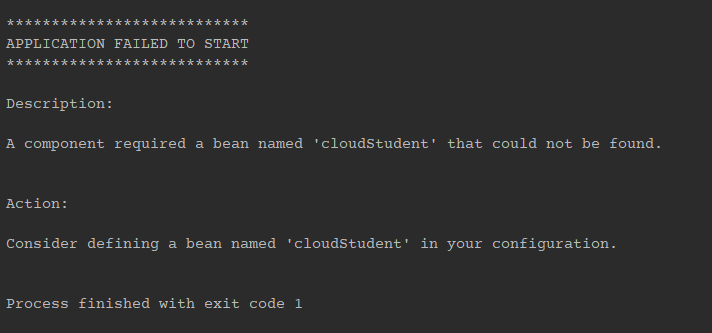

# 스프링 Conditional 어노테이션 조건 직접 만들기 (Custom Conditional)

스프링 Bean 생성 또는 Configuration 등 Proxy 작업 진행하기 전에 조건을 생성할 수 있습니다.

`@Conditional` 어노테이션인데, 기본적으로 몇가지가 만들어져 있습니다.


이 클래스 타입으로 인스턴스 된 객체가 없다면 bean 생성을 하거나, 
application.yml 등의 property resource에 특정 값이 있는 경우 configuration 작업을 하거나 등의 작업을 진행 할 수 있습니다.

위에서 설명한 조건을 사용 할 수 있는 어노테이션이 `@ConditionalOnMissingBean` 또는, `@ConditionalOnProperty` 입니다.

하지만 때에 따라 스프링에서 제공하는 Condition 옵션 외에 직접 만들고 싶은 경우가 있습니다.

`spring-context` 모듈에서 제공하는 `Condition` 클래스를 상속해서 이 구현체의 특정 메소드의 반환 여부를 가지고 우리가 원하는 조건을 만들 수 있습니다.

간단한 예제로 System Property에 특정 key/value가 있다면 bean 생성을 할지 말지에 대해 만들어 봅니다. (application.yml 이 아닌 System.Property 입니다.)

## 예제
```java
// 로컬이 활성화 됐는지
public class LocalPropertyCondition implements Condition {

    @Override
    public boolean matches(ConditionContext context, AnnotatedTypeMetadata metadata) {
        return "true".equals(context.getEnvironment().getProperty("local.enabled"));
    }
}
```

간단한 코드인데, `System Property` 에 `local.enabled` 값이 true 인 경우 해당 Condition의 오버라이딩 된 메소드인 matches 메소드가 true를 반환하게 됩니다.

이게 핵심인데, `public boolean matches(ConditionContext context, AnnotatedTypeMetadata metadata)` **메소드가 true를 return 하면 Conditional 조건이 만족되어 Spring 컨테이너에서 AOP/Proxy 수행을 진행합니다.**

반대로 하나 더 false 인 경우를 만들어 보겠습니다.

```java
// 로컬이 비활성화 됐는지
public class CloudPropertyCondition implements Condition {

    @Override
    public boolean matches(ConditionContext context, AnnotatedTypeMetadata metadata) {
        return "false".equals(context.getEnvironment().getProperty("local.enabled"));
    }
}
```

로컬이 비활성화라면 클라우드 환경일테니 이름은 적당히 지어줍니다.

그리고 사용 예는 이렇습니다. 사용 가능한 타입은 `TYPE, METHOD` 이므로, bean 생성이나 Configuration, Component, Service 등 다양한 타입에서 사용 할 수 있습니다.

```java
@Configuration
public class ConditionConfiguration implements InitializingBean {

    @Bean
    @Conditional(LocalPropertyCondition.class)
    public Student localStudent() {
        return new Student(1, "local");
    }


    @Bean
    @Conditional(CloudPropertyCondition.class)
    public Student cloudStudent() {
        return new Student(2, "cloud");
    }

    @Override
    public void afterPropertiesSet() {
        Assert.notNull(localStudent(), "local student is null");
        Assert.notNull(cloudStudent(), "cloud student is null");
    }
}
```

Student 라는 클래스의 bean 생성을 하는 Configuration 인데, 

하나는 local.enabled가 true일때 생성 될 것이고 (localStudent),

하나는 local.enabled가 false 일 때 생성 될 것입니다. (cloudStudent)

그리고 afterPropertiesSet() 메소드를 가지고 자동으로 검증하게 만듭니다.

그리고 부트 실행 시 아래와 같이 VM OPTION을 넣습니다.

### local.enabled=true 일때


@Conditional(CloudPropertyCondition.class) 에서 `CloudPropertyCondition` 클래스의 `matches` 메소드가 false를 반환했을 테니 해당 bean 생성은 안됩니다.

그리고 console을 확인해 보면 cloudStudent가 없다는 걸 알 수 있습니다.



### local.enabled=false 일때

@Conditional(LocalPropertyCondition.class) 에서 `LocalPropertyCondition` 클래스의 `matches` 메소드가 false를 반환했을 테니 해당 bean 생성은 안됩니다.

그리고 console을 확인해 보면 localStudent가 없다는 걸 알 수 있습니다.


## 쓰일 만한 곳?
유용하게 사용 가능한 곳이 Profile을 검사하는 것인데, 대부분 bean 생성 시 아래처럼 넣었을 것입니다.

```java
@Profile({"dev", "qa", "stg"})
@Profile({"production", "cloud"})
```

개발 환경에서 생성되야 할 bean 과 운영 또는 cloud 에서 생성되야 할 bean 을 분리하게 되는건데, 이 방법은 배포 zone이 더 생기거나 없어지거나, 이름이 바뀐다면 매번 모든 저렇게 선언된 profile들을 바꿔줘야 하는 것인데요.

### dev profile인 경우에만 사용한다.
```java
return context.getEnvironment().acceptsProfiles(Profiles.of("dev"));
```

이것도 위처럼 Condition 을 만들어 사용하면 한곳에서 관리되어 편할겁니다.