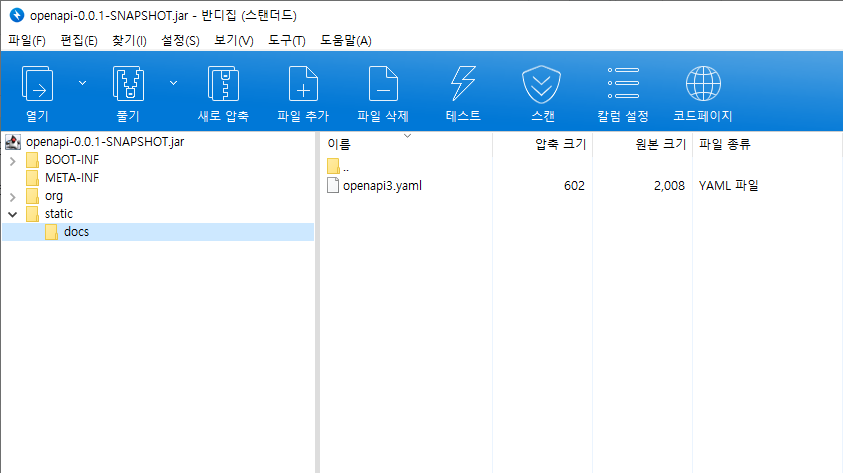
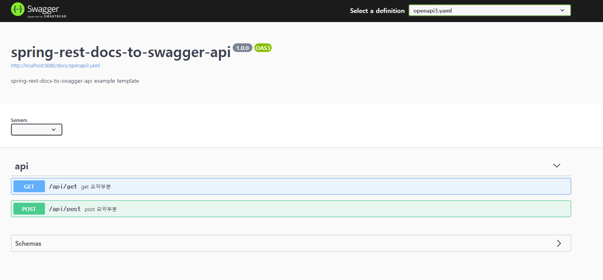
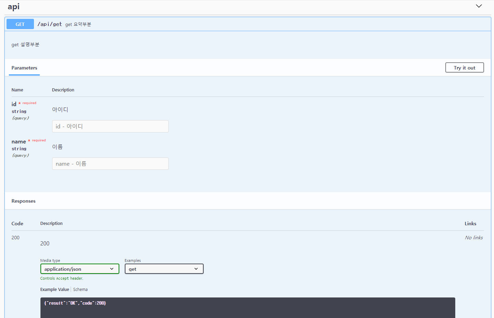
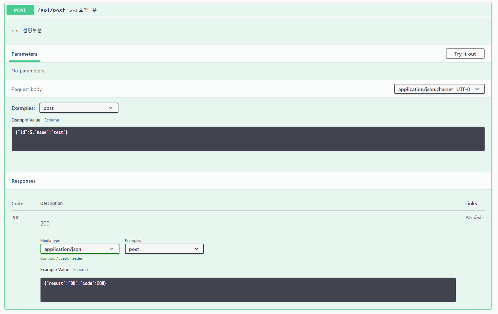
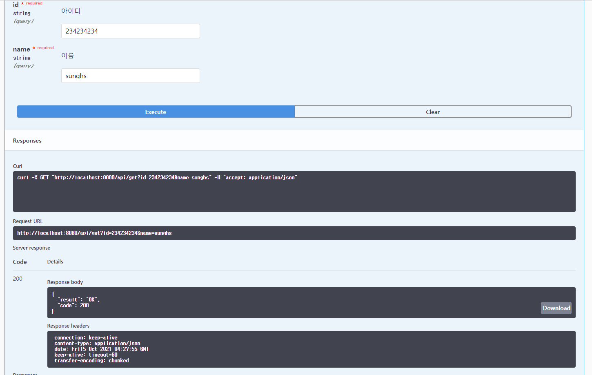

# 테스트코드 기반 swagger 구성하기

기존의 Spring REST Docs는 문서페이지의 기본 템플릿이 되는 adoc 파일을 생성하고, 테스트코드를 기반으로 generated-snippet이 생성 된 뒤, Asciidoctor를 이용해 adoc과 generated-snippet을 이용해 html문서를 생성하게 됩니다.

문서 자체는 테스트코드가 통과한 테스트만 docs에 표현되니 신뢰도는 높지만, 테스트를 직접 해 볼수 있는 Swagger에 비해 접근성이 떨어진다고 생각하시는 분들이 있을 겁니다. 하지만 Swagger는 각종 Model, Service, Controller 등에 Annotation을 추가해서 설명하고 명세해야 하기 때문에 Annotation을 수정하지 않고 내부 비즈니스 코드만 수정한다면, 어떤 변경점이 있어도 Swagger 자체에 표기되는 테스트케이스는 정확하지 않을 수 있습니다. 하지만 테스트를 페이지 내에서 바로 할 수 있다는 장점때문에 Spring REST Docs로 옮기지 않고 Swagger를 유지하시는 분도 많을 겁니다.

이를 이용해 테스트코드를 기반으로 통과한 테스트코드만 Swagger에 표기해 줄 수 있다면 두가지 장점을 합칠 수 있을 겁니다. 이것이 이 포스팅에서 설명하는 내용입니다.

Swagger는 openApi Spec 문서를 적용해 페이지를 구성할 수 있습니다. 이에 착안해서 생긴 방법입니다. 즉, 통과한 테스트코드를 openApi Spec 문서로 구성한 뒤, 이를 Swagger에 덮는 방법입니다.

spring boot와 swagger를 구성하는 방법은 대체로 두가지가 있습니다.

통과한 테스트코드를 openApi Spec 문서로 만들어주는 오픈소스 라이브러리가 있습니다. 이것을 이용해야 합니다.

전체 소스는 https://github.com/sunghs/spring-rest-docs-to-swagger 에 있습니다.


## 예제 controller, service, model
### model
```java
@Getter
@Setter
@ToString
public class RequestDto {

    private Long id;

    private String name;
}

@Getter
@Setter
@AllArgsConstructor
public class ResponseDto {

    private String result;

    private Integer code;
}
```
requestDto는 요청때, responseDto는 응답때 내려 줄 객체입니다.

### service
```java
@Slf4j
@Service
@RequiredArgsConstructor
public class OpenApiService {

    public ResponseDto run(final RequestDto requestDto) {
        log.info("request : {}", requestDto.toString());
        return new ResponseDto("OK", 200);
    }
}
```
예제로 get과 post에서 같이 쓸 service 객체를 하나 만듭니다. requestDto 내용을 찍고, response 해주는 역할을 합니다.

### controller
```java
@RestController
@RequestMapping("/api")
@RequiredArgsConstructor
public class OpenApiController {

    private final OpenApiService openApiService;

    @PostMapping("/post")
    public ResponseDto post(@RequestBody final RequestDto requestDto) {
        return openApiService.run(requestDto);
    }

    @GetMapping("/get")
    public ResponseDto get(final RequestDto requestDto) {
        return openApiService.run(requestDto);
    }
}
```
get과 post에 사용할 controller 입니다.

REST Docs to Swagger는 위에 명시된 api 기능으로 하겠습니다.

## 오픈소스 dependency 추가
com.epages.restdocs-api-spec 라는 오픈소스를 사용합니다. 

이 라이브러리가 테스트코드를 openApi 스펙문서로 추출해주는 기능을 합니다.
```
// 0.11.3을 쓰지만 현재 최신 버전은 2021.08 기준 0.12.0 입니다.
buildscript {
    ext {
        docsVersion = "0.11.3"
        ...
    }
}

// 플러그인 추가
plugins {
    ...
    id 'com.epages.restdocs-api-spec' version "${docsVersion}"
}

dependencies {
    ...
    // 일반 동기식 WebMvc에서 mockMvc 사용시 추가
    testImplementation("com.epages:restdocs-api-spec-mockmvc:${docsVersion}")
    // webflux 테스트 시 webTestClient 이용시 추가
    testImplementation("com.epages:restdocs-api-spec-webtestclient:${docsVersion}")
}
```
gradle을 refresh 하면 documentation task 그룹이 생성되는데, 그 아래 openapi3, openapi, postman task가 있습니다. 
각각 postman 요청스펙, openapi 요청스펙, openapi v3 요청스펙인데, openapi3 요청스펙을 사용합니다.
이 task를 우리한테 맞게 수정해줍니다.

수정방법 레퍼런스는 https://github.com/ePages-de/restdocs-api-spec 의 build configuration 항목에 나와있습니다.

```
openapi3 {
    server = "" // base-path가 있다면 넣어준다.
    title = "spring-rest-docs-to-swagger-api"
    description = "spring-rest-docs-to-swagger-api example template"
    version = "${version}" as Object
    format = "yaml"
}
```

server = "" 부분은 생각해 봐야하는데, swagger가 spring boot 프로젝트와 같이 뜬다면 base-path 만 넣으면 되고, spring boot와 다른 서버에서 구동된다면 uri를 전부 넣어 주어야 합니다. swagger 테스트 시 모든 요청의 prefix로 저 url이 붙습니다.

## bootRun 커스터마이징
spring boot 실행시 intelliJ의 springBootApplication으로 실행해도 되지만, 프로젝트 빌드 시 openapi3을 만들고, 우리가 필요한 위치에 yaml파일을 이동시키는 전처리 task를 넣을 것입니다. 따라서 boot build 시 아래 사이클대로 움직이게 됩니다.

- 자바소스 컴파일
- 자바 테스트소스 컴파일
- test task 실행
- 위에서 수정한 openapi3 task 실행
- openapi3 파일을 static으로 이동
- spring boot 실행

이를 위해서 bootRun task를 아래처럼 override 합니다.
```
task createOpenApi {
    dependsOn 'openapi3'
    doLast {
        copy {
            from "build/api-spec"
            include "*.yaml"
            into "build/resources/main/static/docs"
        }
    }
}

bootRun {
    dependsOn 'createOpenApi'
}
```
bootRun 실행 시 createOpenApi 를 실행하고, createOpenApi에서는 openapi3 yaml파일을 static 영역으로 옮기는 처리를 해줍니다.

## swaggerProvider 설정
spring boot와 swagger를 구성하는 방법은 보통 2가지로 쓰입니다.

### spring boot와 swagger 서버를 분리
이 경우 spring boot openapi3.yaml 파일이 생성되면 swagger 서버에서 가져갈 수 있도록 CORS 처리 및, endpoint 또는 docs로 제공되어야 합니다.
### spring boot서버와 swagger를 통합
기존의 어노테이션 기반으로 swagger를 구성할 때 쓰는 방법입니다. 즉 spring boot 구동 시 swagger 페이지도 같이 구성되게 하는 방법입니다.

기존 인터넷에 돌아다니는 포스팅은 1번 분리된 swagger 서버에서 각 api들의 yaml을 가져다 보여주는 방법이 많은데, 이 포스팅은 spring  boot 서버들이 각각 swagger 페이지를 구성하는 2번 방법을 쓰겠습니다.

따라서 각 api에 swagger를 포함시키니 아래 dependency를 추가합니다.
### build.gradle
```
buildscript {
    ext {
        ...
        swaggerVersion = "3.0.0"
        ...
    }
}
dependencies {
    ...
    implementation("io.springfox:springfox-boot-starter:${swaggerVersion}")
    implementation("io.springfox:springfox-swagger-ui:${swaggerVersion}")
    ...
}
```

swagger에서는 swagger-ui 페이지가 열릴 때 어떤 리소스파일을 로드 할 건지 `SwaggerResourcesProvider`라는 인터페이스를 제공합니다. 이건 매번 swagger 페이지 호출 시 로딩됩니다. 따라서 `SwaggerResourcesProvider`를 구현해서 우리가 만든 yaml이 swagger-ui에 로드되도록 만들면 됩니다.

```java
package sunghs.openapi.config;

import lombok.extern.slf4j.Slf4j;
import org.springframework.context.annotation.Configuration;
import org.springframework.context.annotation.Primary;
import org.springframework.core.io.Resource;
import org.springframework.core.io.support.PathMatchingResourcePatternResolver;
import springfox.documentation.swagger.web.SwaggerResource;
import springfox.documentation.swagger.web.SwaggerResourcesProvider;

import java.util.Arrays;
import java.util.Collections;
import java.util.List;
import java.util.stream.Collectors;

@Slf4j
@Primary
@Configuration
public class DefaultSwaggerResourceProvider implements SwaggerResourcesProvider {

    @Override
    public List<SwaggerResource> get() {
        try {
            PathMatchingResourcePatternResolver patternResolver = new PathMatchingResourcePatternResolver();
            Resource[] resources = patternResolver.getResources("/static/docs/*.yaml");

            if (resources.length == 0) {
                return Collections.emptyList();
            }

            return Arrays.stream(resources).map(resource -> {
                SwaggerResource swaggerResource = new SwaggerResource();
                swaggerResource.setSwaggerVersion("3");
                swaggerResource.setName(resource.getFilename());
                swaggerResource.setLocation("/docs/" + resource.getFilename());
                return swaggerResource;
            }).collect(Collectors.toList());
        } catch (Exception e) {
            log.error("DefaultSwaggerResourceProvider error", e);
            return Collections.emptyList();
        }
    }
}
```
`SwaggerResourcesProvider`를 구현하지 않으면 swagger-ui의 내부에 기본으로 생성된 구현체가 bean으로 설정됩니다. 따라서 `@Primay` 어노테이션을 통해 우리가 만든 `DefaultSwaggerResourceProvider`가 먼저 bean으로 등록되도록 만들어야 합니다.

이 Provider는 매번 swagger 페이지 호출 시 /static/docs/ 아래 경로의 yaml 파일을 구성해서 ui 페이지에 띄우는 설정입니다.

## 테스트코드 추가 (Junit5)
```java
package sunghs.openapi;

import com.epages.restdocs.apispec.MockMvcRestDocumentationWrapper;
import com.fasterxml.jackson.databind.ObjectMapper;
import lombok.RequiredArgsConstructor;
import lombok.extern.slf4j.Slf4j;
import org.junit.jupiter.api.AfterAll;
import org.junit.jupiter.api.BeforeEach;
import org.junit.jupiter.api.DisplayName;
import org.junit.jupiter.api.Test;
import org.junit.jupiter.api.extension.ExtendWith;
import org.springframework.boot.test.context.SpringBootTest;
import org.springframework.http.MediaType;
import org.springframework.restdocs.RestDocumentationContextProvider;
import org.springframework.restdocs.RestDocumentationExtension;
import org.springframework.restdocs.mockmvc.MockMvcRestDocumentation;
import org.springframework.restdocs.mockmvc.RestDocumentationRequestBuilders;
import org.springframework.restdocs.payload.JsonFieldType;
import org.springframework.restdocs.payload.PayloadDocumentation;
import org.springframework.restdocs.request.RequestDocumentation;
import org.springframework.test.context.ActiveProfiles;
import org.springframework.test.context.TestConstructor;
import org.springframework.test.web.servlet.MockMvc;
import org.springframework.test.web.servlet.result.MockMvcResultMatchers;
import org.springframework.test.web.servlet.setup.MockMvcBuilders;
import org.springframework.web.context.WebApplicationContext;
import org.springframework.web.util.UriComponentsBuilder;
import sunghs.openapi.model.RequestDto;

import java.nio.charset.StandardCharsets;

@Slf4j
@SpringBootTest
@ActiveProfiles("local")
@RequiredArgsConstructor
@ExtendWith(RestDocumentationExtension.class)
@TestConstructor(autowireMode = TestConstructor.AutowireMode.ALL)
class OpenApiTests {

    private final ObjectMapper objectMapper;

    private MockMvc mockMvc;

    @BeforeEach
    void setUp(WebApplicationContext webApplicationContext, RestDocumentationContextProvider contextProvider) {
        mockMvc = MockMvcBuilders.webAppContextSetup(webApplicationContext)
                .apply(MockMvcRestDocumentation.documentationConfiguration(contextProvider))
                .build();
    }

    @Test
    @DisplayName("post 문서화 테스트")
    void postTest() throws Exception {
        // given
        RequestDto requestDto = new RequestDto();
        requestDto.setId(5L);
        requestDto.setName("test");

        String request = objectMapper.writeValueAsString(requestDto);

        // when & then
        mockMvc.perform(RestDocumentationRequestBuilders.post("/api/post")
                .content(request)
                .characterEncoding(StandardCharsets.UTF_8.name())
                .contentType(MediaType.APPLICATION_JSON)
                .accept(MediaType.APPLICATION_JSON))
                .andExpect(MockMvcResultMatchers.status().isOk())
                .andDo(MockMvcRestDocumentationWrapper.document("post", "post 설명부분", "post 요약부분",
                        PayloadDocumentation.requestFields(
                                PayloadDocumentation.fieldWithPath("id").type(JsonFieldType.NUMBER).description("아이디"),
                                PayloadDocumentation.fieldWithPath("name").type(JsonFieldType.STRING).description("이름")
                        ),
                        PayloadDocumentation.responseFields(
                                PayloadDocumentation.fieldWithPath("result").type(JsonFieldType.STRING).description("결과"),
                                PayloadDocumentation.fieldWithPath("code").type(JsonFieldType.NUMBER).description("결과코드")
                        )));
    }

    @Test
    @DisplayName("get 문서화 테스트")
    void getTest() throws Exception {
        // given
        UriComponentsBuilder builder = UriComponentsBuilder.fromPath("/api/get")
                .queryParam("id", 3L)
                .queryParam("name", "test")
                .encode(StandardCharsets.UTF_8);

        // when & then
        mockMvc.perform(RestDocumentationRequestBuilders.get(builder.toUriString())
                .characterEncoding(StandardCharsets.UTF_8.name())
                .contentType(MediaType.APPLICATION_JSON)
                .accept(MediaType.APPLICATION_JSON))
                .andExpect(MockMvcResultMatchers.status().isOk())
                .andDo(MockMvcRestDocumentationWrapper.document("get", "get 설명부분", "get 요약부분",
                        RequestDocumentation.requestParameters(
                                RequestDocumentation.parameterWithName("id").description("아이디"),
                                RequestDocumentation.parameterWithName("name").description("이름")
                        ),
                        PayloadDocumentation.responseFields(
                                PayloadDocumentation.fieldWithPath("result").type(JsonFieldType.STRING).description("결과"),
                                PayloadDocumentation.fieldWithPath("code").type(JsonFieldType.NUMBER).description("결과코드")
                        )));
    }

    @AfterAll
    static void tearDown() {
        log.info("test end");
    }
}
```
Spring REST Docs 관련 포스팅을 보면 static import로 메소드를 써놓고, static import를 같이 예제코드로 알려주지 않아 찾기가 힘든 경우가 있어서(...) 위 테스트 코드 예제는 static import 하지 않고 전부 직접 썼습니다.

기존 Spring REST Docs를 쓰는 방법과 비슷하니 다른점만 설명하겠습니다.

### MockMvcRestDocumentationWrapper
document 구성부분 중 기존의 Spring REST Docs의 document() 대신, 오픈소스에서 제공하는 MockMvcRestDocumentationWrapper 를 사용해야 합니다. 만약 웹플럭스 테스트를 위해 webTestClient를 쓴다면, WebTestClientRestDocumentationWrapper를 써야합니다. 물론 dependency도 webtestclient용으로 받아야 합니다.

### relaxedField
MockMvcRestDocumentationWrapper 를 구성하면서는 relaxedField 명시를 할 수 없습니다. openapi3 파일에 모든 request와 response에 대한 명세가 필요하기 때문에, 생략할 수 없습니다.

### ETC
이외 Spring REST Docs에서는 어느정도 혼용 되던 표기법이 완전 strict 하게 되었습니다.

1. RequestDocumentation.requestParameters 는 queryString 영역에만 사용해야 합니다.
2. PayloadDocumentation.requestFields는 requestBody 영역에만 사용해야 합니다.
3. PayloadDocumentation.responseFields는 responseBody 영역에만 사용해야 합니다.
4. Map의 경우 key, value가 정해져 있지 않으므로 PayloadDocumentation.subsectionWithPath를 사용해서 하나로 묶어 넘길 수 있습니다.
5. List 객체안의 Dto 표현법이 PayloadDocumentation.fieldWithPath("list[].name") 처럼 쓰면 test에 실패하고, PayloadDocumentation.fieldWithPath("list.[].name") 처럼 써야 합니다.

## bootRun 커스터마이징
bootJar와 크게 다르지 않습니다. 저 같은 경우 MSA 구조에서 scale-out이 일어나거나 할 때 yaml 파일을 한군데에서 관리할 수 없으므로 (또는 그렇게 하려면 persistence 장비에 던져야 하니) 각각의 api 빌드 시 배포 jar/war에 포함 시키는 방법을 사용했습니다.

`DefaultSwaggerResourceProvider` 는 bootJar 배포 환경에서도 static/docs를 찾을 수 있도록 상대경로로 설정했기 때문에 수정 할 필요가 없습니다.

```
bootJar {
    dependsOn 'openapi3'
    from ("build/api-spec") {
        include "*.yaml"
        into "static/docs"
    }
}
```
```
> Task :compileJava
> Task :processResources
> Task :classes
> Task :bootJarMainClassName
> Task :compileTestJava
> Task :processTestResources NO-SOURCE
> Task :testClasses
> Task :test
> Task :check
> Task :openapi3
> Task :bootJar
```

배포시 아래처럼 jar 안에 포함됩니다.


## 테스트
실행은 로컬시 bootRun, 배포시 bootJar로 진행하면 되며 설정 건드린게 없다면 url는 http://localhost:8080/swagger-ui/ 입니다. (swagger 2.x와 url 다름)

swagger-ui 화면입니다.



servers가 비어있는 이유는 위에서의 openapi3 설정 시 base-path를 설정하지 않았기 때문입니다. base-path가 있다면 넣어주시면 되고, 같은 로컬에서 실행되는 경우 넣을 필요 없습니다.






테스트도 정상 작동합니다.