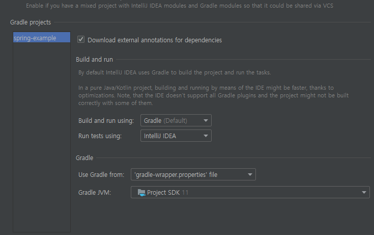

# 파라미터 바인딩을 해주는 HandlerMethodArgumentResolver (MVC Version)

Controller의 Endpoint 메소드에서 파라미터만 추가하면 자동으로 객체 주입이 되는 기능입니다.

자주 쓰던 방식으로는 HttpServletRequest, HttpServletResponse가 있습니다.

예를 들어 아래처럼 파라미터만 추가해도 값이 들어오는걸 확인 할 수 있습니다.

```java
@GetMapping("/test")
public String test() {
    return "OK";
}

// 이랬던 메소드를

@GetMapping("/test")
public String test(HttpServletRequest request) {
    return "OK";
}
```

이렇게 넣어도, 실제 HttpServletRequest 는 우리가 Request 시 넣어주어야 하는 값이 아닌 Spring에서 바인딩 해줍니다.

이걸 우리가 쓰고 싶은대로 커스텀 해서 사용할 수 있도록 스프링에서 추상체를 제공하는데 그 인터페이스 이름이 HandlerMethodArgumentResolver 입니다.

Spring Webflux도 추상체는 거의 동일하지만 약간 다르므로 구현방법이 조금 달라 다음 포스팅에서 다루겠습니다.

## 예제

### 모델이랑 Controller 만들기

모델은 적당히 아래처럼 만들어 봅니다.

```java
@Getter
@Setter
@ToString
@NoArgsConstructor
@AllArgsConstructor
public class UserInfo {

    private Long id;

    private String name;
}
```

id 랑 name 을 필드로 갖는 UserInfo 라는 클래스 입니다.

```java
@Slf4j
@RestController
@RequiredArgsConstructor
public class TestController {

    @GetMapping("/test")
    public UserInfo test(UserInfo userInfo) {
        return userInfo;
    }
}
```

Test 용 컨트롤러 입니다. UserInfo 라는 파라미터가 있습니다. 바인딩 된 UserInfo를 돌려주도록 하겠습니다.

그렇다면 보통은 아래처럼 사용해야 파라미터에 바인딩 되었을 것입니다.

`/test?id=12345&name=test`

이걸 자동으로 추가 할 수 있도록 테스트 해 봅니다.

저 값이 헤더에 들어올 때 그 값을 Controller에 바인딩 하는 형태로 하겠습니다.

데이터에 대한 처리는 먼저

- Interceptor 에서 Header에 있는 UserInfo 정보를 꺼낸 뒤 Object로 변환시켜 저장한다.
- HandlerMethodArgumentResolver 를 이용해 저장된 Object 를 support 해 줍니다.

그렇다면 Interceptor랑 HandlerMethodArgumentResolver 구현체를 만들어야 할 것 입니다.
### Interceptor 만들고 등록

```java
@Slf4j
@RequiredArgsConstructor
public class UserInfoAuthenticationInterceptor implements HandlerInterceptor {

    public static final String USER_INFO_KEY = "userInfo";

    private final ObjectMapper objectMapper;

    @Override
    public boolean preHandle(HttpServletRequest request, HttpServletResponse response, Object handler) {
        String authorization = request.getHeader("authorization");
        UserInfo userInfo;

        try {
            userInfo = StringUtils.isNotEmpty(authorization)
                ? objectMapper.readValue(authorization, UserInfo.class)
                : new UserInfo();
        } catch (Exception e) {
            log.error("authorization read value error", e);
            userInfo = new UserInfo();
        }

        request.setAttribute(USER_INFO_KEY, userInfo);
        return true;
    }
}
```

이름은 UserInfo를 캐치하는데에서 UserInfoAuthenticationInterceptor 로 지었고, DispatcherServlet 에서 Controller에 넘겨주기 전 시점인 preHandler 메소드에 구현합니다.

값이 있는 경우 파싱해서 등록하고, 파싱에 실패했거나 값이 없는 경우에는 그냥 빈 객체를 넣어주도록 합니다. (즉 모든 경우에 통과합니다.)

```java
@Configuration
@RequiredArgsConstructor
public class WebMvcConfiguration implements WebMvcConfigurer {

    private final ObjectMapper objectMapper;

    @Override
    public void addInterceptors(InterceptorRegistry registry) {
        registry.addInterceptor(new UserInfoAuthenticationInterceptor(objectMapper));
    }
}
```
WebMvcConfigurer 구현체의 설정에다가 interceptor를 등록해 줍니다.

### HandlerMethodArgumentResolver 만들고 등록

그럼 이제 파라미터 바인딩에 필요한 데이터를 서빙 하는 Resolver를 만들어 봅니다.

```java
public class UserInfoAuthenticationResolver implements HandlerMethodArgumentResolver {

    @Override
    public boolean supportsParameter(MethodParameter parameter) {
        return parameter.getParameterType().equals(UserInfo.class);
    }

    @Override
    public Object resolveArgument(MethodParameter parameter, ModelAndViewContainer mavContainer,
        NativeWebRequest webRequest, WebDataBinderFactory binderFactory) {
        return ((HttpServletRequest) webRequest.getNativeRequest()).getAttribute(UserInfoAuthenticationInterceptor.USER_INFO_KEY);
    }
}
```

### public boolean supportsParameter(MethodParameter parameter) ###
supportsParameter 메소드가 true를 반환할 때 파라미터 바인딩이 가능합니다. 즉 resolveArgument 에서 꺼내 반환한 객체, 즉 Object에 대해 타입 캐스팅을 supportsParameter 로 진행하는 형태입니다.

### public Object resolveArgument(MethodParameter parameter, ModelAndViewContainer mavContainer, NativeWebRequest webRequest, WebDataBinderFactory binderFactory) ###
이 메소드가 데이터를 서빙 할 객체를 가져와야 하는 부분입니다. webRequest.getNativeRequest() 가 HttpServletRequest를 반환합니다. 우리가 Interceptor에서 HttpServletRequest에 UserInfo 파싱을 완료한 객체를 넣어 놓았으므로, 그걸 꺼내 반환하면 됩니다.

그리고 등록은 Interceptor 등록과 동일하게 WebMvcConfigurer 에서 합니다.

`addArgumentResolvers` 메소드를 override 하면 됩니다.

```java
@Configuration
@RequiredArgsConstructor
public class WebMvcConfiguration implements WebMvcConfigurer {

    private final ObjectMapper objectMapper;

    @Override
    public void addArgumentResolvers(List<HandlerMethodArgumentResolver> resolvers) {
        resolvers.add(new UserInfoAuthenticationResolver());
    }

    @Override
    public void addInterceptors(InterceptorRegistry registry) {
        registry.addInterceptor(new UserInfoAuthenticationInterceptor(objectMapper));
    }
}
```

이제 모든 구현은 끝났습니다. 테스트 코드에서 테스트를 진행할 건데 시나리오는 다음과 같습니다.

- /test 를 호출한다. UserInfo 데이터를 Header에 세팅한다.
    => 정상적으로 넣은 값이 바인딩 되어야 한다.
- /test 를 호출한다. UserInfo 데이터를 세팅하지 않는다.
    => 빈값이 바인딩 되어야 한다.

### TestCode (JUnit 5)
```java
@Slf4j
@RequiredArgsConstructor
@SpringBootTest(webEnvironment = SpringBootTest.WebEnvironment.MOCK)
@TestConstructor(autowireMode = TestConstructor.AutowireMode.ALL)
class UserInfoArgumentResolverTest {

    private MockMvc mockMvc;

    private FixtureMonkey fixtureMonkey;

    private final ObjectMapper objectMapper;

    private final WebApplicationContext webApplicationContext;

    @BeforeEach
    void setup() {
        this.mockMvc = MockMvcBuilders.webAppContextSetup(webApplicationContext).build();
        this.fixtureMonkey = FixtureMonkey.create();
    }

    @Test
    @Order(1)
    @DisplayName("헤더에 userInfo가 없는 경우")
    void userInfoArgumentInvalidTest() throws Exception {
        HttpHeaders httpHeaders = new HttpHeaders();
        httpHeaders.setContentType(MediaType.APPLICATION_JSON);
        httpHeaders.setAccept(Collections.singletonList(MediaType.APPLICATION_JSON));

        this.mockMvc.perform(MockMvcRequestBuilders.get("/test").headers(httpHeaders))
                .andExpect(MockMvcResultMatchers.status().is2xxSuccessful())
                .andExpect(result -> {
                    UserInfo response = objectMapper.readValue(result.getResponse().getContentAsString(), UserInfo.class);
                    Assertions.assertNull(response.getId());
                    Assertions.assertNull(response.getName());
                })
                .andDo(MockMvcResultHandlers.print());
    }

    @Test
    @Order(2)
    @DisplayName("헤더에 userInfo가 들어온 경우")
    void userInfoArgumentValidTest() throws Exception {
        UserInfo userInfo = new UserInfo(100L, "test");

        String userInfoJson = objectMapper.writeValueAsString(userInfo);

        HttpHeaders httpHeaders = new HttpHeaders();
        httpHeaders.setContentType(MediaType.APPLICATION_JSON);
        httpHeaders.setAccept(Collections.singletonList(MediaType.APPLICATION_JSON));
        httpHeaders.set("authorization", userInfoJson);

        this.mockMvc.perform(MockMvcRequestBuilders.get("/test").headers(httpHeaders))
                .andExpect(MockMvcResultMatchers.status().is2xxSuccessful())
                .andExpect(result -> {
                    UserInfo response = objectMapper.readValue(result.getResponse().getContentAsString(), UserInfo.class);
                    Assertions.assertEquals(100, response.getId());
                    Assertions.assertEquals("test", response.getName());
                })
                .andDo(MockMvcResultHandlers.print());
    }
}
```

테스트 코드를 보면, MockMvc로 테스트를 진행하고 있습니다.

첫번째 메소드인 userInfoArgumentInvalidTest() 에서는 헤더에 아무것도 넣지 않고 테스트를 진행합니다.
두번째 메소드인 userInfoArgumentValidTest() 에서는 UserInfo를 세팅하여 테스트 합니다. 

즉 Controller 에서는 바인딩 된 UserInfo 객체 자체를 return 하므로, MockMvc의 andExpect(ResultMatcher) 에서 Assert로 검증해 보겠습니다.

DisplayName이 표시되지 않으니 테스트 실행 주체를 Gradle이 아닌 IntelliJ로 바꿉니다. (언제쯤 Gradle로 실행해도 표시될까요..)



테스트는 모두 성공적으로 통과합니다.

### 헤더에 값이 없는 경우


헤더에 아무것도 넣지 않은 경우, Response Body에는 객체는 인스턴스 되었지만 필드가 채워지지 않은 형태인 걸 확인 할 수 있습니다.

### 헤더에 값이 있는 경우


Request에 넣은 UserInfo 값과 Response에 돌아온 UserInfo 값이 동일하네요. Controller의 UserInfo에 값이 바인딩 되었습니다.

[예제 소스는 spring-example 의 argumentresolver 패키지에 있습니다. (클릭)](https://github.com/sunghs/spring-example)