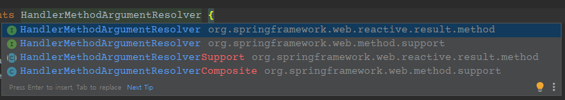

# 파라미터 바인딩을 해주는 HandlerMethodArgumentResolver (Webflux Version)

예제는 mvc 포스팅과 동일합니다.

모델과 서비스는 동일하게 되어있다고 간주하고 진행합니다.

webflux에서 다른부분만 따로 포스팅 합니다.

[MVC 포스팅](https://sunghs.tistory.com/155)

먼저 webflux 에는 HandlerInterceptor가 존재하지 않습니다. 설계 컨셉에 맞지 않아 Interceptor의 역할을 WebFilter에 등록해주어야 합니다.

또한 Webflux에서는 WebFilter 뿐만 아니라 HandlerFilterFunction 으로 RouterFunction의 endpoint 별로 부분적으로 필터 제한이 가능하게 하는 추상체가 있습니다.

하는 역할은 WebFilter와 동일하지만, WebFilter는 *컴포넌트 등록 시 모든 request에 대해 수행되지만, HandlerFilterFunction 은 원하는 RouterFunction에만 등록 가능* 하다는 특징이 있습니다.

다만 HandlerFilterFunction 은 Annotated Controller 방식의 Endpoint에는 사용 할 수 없습니다.

[HandlerFilterFunction reference](https://docs.spring.io/spring-framework/docs/current/javadoc-api/org/springframework/web/reactive/function/server/HandlerFilterFunction.html)

[baeldung reference](https://www.baeldung.com/spring-webflux-filters)

그래서 Annotated Controller를 사용하는 이번 예제에서는 Webfilter에 구현하려고 합니다.

mvc 포스팅의 HandlerInterceptor는 아래의 로직이었는데요.

## MVC 의 HandlerInterceptor

```java
@Slf4j
@RequiredArgsConstructor
public class UserInfoAuthenticationInterceptor implements HandlerInterceptor {

    public static final String USER_INFO_KEY = "userInfo";

    private final ObjectMapper objectMapper;

    @Override
    public boolean preHandle(HttpServletRequest request, HttpServletResponse response, Object handler) {
        String authorization = request.getHeader("authorization");
        UserInfo userInfo;

        try {
            userInfo = StringUtils.isNotEmpty(authorization)
                ? objectMapper.readValue(authorization, UserInfo.class)
                : new UserInfo();
        } catch (Exception e) {
            log.error("authorization read value error", e);
            userInfo = new UserInfo();
        }

        request.setAttribute(USER_INFO_KEY, userInfo);
        return true;
    }
}
```

이걸 Webfliter에 등록해 보겠습니다.

## Webfilter 구현 및 등록

```java
@Slf4j
public class AuthenticationFilter implements WebFilter {

	public static final String USER_INFO_KEY = "userInfo";

	@Override
	public Mono<Void> filter(ServerWebExchange exchange, @NonNull WebFilterChain chain) {
		String authorization = exchange.getRequest().getHeaders().getFirst("authorization");
		UserInfo userInfo;
		try {
			userInfo = StringUtils.isNotEmpty(authorization)
				? objectMapper.readValue(authorization, UserInfo.class)
				: new UserInfo();
		} catch (Exception e) {
			log.error("authorization read value error", e);
			userInfo = new UserInfo();
		}
		exchange.getAttributes().put(USER_INFO_KEY, userInfo);
		return chain.filter(exchange);
	}
}
```

MVC의 HandlerInterceptor는 HandlerMapping이 완료된 시점에서 진행됩니다. 즉 어느 endpoint로 들어왔는지에 대해 걱정 할 필요가 없는데요.

위에도 말씀드렸듯 WebFilter의 경우에는 WAS의 Filter 처럼 모든 endpoint에 대해 수행하게 됩니다.

따라서 상황에 따라 예외처리가 필요하게 되는데 이 부분은 적절히 구현하면 될것 같습니다.

```java
if (authorization 검사가 필요하지 않은 endpoint 인 경우) {
    return chain.filter(exchange);
}
```
이렇게 메소드 초입부에 early return 형식으로 처리해 주시면 될것 같습니다.

등록은 클래스 자체에서 Component 어노테이션 또는 아래처럼 Configuration 파일에서 직접 bean 생성 처리 하시면 됩니다.

```java
@Bean
@ConditionalOnWebApplication(type = Type.REACTIVE)
public WebFilter AuthenticationFilter() {
    return new AuthenticationFilter();
}
```

## HandlerMethodArgumentResolver 구현 및 등록

HandlerMethodArgumentResolver 의 패키지 경로가 org.springframework.web.reactive.result.method.HandlerMethodArgumentResolver 입니다.



사진에서 첫번째걸 사용하셔야 합니다.

***web.method.support 패키지 안의 HandlerMethodArgumentResolver는 mvc꺼니 사용에 주의 하시고,*** 나머지는 MVC와 동일하게 구현하시면 됩니다.

```java
public class UserInfoArgumentResolver implements HandlerMethodArgumentResolver {

	@Override
	public boolean supportsParameter(MethodParameter parameter) {
		return parameter.getParameterType().equals(UserInfo.class);
	}

	@Override
	public Mono<Object> resolveArgument(@NonNull MethodParameter parameter, @NonNull BindingContext bindingContext, ServerWebExchange exchange) {
		UserInfo userInfo = exchange.getAttribute(AuthenticationFilter.USER_INFO_KEY);
		return userInfo != null ? Mono.just(userInfo) : Mono.empty();
	}
}
```

등록은 MVC와 동일합니다. Configurer 의 추상체가 WebFluxConfigurer 인 것만 다릅니다.

```java
@Configuration
@ConditionalOnWebApplication(type = Type.REACTIVE)
public class ResolverConfiguration implements WebFluxConfigurer {

	@Override
	public void configureArgumentResolvers(ArgumentResolverConfigurer configurer) {
		configurer.addCustomResolver(new UserInfoArgumentResolver());
	}
}
```

UserInfoArgumentResolver 의 resolveArgument 메소드가 Mono<Object> 를 반환하지만 실제 Controller에서 아규먼트 바인딩을 사용할 경우에는 publisher 를 구독한 상태로 사용하게 됩니다.

즉, Annotated Controller 형태인 경우 MVC와 동일하게 아래처럼 사용됩니다.

```java
@RestController
public class TestController {

    @GetMapping("/test")
    public Mono<String> test(UserInfo userInfo) {
        return Mono.just("OK");
    }
}
```

routerFunction 형태에서도 동일하게 사용됩니다.

