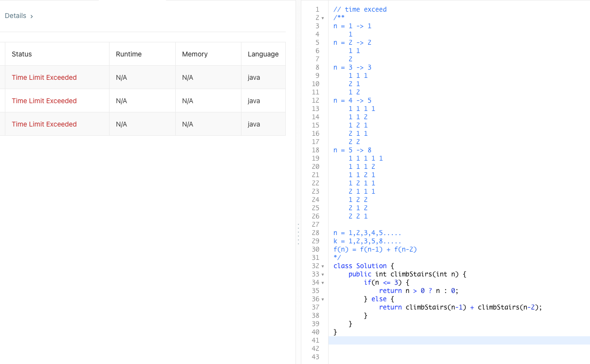
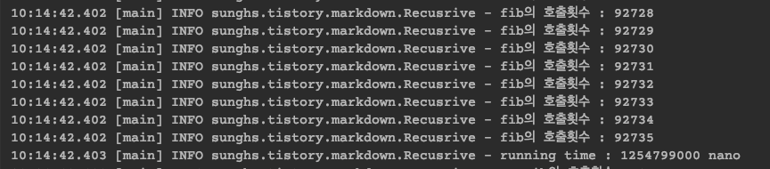
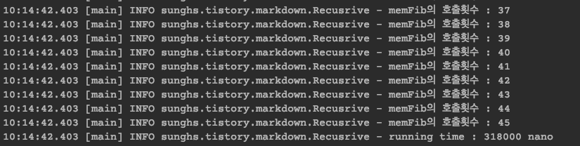
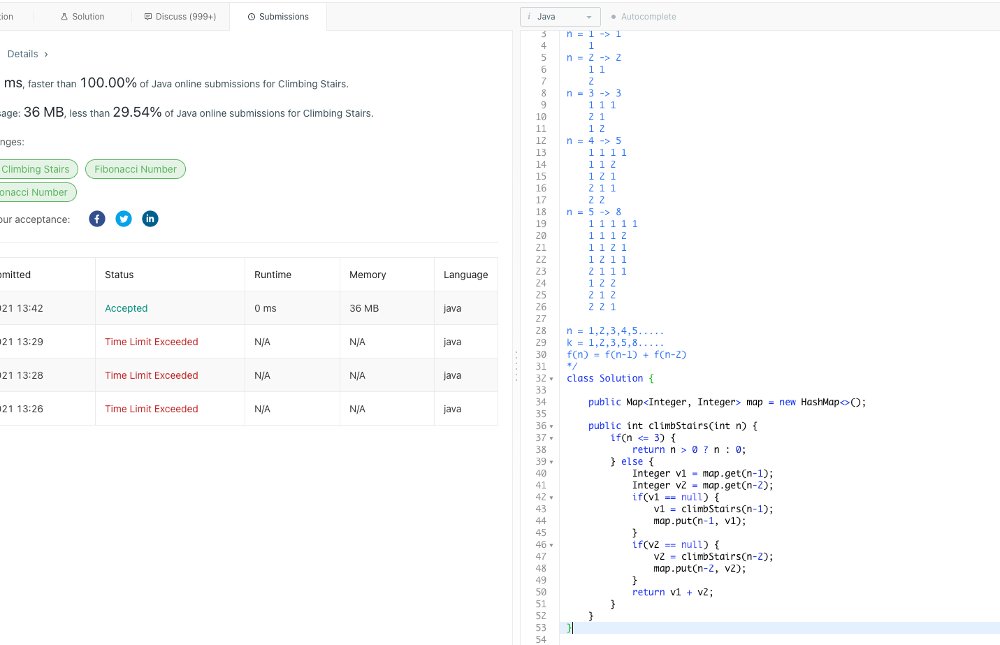

## Climbing Stairs 문제 (memoization)

문제 링크 : https://leetcode.com/problems/climbing-stairs/

문제의 풀이 방법은 전형적인 피보나치 수열의 합 문제였는데,  
이상하게 피보나치 풀이법인 recursive 방법으로 풀면 Time Limit Exceeded 실패가 발생했다.


실행 때 마다 시간이 좀 다르니 혹시 운이 없어서 그런가 했는데, 3번을 돌려도 똑같이 실패했다.




그래서 멤버변수로 Map을 하나 만들고, 이미 지나온 값은 메모리에 들고 있는 방(memoization) 방식으로 문제를 풀었다.

예를들어 피보나치 수열은 아래랑 같은 공식이 성립하는데 
```
f(n) = f(n-1) + f(n-2)
```
f(5) = f(4) + f(3) 과 같고
f(4) = f(3) + f(2) 와 같고
f(3) = f(2) + f(1) 과 같다.

f(2) = 2 고
f(1) = 1 이다. 

이걸 전부 풀어써보면

```
f(5) = f(4) + f(3)
f(5) = {f(3) + f(2)} + f(3)
f(5) = {f(2) + f(1) + f(2)} + f(3)
f(5) = {f(1) + f(0) + f(1) + f(2)} + f(3)
f(5) = {1 + 1 + f(1) + f(2)} + f(3)
f(5) = {1 + 1 + 1 + f(2)} + f(3)        // 여기서 앞 f(3) 계산 완료
f(5) = {1 + 1 + 1 + f(1) + f(0)} + f(3)
f(5) = {1 + 1 + 1 + 1 + 1} + f(3)
f(5) = {1 + 1 + 1 + 1 + 1} + f(2) + f(1)
f(5) = {1 + 1 + 1 + 1 + 1} + f(1) + f(0) + f(1)
f(5) = {1 + 1 + 1 + 1 + 1} + 1 + 1 + f(1)
f(5) = {1 + 1 + 1 + 1 + 1} + 1 + 1 + 1 // 여기서 뒤 f(3) 예산 완료
``` 

이렇게 보면 f(3)을 두번 계산 해야 한다.
따라서 f(3)이 처음 계산이 완료 된 경우 이 값을 알고 있게 되면

```
f(5) = f(4) + f(3)
f(5) = {f(3) + f(2)} + f(3)
f(5) = {f(2) + f(1) + f(2)} + f(3)
f(5) = {f(1) + f(0) + f(1) + f(2)} + f(3)
f(5) = {1 + 1 + f(1) + f(2)} + f(3)
f(5) = {1 + 1 + 1 + f(2)} + f(3)        // 여기서 앞 f(3) 계산 완료 -> 메모리에 올림
f(5) = {1 + 1 + 1 + f(1) + f(0)} + f(3)
f(5) = {1 + 1 + 1 + 1 + 1} + f(3)
f(5) = {1 + 1 + 1 + 1 + 1} + 3       // f(3) 을 바로 3으로 변경
```
으로 횟수가 줄어들게 된다.

f(5)의 경우 줄어든 수치가 거의 차이가 없지만 f(50)의 경우에는 f(49) + f(48) 이므로
f(49) = f(48) + f(47)
f(48) = f(47) + f(46)
... 의 값을 f(50)의 뒷 항인 f(48) 계산 때 다 알고 있으므로 실제로 recursive 횟수가 엄청 줄어 들게 된다.


### 자바 코드로 테스트
```java
package sunghs.tistory.markdown;

import java.time.LocalDateTime;
import java.time.temporal.ChronoUnit;
import java.util.HashMap;
import java.util.Map;
import lombok.extern.slf4j.Slf4j;

@Slf4j
public class Recusrive {

    static Map<Integer, Integer> map = new HashMap<>();

    static int fibCnt = 0;

    static int memFibCnt = 0;

    public static void main(String[] args) {
        LocalDateTime start = LocalDateTime.now();
        fib(25);
        log.info("running time : {} nano", ChronoUnit.NANOS.between(start, LocalDateTime.now()));

        start = LocalDateTime.now();
        memFib(25);
        log.info("running time : {} nano", ChronoUnit.NANOS.between(start, LocalDateTime.now()));
    }

    static int fib(int n) {
        log.info("fib의 호출횟수 : {}", ++fibCnt);

        if (n <= 3) {
            return Math.max(n, 0);
        } else {
            return fib(n - 1) + fib(n - 2);
        }
    }

    static int memFib(int n) {
        log.info("memFib의 호출횟수 : {}", ++memFibCnt);

        if (n <= 3) {
            return Math.max(n, 0);
        } else {
            Integer i1 = map.get(n - 1);
            Integer i2 = map.get(n - 2);
            if (i1 == null) {
                i1 = memFib(n - 1);
                map.put(n - 1, i1);
            }
            if (i2 == null) {
                i2 = memFib(n - 2);
                map.put(n - 2, i2);
            }
            return i1 + i2;
        }
    }
}
```

25회씩 돌려봤을 때
### fib의 호출 횟수랑 시간


### 메모리를 쓰는 fib의 호출 횟수랑 시간


그래서 이 방법을 써서 알고리즘을 풀면 통과하게 된다.


모두가 이렇게 푼 줄 알았는데 Discuss 보니까 생각지도 못한 방법으로 풀이 한 것도 있었다.. 신기하다
