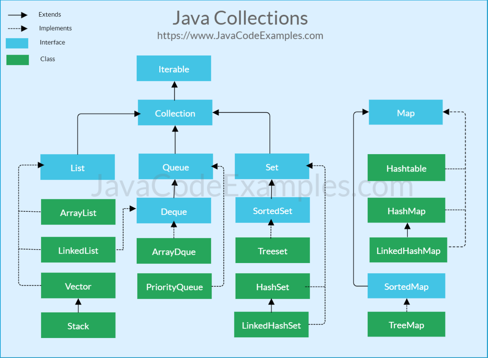

## Java Collections 생성과 동시에 초기화

대표 Collections (Map, List, Set) 을 선언과 동시에 초기화 하는 방법.  
클래스 인스턴스 시 생성자에서 주입하지 않고 고정으로 들어가는 값을 세팅하거나 할때 필요한 경우가 있다.


### 기본방법
```java
private Map<String, Object> map = new HashMap<>() {
    {
        put("key1", "value1");
        put("key2", "value2");
    }
};

private List<String> list = new ArrayList<>() {
    {
        add("1");
        add("2");
    }
};

private Set<String> set = new HashSet<>() {
    {
        add("1");
        add("2");
    }
};
```

### List와 Set은 Arrays 클래스를 이용하는 방법도 있다.
가변 파라미터로 여러개 가능
```java
private List<String> list = Arrays.asList("1", "2");

private Set<String> set = new HashSet<>(Arrays.asList("1", "2"));
```

### JAVA 9 이상 방법, 최대 10개 까지 가능
```java
private Map<String, Object> map2 = Map.of("key1", "value1", "key2", "value2");

private List<String> list3 = List.of("1", "2");

private Set<String> set3 = Set.of("1", "2");
```

### 인스턴스 후 변경 불가능한 객체 생성 (ReadOnly 개념)
생성자 인자값이 Map<K, V\>, List<T\>, Set<T\> 이므로 편한 인스턴스 방법을 생성자에 넣으면 된다.  
읽기 전용이며, 값을 바꾸려하면 UnsupportedOperationException 발생
```java
private Map<String, Object> readOnlyMap = Collections.unmodifiableMap(Map.of("key1", "value1", "key2", "value2"));

private List<String> readOnlyList = Collections.unmodifiableList(List.of("1", "2"));

private Set<String> readOnlySet = Collections.unmodifiableSet(Set.of("1", "2"));
```