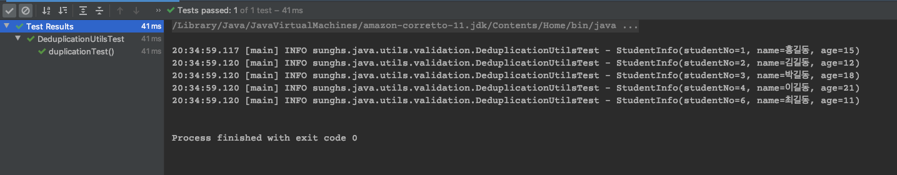

# Java Object List 중복제거

[Github 소스](https://github.com/sunghs/java-utils)  

Java8 이상의 Collections에는 Stream API 사용 시 distinct라는 중복 제거 메소드가 있다.  
Stream API의 distinct 메소드는 Object 의 equals 로 비교하므로 객체 자체가 같은지를 비교한다.

따라서 리터럴 형태의 String을 인자로 갖는 List등은 비교가 가능한데, Dto 형태의 모델은 비교가 안되며 Object 자체도 같은 주소값을 가지는 경우에는 가능한데 안의 속성을 비교해야 하는 경우 비교가 어렵다.  
이런 경우 사용 할 수 있는 Utils 클래스이다.

---

#### 아래 학생 정보를 담는 클래스가 있다고 하자
### Dto Class 예
```java
@Data
public class StudentInfo {

    private long studentNo;

    private String name;

    private int age;

    public StudentInfo(long studentNo, String name, int age) {
        this.studentNo = studentNo;
        this.name = name;
        this.age = age;
    }
}
```

---

#### 그리고 이런 List가 있다고 하자
### 중복 제거가 필요한 List 
```java
StudentInfo s1 = new StudentInfo(1, "홍길동", 15);
StudentInfo s2 = new StudentInfo(2, "김길동", 12);
StudentInfo s3 = new StudentInfo(3, "박길동", 18);
StudentInfo s4 = new StudentInfo(4, "이길동", 21);
StudentInfo s5 = new StudentInfo(5, "홍길동", 16);
StudentInfo s6 = new StudentInfo(6, "최길동", 11);

List<StudentInfo> list = List.of(s1, s2, s3, s4, s5, s6);
```
list 객체에는 6개의 StudentInfo가 담겨있고, 이 중 이름(String name)이 중복되는 대상은 지우려고 한다.  
이런 상황일 때 Stream API 의 distinct 는 효과가 없다.

---

#### 아래 Util 클래스는 특정 Key를 기준으로 filter 처리를 해서 넘기는 방법이다.
### 중복제거 Util Class
```java
public class DeduplicationUtils {

    /**
     * @param list 중복이 있는 list
     * @param key  중복 여부를 판단하는 키값
     * @param <T>  generic type
     * @return list
     */
    public static <T> List<T> deduplication(final List<T> list, Function<? super T, ?> key) {
        return list.stream()
            .filter(deduplication(key))
            .collect(Collectors.toList());
    }

    private static <T> Predicate<T> deduplication(Function<? super T, ?> key) {
        final Set<Object> set = ConcurrentHashMap.newKeySet();
        return predicate -> set.add(key.apply(predicate));
    }
}
```
> filter에서 해당 key에 대상을 넣고, 결과에 따라 포함시킬지의 여부를 판단하는 간단한 Predicate 함수형 인터페이스

deduplication 메소드는 중복이 있는 list, 중복 제거의 기준이 될 key 를 인자로 받아, 중복을 제거한 후 return 한다.  
Key는 Function 함수형 인터페이스 객체인데, input 과 output 이 같아 사실 상 값을 반환하는 레퍼런스 메소드를 넣어주면 된다.

---

### 사용 예
```java
@Test
public void duplicationTest() {
    StudentInfo s1 = new StudentInfo(1, "홍길동", 15);
    StudentInfo s2 = new StudentInfo(2, "김길동", 12);
    StudentInfo s3 = new StudentInfo(3, "박길동", 18);
    StudentInfo s4 = new StudentInfo(4, "이길동", 21);
    StudentInfo s5 = new StudentInfo(5, "홍길동", 16);
    StudentInfo s6 = new StudentInfo(6, "최길동", 11);

    List<StudentInfo> list = List.of(s1, s2, s3, s4, s5, s6);

    // 이름이 같은 사람은 제거
    List<StudentInfo> distinct = DeduplicationUtils.deduplication(list, StudentInfo::getName);

    // 학번이 5인 홍길동이 제거 되었으니 size 는 5
    Assertions.assertEquals(5, distinct.size());

    distinct.forEach(studentInfo -> log.info(studentInfo.toString()));
}
``` 

---

### 결과


studentNo가 5, 이름이 홍길동, 나이가 16살인 객체는 제외된다.