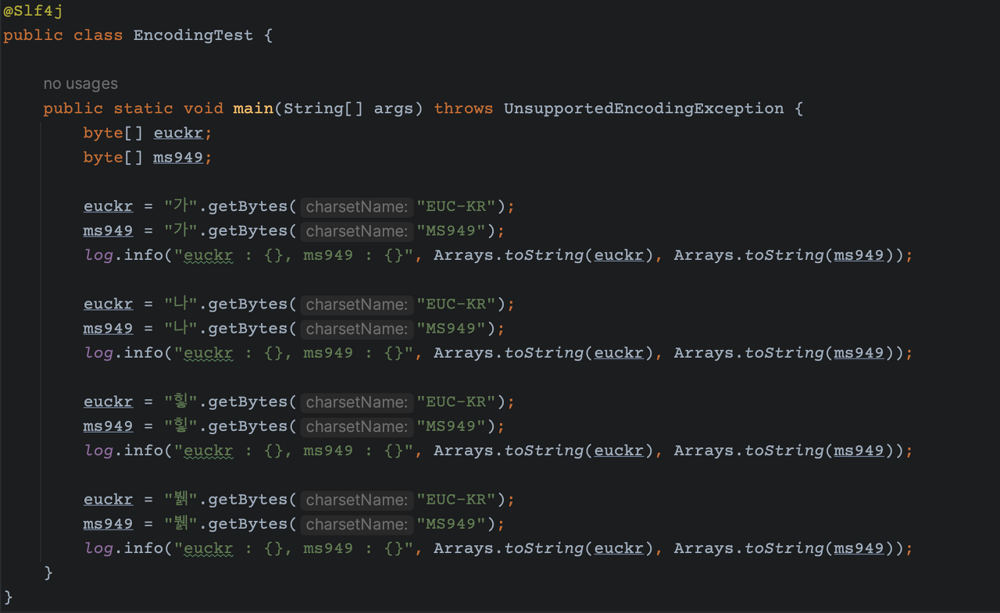
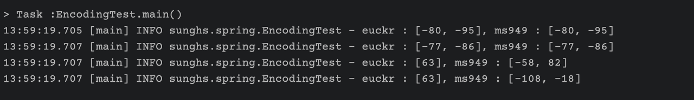
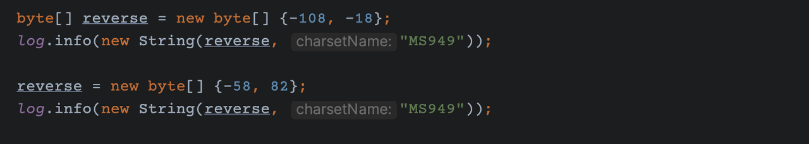
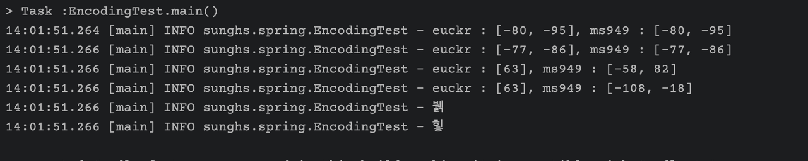

# MS949(CP949)와 EUC-KR은 다르다

요새 대부분 UTF-8을 사용해서 MS949, EUC-KR 등을 잘 사용하지 않는다. (ASCII, ISO-8859-1 등)

하지만 레거시에서는 EUC-KR을 사용하는 경우가 꽤 있는데, 이번에 레거시에서 작업하면서 발생한 문제가 있었다.

레거시 DB는 인코딩을 us7ascii 을 사용하고 있었고, 웹은 EUC-KR로 뿌리고 있었고, 그 중간과정을 MS949로 인코딩해서 던져주었다가, EUC-KR로 변경했는데 표시못하는 한글이 발생하기 시작했다.

가만히 있는 MS949를 왜 EUC-KR로 바꾸었냐면.. ***둘이 같은 줄 알았다.***

EUC-KR과 MS949이 같다고 표현하는 예전?블로그들이 꽤 많았고, 구글링 해가며 개발을 하다보니 그런 지식이 자연스럽게 정립되었는데, 정확히 말하면 다르다.

## MS949 (CP949)가 좀 더 확장된 개념이다.

EUC-KR도 한글이고 MS949도 한글이나 EUC-KR에서 표현이 불가능하던 한글이 MS949에서는 표현이 가능하다.

즉 MS949가 확장된 더 상위호환의 인코딩 타입이다.

EUC-KR은 2350자의 한글만 표현이 가능하고, MS949는 +8000자를 더 포함하여 약 11000자 정도를 표현할 수 있게 된다.

바이트 코드의 개념을 설명하면 더 좋지만 여기서는 둘이 다름을 설명하니 그냥 넘어간다..

## 테스트

테스트 과정은 아래와 같다.

1. 리터럴 한글 객체의 각 두 타입의 인코딩으로 byte 배열을 구함
- EUC-KR
- MS949

2. byte 배열의 값을 출력

왜 이렇게 하냐면 sysout 등도 결국 콘솔에서 봐야하기 때문에 특정 인코딩 타입을 지정해야 한다.

결국 둘중 하나는 계속 못보거나 아니면 콘솔 인코딩을 바꿔가며 테스트 해야하는데 번거로워서 바이트 코드로 바꿔 결과물만 출력해보면 알 수 있게 된다.

### 코드

코드 내의 '가' 와 '나'는 MS949와 EUC-KR 둘다 표현이 가능하므로 정상적인 바이트코드가 나올것이고, 그 값이 같을 것이다.

그리고 코드 내 '힣'과 '뷁'은 ***EUC-KR은 표현이 불가하고, MS949는 표현이 가능하니 EUC-KR에서는 바이트코드가 이상하게 나올것이다.***

### 결과

'가'는 -80, -95 이고 '나'는 -77, -86으로 동일하다.

'뷁'과 '힣'은 EUC-KR에서는 63으로 동일하고 (63은 ascii에서 ?임), MS949에서는 정상적인 코드가 나온것 같다.

즉 EUC-KR로 바꿨더니 바이트코드가 같았다는 말은, 표현할 수 없어서 한가지로 변경된 것이다.

그러면 MS949에서 나온 바이트코드가 (-58, 82 와 -108, -18) 정말 '힣'과 '뷁'인지 검증해보면 된다

콘솔에서 정확하게 나오는걸 알 수 있다.

### 결론

MS949는 EUC-KR을 모두 포함하고 표현할 수 없는 한글까지 표시가 가능하다.

특히 댓글 서비스와 같은 한글이 많이 쓰이는 곳에 EUC-KR로 구성되어 있다면 확인 후 MS949로 내려주어야 한다.

그리고.. 새 시스템 구성에서는 UTF-8로 통일하는게 좋다.