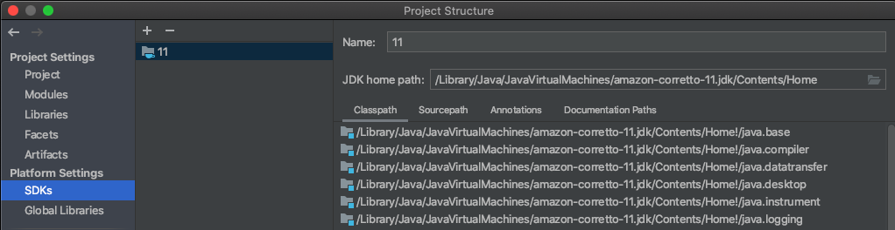
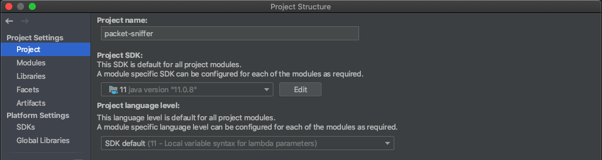

# [JAVA] SSLHandshakeException 발생 시 대처
### 정말 짜증나는 에러다.
<br/>
<br/>

---
## 1. JDK의 SSL 인증서 넣기
public 망이 아닌 사내 망에서 외부 통신 시 필요 할 수 있다.

보통은 인트라 망이면 SSL 인증서 파일을 제공할텐데 그 인증서 파일을 JDK에 추가 할 수 있다.

설치 된 JDK 홈 아래 lib/security 에 있는 cacerts 라는 파일에 인증서를 추가한다.

Windows 기본 설치 경로라면 C:\Program Files\Java 아래 구성되어 있을 것이고 (자세한 사항은 환경변수를 참조하면 된다.)  
Mac 기본 설치 경로라면 /Library/Java/JavaVirtualMachines 아래 있을 확률이 높다.

예를들어 Mac 기준이라면 /Library/Java/JavaVirtualMachines/jdk11.x.x/lib/security 이다.

**추가하고자 하는 SSL 인증서 파일을 가지고 cmd, terminal 등의 프로그램에 아래와 같이 추가한다.**
```
Sudo keytool -import -file "인증서파일 경로 및 파일명" -keystore cacerts -storepass change -alias "알리아스 명"
```
Unix 계열이라면 앞에 sudo를, Windows 라면 cmd를 관리자 권한으로 켜고 keytool부터 시작하면 된다.  
alias 명을 주면 삭제도 쉽고, grep으로 인증서가 추가 되었는지 보기도 쉽다.

### 예를들어 /users/sunghs/cert.crt 를 sunghs.cert 라는 alias 명으로 추가한다면
```
# unix like
sudo keytool -import -file /users/sunghs/cert.crt -keystore cacerts -storepass change -alias "sunghs.cert"

# windows like
# cmd 프로그램이 관리자 권한이어야 한다.
keytool -import -file /users/sunghs/cert.crt -keystore cacerts -storepass change -alias "sunghs.cert"
```

### (참고) SSL 인증서의 조회 또는 삭제
```
# 조회
sudo keytool -list -v -cacerts -storepass changeit | grep sunghs

# 삭제
sudo keytool -delete -cacerts -storepass changeit -alias "sunghs.cert"
```
이후 SSLHandshakeException이 발생하는지 테스트 해 본다.

대부분 이 방법으로 해결된다.

---
### 안된다면?
<br/>
<br/>
<br/>

## 2. IDE에서 다른 JDK를 사용 하고 있을 수 있으니, 확인해본다.
예를 들면 Mac 인텔리제이의 경우 내장 JDK가 함께 있어 그걸 사용하고 있을 수 있다.

물론 프로젝트 빌드 및 구동할때 필요한 JDK에 설치 되어야 하므로, 내장 JDK를 사용중이라면 
- (Mac 기준) command + ; 를 눌러 Project Structure 진입 
- Platform Settings > SDKs 에서 JDK를 추가한다.
- 이후 상단의 Project Settings > project > Project SDK: 부분에 추가한 JDK를 선택한다.




---
### 이것도 안된다면?
엄청나게 삽질을 통해 해결 한 방법이다.
(진짜 삽질 많이 한 듯)
<br/>
<br/>
<br/>

## 3. 프로젝트 구동 시 문제가 되는 https URL에 connection을 날려 인증서를 가지고 와 구동 시 메모리에 올려놓는 방법이다.

코드는 이렇다.
```java
URL url = new URL("https://문제가 되는 URL");
HttpsURLConnection connection = (HttpsURLConnection) url.openConnection();

log.debug("Response Code : {}", connection.getResponseCode());
log.debug("Cipher Suite : {}", connection.getCipherSuite());

for (Certificate cert : connection.getServerCertificates()) {
    CertificateFactory factory = CertificateFactory.getInstance("X.509");
    X509Certificate x509 = (X509Certificate) factory.generateCertificate(new ByteArrayInputStream(cert.getEncoded()));

    log.debug("Cert Dn : {}", x509.getSubjectDN());
    log.debug("Issuer Dn : {}", x509.getIssuerDN());
}
connection.disconnect();
```
log.debug 를 쓰기 위해서는 @Slf4j가 필요하다. (빼도 된다.)

InitializingBean이나 PostConstruct, 또는 Configuration에서 구동 시 바로 받아 올 수 있도록 구현 해 놓으면 된다.

원리는 위에서도 말했듯이, 해당 URL에 커넥션을 연결한 뒤, 그 URL의 인증서를 프로그램 구동 시 인증서를 관리하는 Map에 올려놓는 방법이다.

불특정 다수의 https URL에서 문제가 생긴다면 크게 효과는 없겠지만 몇몇 URL만 필요한 상황이라면 해볼만 하다.