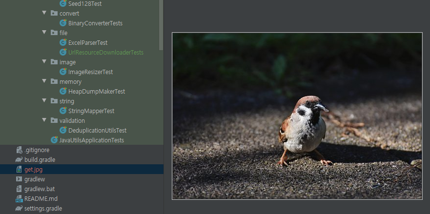

# URL 리소스 다운로드

[Github 소스](https://github.com/sunghs/java-utils) 

URL 경로를 입력하면 다운로드 받는 스트림을 제공합니다.

대표적으로 이미지, 파일 같은 것을 다운로드 가능합니다.


### 코드
```java
package sunghs.java.utils.file;

import lombok.extern.slf4j.Slf4j;

import java.io.FileOutputStream;
import java.io.IOException;
import java.net.URL;
import java.nio.channels.Channels;
import java.nio.channels.ReadableByteChannel;

/**
 * URL 리소스 다운로더
 *
 * @author https://sunghs.tistory.com
 * @see <a href="https://github.com/sunghs/java-utils">source</a>
 */
@Slf4j
public class UrlResourceDownloader {

    private final long count;

    private final String fileName;

    public UrlResourceDownloader(String fileName) {
        this.fileName = fileName;
        this.count = Long.MAX_VALUE;
    }

    public UrlResourceDownloader(String fileName, long count) {
        this.fileName = fileName;
        this.count = count;
    }

    public String getFileName() {
        return this.fileName;
    }

    public long getCount() {
        return this.count;
    }

    /**
     * 파일 다운로드
     * @param urlString 다운받을 URL
     */
    public void download(String urlString) {
        try {
            URL url = new URL(urlString);
            ReadableByteChannel readableByteChannel = Channels.newChannel(url.openStream());

            FileOutputStream fileOutputStream = new FileOutputStream(fileName);
            fileOutputStream.getChannel().transferFrom(readableByteChannel, 0, count);
            fileOutputStream.close();
        } catch (IOException e) {
            log.error("file download error", e);
        }
    }
}

```

1. 생성자 파라미터로 저장할 URL을 넣습니다.
2. 생성자 파라미터 중 count를 지정 가능합니다. ```ReadableByteChannel```을 사용하므로 지정하지 않을 시 Long.MAX_VALUE 만큼 읽어냅니다. 즉 다운받을 수 있는 가장 큰 크기는 9,223,372,036,854,775,807 byte (= 8192 TB)입니다. 
3. ```download(String url)``` 메소드로 타겟의 URL을 지정하면 됩니다.

### 테스트
JUnit 5를 기준으로 작성하였습니다.

```java
@Slf4j
class UrlResourceDownloaderTests {

    String url;

    @BeforeEach
    void setUp() {
        url = "https://cdn.pixabay.com/photo/2021/08/22/08/54/bird-6564593__340.jpg";
    }

    @Test
    void fileDownloadTest() {
        UrlResourceDownloader urlResourceDownloader = new UrlResourceDownloader("/user/sunghs/desktop/test.jpg");
        urlResourceDownloader.download(url);
    }
}
```

예제로 https://cdn.pixabay.com/photo/2021/08/22/08/54/bird-6564593__340.jpg 파일을 다운 받습니다. (무료 이미지)

파일 스트림을 ```/user/sunghs/desktop/test.jpg``` 로 씁니다. 윈도우라면 ```C:\\Users\\sunghs\\Desktop\\test.jpg``` 쯤 될 것입니다.

절대경로 없이 사용한다면 클래스패스 기준으로 다운로드 받습니다. 즉 ```new UrlResourceDownloader("get.jpg")``` 이런식으로 쓴다면



이렇게 저장됩니다.
