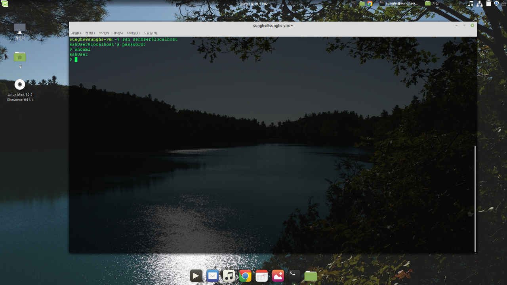
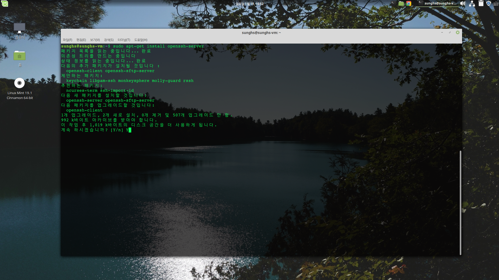
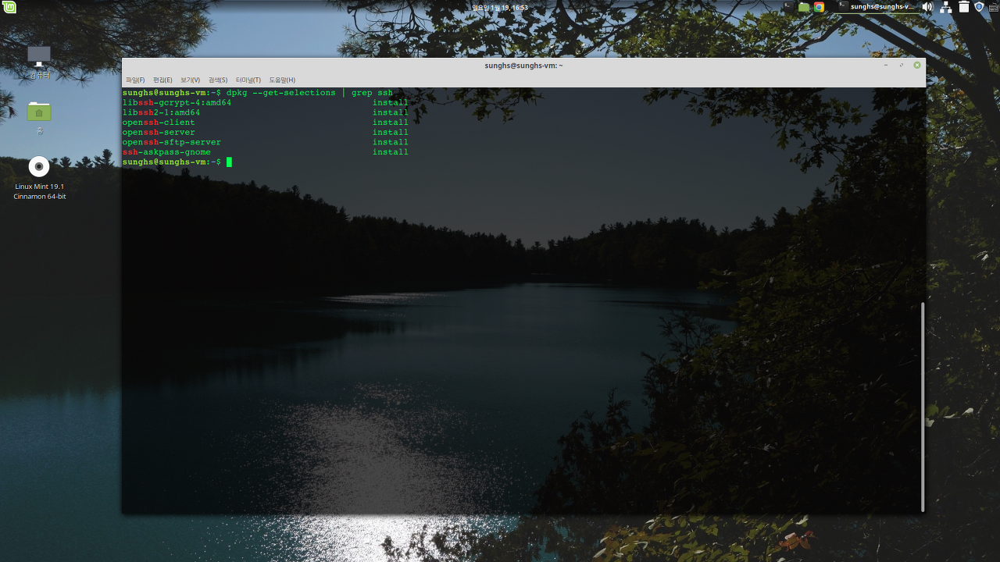
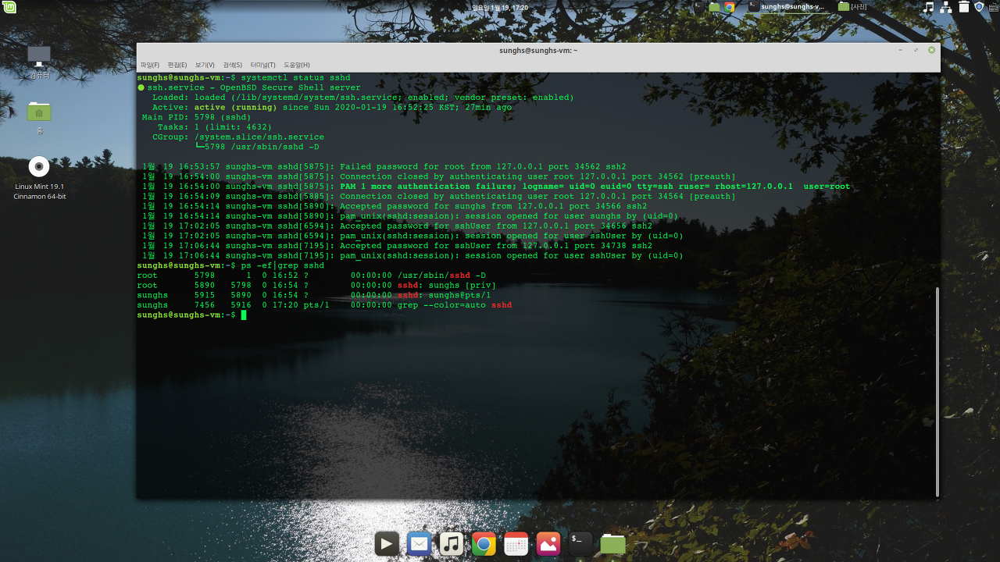

## [LINUX] SSH 정의 및 사용법

SSH SERVER/CLIENT는 타 서버의 원격 접속을 가능하게 해주는 패키지로 WINDOWS의 MSTSC과 유사하다.

### SSH 설치
리눅스 배포판 (centOS, Ubuntu 등) 마다 패키지관리자나 명령어가 조금 다를 수있다.
여기서 하는건 우분투계열 (mint)로 하며 centOS 계열은 rpm이나 yum 패키지로 진행하면 된다.

#### 패키지 설치 확인
*dpkg --get-selections | grep ssh*

여기서 ssh server 와 client가 보이지 않으면 설치 해줘야 한다.

#### 패키지 설치
*sudo apt-get install openssh-server*


#### 접속하기


#### 프로세스 확인


### SSH 기본 명령어 정리

#### 접속

```xml
ssh user@host
```

#### 종료
```xml
$ exit
```

#### 설정파일
/etc/ssh/sshd_config


#### SSH 옵션
```xml
usage: ssh [-46AaCfGgKkMNnqsTtVvXxYy] [-b bind_address] [-c cipher_spec]
           [-D [bind_address:]port] [-E log_file] [-e escape_char]
           [-F configfile] [-I pkcs11] [-i identity_file]
           [-J [user@]host[:port]] [-L address] [-l login_name] [-m mac_spec]
           [-O ctl_cmd] [-o option] [-p port] [-Q query_option] [-R address]
           [-S ctl_path] [-W host:port] [-w local_tun[:remote_tun]]
           [user@]hostname [command]
```

#### 자주 쓰는 옵션

- p : 특정 포트 지정, 생략시 22번으로 접속
- l : 사용자 지정, 생략 가능
- i : RSA 인증방식의 인증키 파일 위치

접속과 동시에 명령어 전달이 가능하다.
*1.2.3.4 9001포트에 접속해서 ssh 프로세스 확인*
```xml
ssh user@1.2.3.4 -p9001 ps -ef|grep ssh
```


#### 주의점
ssh 접속을 허용할 서버는 방화벽에서 접속 포트를 해제 해 주어야 한다. 기본값이 22번 포트이므로 22번을 해제하거나, 22번을 사용하지 않을거면 접속 포트를 결정하고 해당 포트를 TCP 인바운드 허용이 되어야 한다.