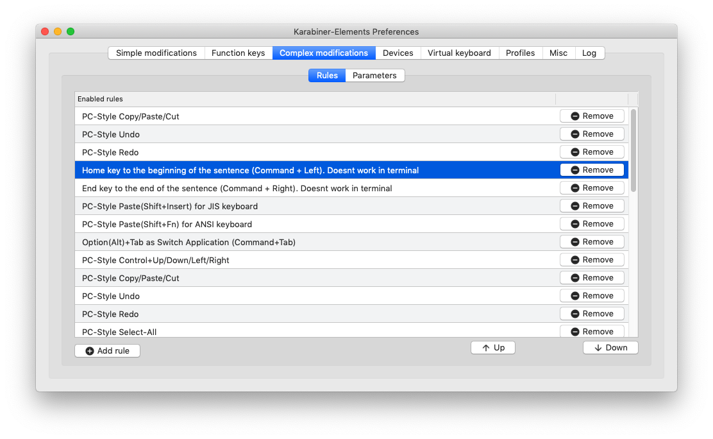
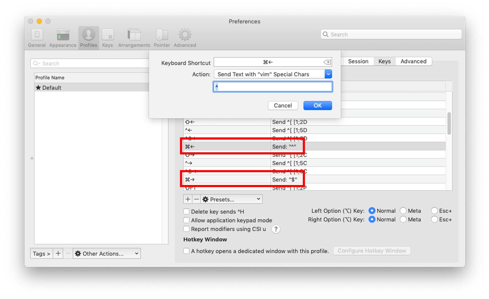

## Mac Vim Home/End키 설정

vim에서 **맨 뒤로 가는 키는 "$", 맨 앞으로 가는 키는 "^" 이므로** iterm2 기준으로는 키 매핑 시 Send Text with "vim" Special Chars 항목으로 해당 문자열을 보내면 된다.  
(맥 기본 터미널은 찾아 봐야함)

Karabiner를 써서 Home/End 키를 맥의 Command+좌우 화살표로 바꾼경우 결국 Key Profile은 이렇게 된다.

### Karabiner 설정

### Karabiner 설정 이후 iterm2 키 바인딩

* * *

Karabiner의 Home/End 키 (Cmd + 좌우 화살표) 는 vim을 제외한 줄 맨 앞으로, 줄 맨 뒤로와 같으므로
vim만 커스텀 해야 맥 어느 환경에서든 Home/End가 똑같이 동작한다.  
(DefaultKeyBinding.dict와 같은 수정 없이)
