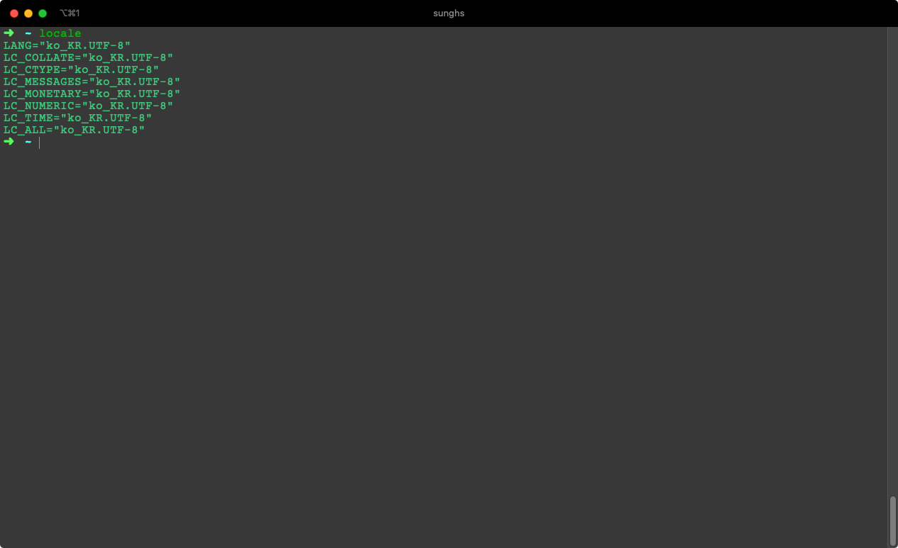
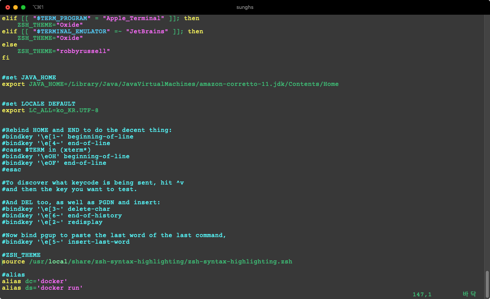
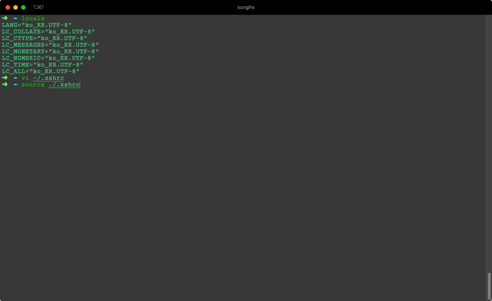

## 맥 터미널 한글 물음표

로컬 터미널 사용시 한글 부분이 물음표(???)로 나오거나, SSH 사용 시 한글부분이 ???로 나온다면 locale 확인하고 아래 방법으로 해결이 가능했다.

먼저 세션에 locale을 쳐서 언어셋이 ko_KR.UTF-8로 되어있다면 아래 내용과 상관없이 다른문제로 인해 물음표가 생기는 이유다.
아래 내용은 언어셋을 ko_KR.UTF-8로 바꾸는 내용이다.

```sh
export LC_ALL=ko_KR.UTF-8  
```

위와 같은 명령어는 현재 세션에만 적용되는 것으로 설정된 세션을 끄거나 새로운 세션이 붙으면 똑같이 한글이 물음표로 나온다.
bash shell의 profile에 설정을 하게 되면 계속 적용된 세션으로 사용이 가능하다. 


```sh
# bash를 사용하는 경우
vi ~/.bashrc
export LC_ALL=ko_KR.UTF-8
source ~/.bashrc

# zsh (oh-my-zsh)를 사용하는 경우
vi ~/.zshrc
export LC_ALL=ko_KR.UTF-8
source ~/.zshrc
```



정상적으로 적용되었다면 locale 명령어 사용 시 아래와 같이 나온다.

```sh
LANG=
LC_COLLATE="ko_KR.UTF-8"
LC_CTYPE="ko_KR.UTF-8"
LC_MESSAGES="ko_KR.UTF-8"
LC_MONETARY="ko_KR.UTF-8"
LC_NUMERIC="ko_KR.UTF-8"
LC_TIME="ko_KR.UTF-8"
LC_ALL="ko_KR.UTF-8"
```


