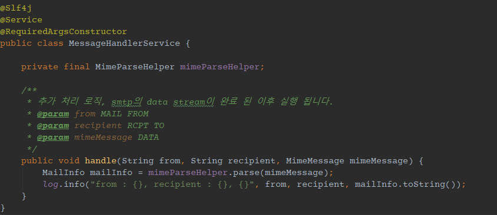
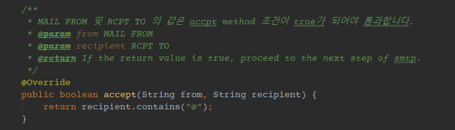
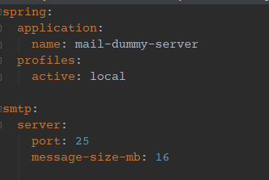
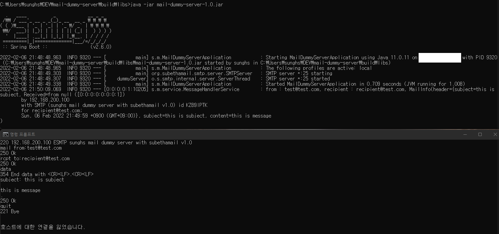

# mail dummy server

[프로젝트 소스는 여기](https://github.com/sunghs/mail-dummy-server)

메일 전송 로직 등을 만들고 제대로 발송이 되는지 확인해야 하는데, 이럴 때 naver, google, nate 등으로 마구 쏘다가는 발송 IP 차단 당할 수 있습니다. 또한 google 같은 경우에는 메일 전문을 비대칭키로 암호화해서 메일서버의 키로 복호화 해서 메일의 변조나 위장을 방지하는 DKIM 설정이 필요합니다. 그래서 테스트 해 보기가 여간 까다로운게 아닙니다.

이럴 때 메일을 수신해서 버려줄 수 있는 더미 서버가 있으면 좋겠다는 생각이 들어 하나 만들었습니다.

SMTP (Simple Mail Transfer Protocol)는 RFC 2821 규약으로 정의 되어 있는데 이것도 무조건 OK 구문이면 금방 만들겠지만 규칙에 맞춰 만드려면 굉장한 시간이 소모될 것 같은데, 이를 오픈소스로 만들어진게 있어 사용했습니다.

[smtp 오픈소스](https://github.com/voodoodyne/subethasmtp)

추상화가 잘 되어있어 만드는데 어렵지 않았습니다.

개발환경은

- Java 11
- Spring Boot 2.6.0
- Gradle 7.3
- Subethasmtp 5.2.4

으로 되어 있으며, 빌드 후 바로 실행하시면 됩니다.

*아.. 빌드 시 lombok 필요합니다.*

## 커스텀

### 1. 데이터 핸들링
송신 한 데이터를 추가적으로 핸들링 하려면 아래 `MessageHandlerService` 의 `handle` 메소드 내에 구현하시면 됩니다.  
기본으로는 로깅하고 끝냅니다.

### 2. MAIL FROM 및 RCPT TO 검사
`MessageListenerService`의 `accpet` 메소드가 true 이면 DATA 단계로 넘어갈 수 있습니다.  
false 인 경우 MAIL FROM 및 RCPT TO 수신이 거절됩니다.  
따라서 아래 예시 코드로 보면 RCPT TO 에 @가 포함되지 않으면 거절됩니다.

### 3. 설정
수신포트와 최대 메일 사이즈를 정할 수 있습니다.  
기본 설정된 포트는 well known smtp port인 25로 해놨습니다.

## 테스트
SMTP에서 필수 데이터는 `MAIL FROM`, `RCPT TO`, `DATA` 이며
`EHLO(HALO)` 와 DATA 내 header인 `subject`, `from`, `to` 정도는 생략할 수 있습니다. (있으면 좋음)  
다만 header와 본문 body는 한줄 띄워야 합니다. (header와 구분짓기 위함)

이 프로젝트를 서버 하나에 띄우시고, name server에 추가하신 후 메일 쏘시면 됩니다.

